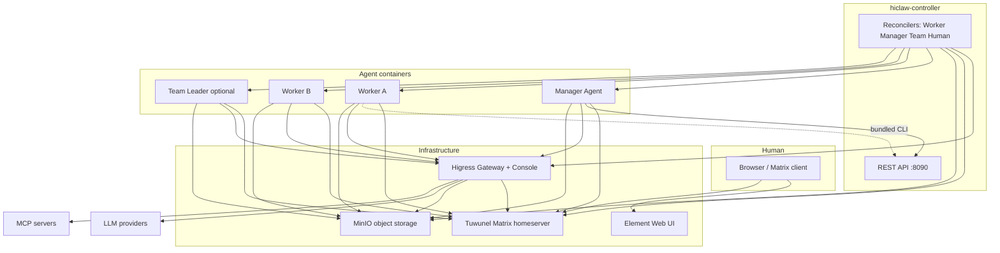

# HiClaw Architecture (v1.1.0)

HiClaw is an **Agent Teams** platform: a **Manager** coordinates **Workers** (and optional **Teams** with a **Team Leader**) while a **Human** participates over **Matrix**. Version **1.1.0** splits the system into **multiple containers**: infrastructure runs in a **dedicated controller stack** (embedded on a single machine or as separate Kubernetes workloads), while **Manager** and **Worker** images stay **lightweight**—they bundle the agent runtime, `hiclaw` CLI, and skills, but **not** Higress, Tuwunel, MinIO, or Element Web.

---

## Multi-container overview

| Layer | Role | Typical images |
|--------|------|------------------|
| **hiclaw-controller** | Go operator: reconciles **Worker**, **Manager**, **Team**, and **Human** CRDs; REST API; worker/manager lifecycle; gateway consumer setup; credential flows when cloud providers are enabled. | `hiclaw-controller` (Kubernetes) or **`hiclaw-controller-embedded`** (local): Higress all-in-one + **Tuwunel** + **MinIO** + **Element Web** (nginx) + controller binary |
| **Manager** | Coordinator agent: tasks, workers, teams, humans, Higress routes/MCP—via Matrix and the controller API. | `hiclaw-manager` (OpenClaw / Node) or `hiclaw-manager-copaw` (QwenPaw / Python)—based on **openclaw-base** or slim Python, **without** full infra stack |
| **Worker** | Task executor: one container per worker, created on demand; stateless; config and artifacts on object storage. | `hiclaw-worker`, `hiclaw-copaw-worker`, `hiclaw-hermes-worker`, `hiclaw-openhuman-worker`, or `agentteams-qwenpaw-worker` |

The **openclaw-base** image supplies **Ubuntu 24.04**, **Node.js 22**, **OpenClaw**, and **mcporter** for OpenClaw-based Manager/Worker images. It intentionally **does not** ship the old all-in-one Higress bundle; the AI gateway runs in the **controller** (embedded) or as the **Higress Helm subchart** (Kubernetes).

---

## Component relationship

### Mermaid (logical)



### ASCII (deployment shape)

**Local single host (`install/`)** — one **embedded** controller container holds Higress, Tuwunel, MinIO, Element Web, and the controller process; it creates **separate** Manager and Worker containers via the Docker/Podman API:

```
+--------------------------- hiclaw-controller (embedded) --------------------------+
|  Higress (:8080/...)   Tuwunel (:6167)   MinIO (:9000)   Element+nginx   controller |
|                              hiclaw-controller :8090 (REST)                        |
+-------------------------------+--------------+-------------------------------------+
                                | API / Docker |
              +-----------------+----------------+------------------+
              |                                  |
       hiclaw-manager                     hiclaw-worker-*
       (lightweight)                      (lightweight)
```

**Kubernetes (`helm/hiclaw`)** — each major piece is its own **Pod** (or chart dependency): Higress subchart, Tuwunel StatefulSet, MinIO, Element Web, **controller** Deployment, plus **Manager** and **Worker** Pods created from CRs (no static Manager Deployment when CR-driven install is used).

---

## Two deployment modes

### 1. Local single machine — `install/`

- **`install/hiclaw-install.sh`** pulls the **embedded controller** image (`Dockerfile.embedded`): Higress **all-in-one** base, plus **Tuwunel**, **MinIO**, **mc**, **Element Web**, **`hiclaw-controller`**, **`hiclaw`**, and **supervisord** wiring (`supervisord.embedded.conf`).
- The installer starts **`hiclaw-controller`**, waits for internal Higress / Tuwunel / MinIO health, then the **ManagerReconciler** creates the **`hiclaw-manager`** container (and Workers when you add **Worker** CRs or use the CLI).
- **Manager** uses `HICLAW_RUNTIME` outside `aliyun`/`k8s`: it waits on **localhost** ports inside the **host** network namespace only where documented—when co-located, the install script maps host ports (e.g. gateway **18080**) into the controller container; the Manager container receives `HICLAW_CONTROLLER_URL` and optional **Docker socket** for Worker lifecycle.

### 2. Kubernetes — `helm/hiclaw`

- **`helm/hiclaw/values.yaml`** defines **matrix** (Tuwunel managed or existing Synapse), **gateway** (managed Higress or external Alibaba **ai-gateway**), **storage** (managed MinIO or external OSS), optional **credentialProvider**, **controller**, **manager** (bootstrap **Manager** CR), **elementWeb**, **worker** defaults (images per **openclaw** / **copaw** / **hermes** / **openhuman** / **qwenpaw** runtime).
- The **controller** Pod reconciles CRs against **in-cluster** Matrix, Higress, and MinIO endpoints; **Manager** runs with `HICLAW_RUNTIME=k8s`, syncing workspace from cluster MinIO via `mc` and consuming credentials injected by the operator.

---

## Communication mechanisms

### Matrix (Tuwunel)

- **Human ↔ Manager ↔ Worker** (and **Team Leader** / team room) use the **Matrix** client-server API.
- Rooms provide **human-in-the-loop** visibility: assignments, progress, and interventions share the same timeline.
- Tuwunel is a **conduwuit**-family homeserver; configuration uses the **`CONDUWUIT_`** environment prefix.

### MinIO (or compatible S3 / OSS)

- **Shared object storage** for worker workspaces (`agents/<name>/…`), **shared** task trees (`shared/tasks/…`), manager paths (`manager/…`), and team-scoped prefixes when using Teams.
- **Manager** and **Workers** use the **`mc`** client (and sync scripts) to mirror or push objects; Workers are designed to be **replaceable** because durable state lives in the bucket.

### Higress — AI Gateway and API Gateway

- **LLM traffic**: OpenAI-compatible routes through Higress with **per-identity consumer** key auth.
- **MCP servers** and optional **HTTP/gRPC exposure** of worker ports are modeled as gateway routes managed during reconciliation.
- **Console** (session-cookie auth) is used for route/consumer/MCP administration; the Manager’s init scripts and skills align with that model.

---

## Runtime model

### Worker runtimes (`Worker` CR `spec.runtime`)

| Runtime | Stack | Notes |
|---------|--------|--------|
| **openclaw** (default) | Node.js / OpenClaw gateway in **openclaw-base**-derived image | Primary worker path; **mcporter** for MCP tool calls through Higress |
| **copaw** | Python / **QwenPaw** (`copaw-worker` patterns) | Alternative agent loop; Matrix via QwenPaw channels; skills layout under `copaw-worker-agent/` |
| **hermes** | Python / **`hermes-worker`** | Matrix worker runtime with Hermes policy/config tree under `hermes-worker-agent/` |
| **openhuman** | Rust / **OpenHuman** Core | Native Matrix (`channel-matrix`); skills under `openhuman-worker-agent/` |
| **qwenpaw** | **QwenPaw** / TeamHarness | Desired-state via `runtime.yaml`; skills under `qwenpaw-worker-agent/` (distinct from `copaw-worker-agent/`) |

Helm **`worker.defaultImage`** supplies distinct repository defaults for each runtime. The controller resolves the effective runtime and image when creating Pods or Docker containers.

### Manager runtimes

The shipped **Manager entrypoint** (`start-manager-agent.sh`) selects:

| Mode | `HICLAW_MANAGER_RUNTIME` | Behavior |
|------|---------------------------|----------|
| **OpenClaw** | `openclaw` (default) | Node/OpenClaw gateway; Matrix “message tool” style integration |
| **QwenPaw** | `copaw` | Python QwenPaw workspace; Matrix via **`copaw channels send`** (`start-copaw-manager.sh`) |

**Hermes**, **OpenHuman**, and **QwenPaw** (`runtime=qwenpaw`) are **Worker** runtimes in the API and charts; Manager images today boot **OpenClaw** or **QwenPaw-via-`copaw`** only (see comments in `start-manager-agent.sh`).

---

## Declarative resources and `hiclaw` CLI

### CRDs (`hiclaw.io/v1beta1`)

1. **Worker** — model, runtime, image, skills, MCP servers, optional **expose** ports, **channelPolicy**, **state** (`Running` / `Sleeping` / `Stopped`), **accessEntries** (cloud credential scoping when provider sidecar is used).
2. **Manager** — model, runtime, image, soul/agents overrides, skills, MCP servers, **config** (heartbeat interval, worker idle timeout, notify channel), **state**, **accessEntries**.
3. **Team** — **Leader** + **Workers** specs, optional **admin**, **peerMentions**, team **channelPolicy**; status aggregates member readiness and rooms (**team room**, **leader DM**, per-member **RoomID** with Manager).
4. **Human** — display name, email, **permissionLevel**, accessible teams/workers; status includes Matrix user, initial password (once), rooms.

### `hiclaw` CLI

The **`hiclaw`** binary is built from **`hiclaw-controller`** and copied into **Manager**, **Worker**, and **embedded controller** images. It talks to the controller **REST API** (e.g. create/get workers, teams, humans, managers) and is the primary **operator-facing** tool inside containers and docs examples (`hiclaw get managers default`, etc.).

---

## Skills system

Skills are **agent-facing Markdown** (`SKILL.md`) plus optional `scripts/` and `references/`, loaded from workspace or image paths.

### Manager skills (16)

Under **`manager/agent/skills/`**, each top-level directory is one skill:

1. `channel-management`  
2. `file-sync-management`  
3. `git-delegation-management`  
4. `hiclaw-find-worker`  
5. `human-management`  
6. `matrix-server-management`  
7. `mcporter`  
8. `mcp-server-management`  
9. `model-switch`  
10. `project-management`  
11. `service-publishing`  
12. `task-coordination`  
13. `task-management`  
14. `team-management`  
15. `worker-management`  
16. `worker-model-switch`  

These are shared by **OpenClaw** and **QwenPaw** Managers (QwenPaw-specific prompt overrides live under `manager/agent/copaw-manager-agent/` but skills stay common).

### Worker skills

- **Per-runtime builtins** — templates under **`manager/agent/worker-agent/`** (OpenClaw), **`copaw-worker-agent/`**, **`hermes-worker-agent/`**, **`openhuman-worker-agent/`**, and **`qwenpaw-worker-agent/`** include a small **core** set (e.g. **file-sync**, **mcporter**, **find-skills**, **project-participation**, **task-progress**) materialized into each worker workspace on provision.
- **On-demand / distributable** — **`manager/agent/worker-skills/`** (e.g. **github-operations**, **git-delegation**): the Manager can push selected packages to workers when `spec.skills` references them.

### Team Leader skills

Under **`manager/agent/team-leader-agent/skills/`**:

- `communication`
- `file-sharing`
- `mcporter`
- `organization`
- `project-management`
- `task-management`
- `team-coordination`

The older compatibility aliases `team-project-management`, `team-task-coordination`, and `team-task-management` are removed from the built-in template. Existing Team Leader workspaces that already contain those copied skills are not mutated in place; new and upgraded workspaces should use the canonical `project-management`, `task-management`, and `team-coordination` skills.

---

## Security snapshot

- **Higress consumers** use **key-auth** (Bearer) to scope LLM, storage, and MCP routes per Manager/Worker identity.
- **Secrets** (gateway keys, passwords) are generated or injected by the operator/installer; cloud deployments can use a **credential-provider** sidecar for STS-scoped object storage and gateway APIs (`values.yaml` **credentialProvider** block).

---

## Related reading

- **[`docs/quickstart.md`](quickstart.md)** — end-to-end setup.  
- **[`design/design.md`](../design/design.md)** — product design (Chinese).  
- **[`AGENTS.md`](../AGENTS.md)** — repository map for developers and agents.
