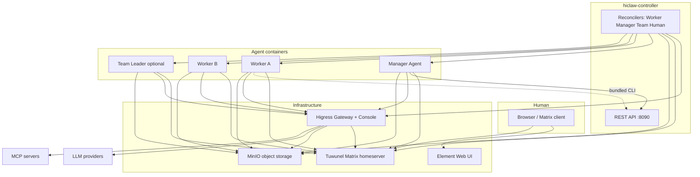

# HiClaw 架构说明（v1.1.0）

HiClaw 是一个 **Agent Teams** 平台：**Manager** 负责协调 **Workers**，也可以通过 **Team Leader** 组织可选的 **Teams**；**Human** 通过 **Matrix** 参与协作。**v1.1.0** 将系统拆分为**多容器**架构：基础设施运行在独立的 **controller stack** 中（本地模式为嵌入式单容器，Kubernetes 模式为独立工作负载），**Manager** 和 **Worker** 镜像保持轻量，只包含 Agent runtime、`hiclaw` CLI 和 skills，不再内置 Higress、Tuwunel、MinIO 或 Element Web。

---

## 多容器概览

| 层级 | 职责 | 典型镜像 |
|------|------|----------|
| **hiclaw-controller** | Go operator：协调 **Worker**、**Manager**、**Team** 和 **Human** CRD；提供 REST API；管理 worker/manager 生命周期、gateway consumer 配置，以及云厂商能力开启时的凭证流程。 | `hiclaw-controller`（Kubernetes）或 **`hiclaw-controller-embedded`**（本地）：Higress all-in-one + **Tuwunel** + **MinIO** + **Element Web**（nginx）+ controller binary |
| **Manager** | 协调型 Agent：通过 Matrix 和 controller API 管理任务、workers、teams、humans、Higress routes/MCP。 | `hiclaw-manager`（OpenClaw / Node）或 `hiclaw-manager-copaw`（QwenPaw / Python）：基于 **openclaw-base** 或 slim Python，**不包含**完整基础设施栈 |
| **Worker** | 任务执行容器：每个 worker 一个容器，按需创建；无状态；配置和产物保存在对象存储中。 | `hiclaw-worker`、`hiclaw-copaw-worker`、`hiclaw-hermes-worker`、`hiclaw-openhuman-worker` 或 `agentteams-qwenpaw-worker` |

**openclaw-base** 镜像提供 **Ubuntu 24.04**、**Node.js 22**、**OpenClaw** 和 **mcporter**，供 OpenClaw 形态的 Manager/Worker 镜像复用。它不再包含旧的 all-in-one Higress bundle；AI gateway 运行在**嵌入式 controller** 中，或在 Kubernetes 中作为 **Higress Helm subchart** 运行。

---

## 组件关系

### Mermaid（逻辑视图）



### ASCII（部署形态）

**本地单机（`install/`）**：一个**嵌入式** controller 容器承载 Higress、Tuwunel、MinIO、Element Web 和 controller 进程；它通过 Docker/Podman API 创建**独立的** Manager 和 Worker 容器。

```text
+--------------------------- hiclaw-controller (embedded) --------------------------+
|  Higress (:8080/...)   Tuwunel (:6167)   MinIO (:9000)   Element+nginx   controller |
|                              hiclaw-controller :8090 (REST)                        |
+-------------------------------+--------------+-------------------------------------+
                                | API / Docker |
              +-----------------+----------------+------------------+
              |                                  |
       hiclaw-manager                     hiclaw-worker-*
       (lightweight)                      (lightweight)
```

**Kubernetes（`helm/hiclaw`）**：主要组件分别运行在独立的 **Pod** 中，或作为 chart dependency 部署：Higress subchart、Tuwunel StatefulSet、MinIO、Element Web、**controller** Deployment，以及由 CR 创建的 **Manager** 和 **Worker** Pods。使用 CR 驱动安装时，不再需要静态 Manager Deployment。

---

## 两种部署模式

### 1. 本地单机 - `install/`

- **`install/hiclaw-install.sh`** 拉取**嵌入式 controller** 镜像（`Dockerfile.embedded`）：基于 Higress **all-in-one**，额外包含 **Tuwunel**、**MinIO**、**mc**、**Element Web**、**`hiclaw-controller`**、**`hiclaw`** 和 **supervisord** 编排（`supervisord.embedded.conf`）。
- 安装脚本启动 **`hiclaw-controller`**，等待内部 Higress / Tuwunel / MinIO 健康检查通过，然后由 **ManagerReconciler** 创建 **`hiclaw-manager`** 容器；添加 **Worker** CR 或使用 CLI 时，再创建 Worker。
- 非 `aliyun` / `k8s` 场景下，**Manager** 使用 `HICLAW_RUNTIME` 的本地运行逻辑：只在文档明确说明的共址场景里等待宿主机网络命名空间中的 localhost 端口；安装脚本会把宿主机端口（例如 gateway **18080**）映射到 controller 容器。Manager 容器会收到 `HICLAW_CONTROLLER_URL`，并可选挂载 **Docker socket** 用于 Worker 生命周期管理。

### 2. Kubernetes - `helm/hiclaw`

- **`helm/hiclaw/values.yaml`** 定义 **matrix**（托管 Tuwunel 或已有 Synapse）、**gateway**（托管 Higress 或外部阿里云 **ai-gateway**）、**storage**（托管 MinIO 或外部 OSS）、可选 **credentialProvider**、**controller**、**manager**（bootstrap **Manager** CR）、**elementWeb**、**worker** 默认值（按 **openclaw** / **copaw** / **hermes** / **openhuman** / **qwenpaw** runtime 区分镜像）。
- **controller** Pod 会面向集群内 Matrix、Higress 和 MinIO endpoint 协调 CR。**Manager** 以 `HICLAW_RUNTIME=k8s` 运行，通过 `mc` 从集群 MinIO 同步工作区，并消费 operator 注入的凭证。

---

## 通信机制

### Matrix（Tuwunel）

- **Human -> Manager -> Worker**（以及 **Team Leader** / team room）使用 **Matrix** client-server API。
- Room 提供 **human-in-the-loop** 可见性：任务分配、进展汇报和人工介入都在同一个 timeline 中。
- Tuwunel 是 **conduwuit** 系 homeserver，配置使用 **`CONDUWUIT_`** 环境变量前缀。

### MinIO（或兼容 S3 / OSS）

- 共享对象存储用于保存 worker 工作区（`agents/<name>/...`）、共享任务树（`shared/tasks/...`）、manager 路径（`manager/...`），以及使用 Teams 时的 team 级前缀。
- **Manager** 和 **Workers** 使用 **`mc`** client（以及同步脚本）mirror 或 push objects。由于持久状态保存在 bucket 中，Workers 被设计为可替换。

### Higress - AI Gateway 和 API Gateway

- **LLM 流量**：通过 Higress 的 OpenAI-compatible routes 转发，并按身份使用 **per-identity consumer** key auth。
- **MCP servers** 以及可选的 worker 端口 **HTTP/gRPC 暴露**，都建模为 reconciliation 过程中管理的 gateway routes。
- **Console** 使用 session-cookie auth，用于 route、consumer 和 MCP 管理；Manager 初始化脚本和 skills 与该模型保持一致。

---

## 运行时模型

### Worker runtimes（`Worker` CR `spec.runtime`）

| Runtime | 技术栈 | 说明 |
|---------|--------|------|
| **openclaw**（默认） | Node.js / OpenClaw gateway，基于 **openclaw-base** 派生镜像 | 主 worker 路径；使用 **mcporter** 通过 Higress 调用 MCP 工具 |
| **copaw** | Python / **QwenPaw**（`copaw-worker` patterns） | 备用 agent loop；通过 QwenPaw channels 接入 Matrix；skills 位于 `copaw-worker-agent/` |
| **hermes** | Python / **`hermes-worker`** | Matrix worker runtime，Hermes policy/config tree 位于 `hermes-worker-agent/` |
| **openhuman** | Rust / **OpenHuman** Core | 原生 Matrix（`channel-matrix`）；skills 位于 `openhuman-worker-agent/` |
| **qwenpaw** | **QwenPaw** / TeamHarness | 通过 `runtime.yaml` 做 desired-state；skills 位于 `qwenpaw-worker-agent/`（与 `copaw-worker-agent/` 不同） |

Helm **`worker.defaultImage`** 会为不同 runtime 提供不同的默认 repository。controller 在创建 Pods 或 Docker containers 时解析最终 runtime 和镜像。

### Manager runtimes

已发布的 **Manager entrypoint**（`start-manager-agent.sh`）会按以下规则选择运行时：

| Mode | `HICLAW_MANAGER_RUNTIME` | 行为 |
|------|---------------------------|------|
| **OpenClaw** | `openclaw`（默认） | Node/OpenClaw gateway；Matrix “message tool” 风格集成 |
| **QwenPaw** | `copaw` | Python QwenPaw workspace；通过 **`copaw channels send`** 接入 Matrix（`start-copaw-manager.sh`） |

**Hermes**、**OpenHuman** 和 **QwenPaw**（`runtime=qwenpaw`）在 API 和 charts 中是 **Worker** runtime；当前 Manager 镜像只启动 **OpenClaw** 或 **QwenPaw-via-`copaw`**（见 `start-manager-agent.sh` 中的注释）。

---

## 声明式资源与 `hiclaw` CLI

### CRDs（`hiclaw.io/v1beta1`）

1. **Worker**：model、runtime、image、skills、MCP servers、可选 **expose** ports、**channelPolicy**、**state**（`Running` / `Sleeping` / `Stopped`）、**accessEntries**（使用 provider sidecar 时的云凭证作用域）。
2. **Manager**：model、runtime、image、soul/agents overrides、skills、MCP servers、**config**（heartbeat interval、worker idle timeout、notify channel）、**state**、**accessEntries**。
3. **Team**：**Leader** + **Workers** specs、可选 **admin**、**peerMentions**、team **channelPolicy**；status 聚合成员就绪状态和 rooms（**team room**、**leader DM**、每个成员与 Manager 的 **RoomID**）。
4. **Human**：display name、email、**permissionLevel**、可访问 teams/workers；status 包含 Matrix user、initial password（一次性）和 rooms。

### `hiclaw` CLI

**`hiclaw`** binary 由 **`hiclaw-controller`** 构建，并复制到 **Manager**、**Worker** 和**嵌入式 controller** 镜像中。它通过 controller **REST API** 执行 create/get workers、teams、humans、managers 等操作，是容器内和文档示例中的主要**面向操作者**工具（例如 `hiclaw get managers default`）。

---

## Skills 系统

Skills 是面向 Agent 的 **Markdown**（`SKILL.md`），可带可选的 `scripts/` 和 `references/`，从工作区或镜像路径加载。

### Manager skills（16）

**`manager/agent/skills/`** 下每个顶层目录是一个 skill：

1. `channel-management`
2. `file-sync-management`
3. `git-delegation-management`
4. `hiclaw-find-worker`
5. `human-management`
6. `matrix-server-management`
7. `mcporter`
8. `mcp-server-management`
9. `model-switch`
10. `project-management`
11. `service-publishing`
12. `task-coordination`
13. `task-management`
14. `team-management`
15. `worker-management`
16. `worker-model-switch`

这些 skills 被 **OpenClaw** 和 **QwenPaw** Manager 共享。QwenPaw 专用 prompt overrides 位于 `manager/agent/copaw-manager-agent/`，但 skills 保持通用。

### Worker skills

- **按 runtime 内置**：**`manager/agent/worker-agent/`**（OpenClaw）、**`copaw-worker-agent/`**、**`hermes-worker-agent/`**、**`openhuman-worker-agent/`** 和 **`qwenpaw-worker-agent/`** 下的模板包含一组小型 **core** skills，例如 **file-sync**、**mcporter**、**find-skills**、**project-participation**、**task-progress**，在 worker provision 时物化到每个 worker workspace。
- **按需分发**：**`manager/agent/worker-skills/`**（例如 **github-operations**、**git-delegation**）中的包，可由 Manager 在 `spec.skills` 引用时推送给 workers。

### Team Leader skills

**`manager/agent/team-leader-agent/skills/`** 下包含：

- `communication`
- `file-sharing`
- `mcporter`
- `organization`
- `project-management`
- `task-management`
- `team-coordination`

旧的兼容别名 `team-project-management`、`team-task-coordination` 和 `team-task-management` 已从内置模板中移除。已经复制这些 skills 的既有 Team Leader 工作区不会被原地修改；新建和升级后的工作区应使用 canonical 的 `project-management`、`task-management` 和 `team-coordination`。

---

## 安全快照

- **Higress consumers** 使用 **key-auth**（Bearer）按 Manager/Worker 身份划分 LLM、storage 和 MCP routes 权限。
- **Secrets**（gateway keys、passwords）由 operator/installer 生成或注入；云部署可以通过 **credential-provider** sidecar 提供 STS 级别的对象存储和 gateway API 访问（见 `values.yaml` 的 **credentialProvider** 配置）。

---

## 相关阅读

- **[`docs/zh-cn/quickstart.md`](quickstart.md)**：端到端安装。
- **[`AGENTS.md`](../../AGENTS.md)**：面向开发者和 Agent 的代码库地图。
