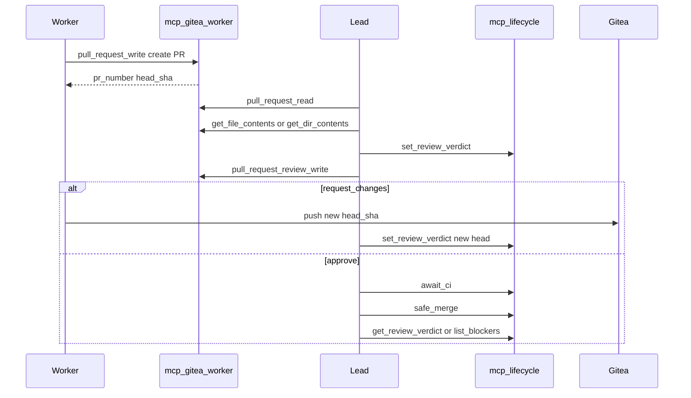

# Lead Review Loop (Gitea + lifecycle-mcp)

You coordinate code review and merge through **two MCP layers**. Use gitea-mcp for raw forge CRUD; use lifecycle-mcp for orchestration state, bounded waits, and gated merge.

## Two Layers

| Layer | Server | Role |
|-------|--------|------|
| **gitea-mcp** (53 tools) | `mcp-gitea-<worker>` per Worker PAT | Raw Gitea API: PR read/write, diff context, post Gitea review state |
| **lifecycle-mcp** (18 tools) | `mcp-lifecycle` (Tailscale-only) | Verdict artifacts, bounded `await_*`, `safe_merge`, blockers view |

- **gitea-mcp** = forge proxy (per-worker PAT via Higress). No orchestration SQLite.
- **lifecycle-mcp** = orchestration SQLite only (`ops.db`). **No forge CRUD** — never use it to create PRs or post file diffs.
- **lifecycle-mcp endpoint**: Tailscale-only `100.65.242.110:8086`, bearer-authed — not reachable from the public internet.

Read `mcporter` skill before calling either server.

## Sequence Overview

## Worker Opens PR

1. Worker uses `mcp-gitea-<worker>.pull_request_write` to create the PR.
2. Worker reports `pr_number`, `head_sha`, and repo (`owner/name`) to you in the Team Room.

## You Review

1. **Read PR** — `mcp-gitea-<worker>.pull_request_read` (metadata, current head).
2. **Diff context** — `get_file_contents` or `get_dir_contents` on the same gitea-mcp server (or the Worker's server that owns the PR).
3. **Store rich verdict** — lifecycle-mcp `set_review_verdict(repo, pr_number, verdict='approve'|'request_changes', head_sha=<sha>, score=?, rationale='...', reviewer='lead-<your-name>')`.
   - Verdict is keyed by `(repo, pr_number)` with optional `head_sha`.
   - `set_review_verdict` is normally called by the n8n review branch, but **you may call it directly** — no role lock.
4. **Post Gitea review state** — `pull_request_review_write` on gitea-mcp (APPROVED / REQUEST_CHANGES) **after** storing the rich verdict.

## If `request_changes`

- Worker pushes fixes (new `head_sha`).
- Loop back: re-read PR, `set_review_verdict` with the **new** `head_sha`, then `pull_request_review_write`.

## If `approve`

1. **Wait for CI** — lifecycle-mcp `await_ci(repo, head_sha)` (bounded; default 50s, hard cap 110s).
   - Returns `{status:'no_checks'}` if the repo has no CI.
   - Returns `{status:'pending', ...}` on timeout — re-invoke; do not hang past tool wall-clock.
2. **Gated merge** — lifecycle-mcp `safe_merge(repo, pr_number, head_sha, merge_method='merge')`.
   - Re-verifies **server-side now**: PR open, `head_sha` matches current PR head, verdict is `approve` **for that head**, CI green (or no checks).
   - Refuses stale reviews when verdict `head_sha` ≠ PR head.
   - Idempotent: already-merged PR returns `{merged:true}` without re-merging.
   - Branch protection remains the backstop — Gitea refusal is surfaced, never bypassed.
3. **Final state** — `get_review_verdict(repo, pr_number)` or `list_blockers(repo)` if anything is stuck.

## Report to Requester

After merge or when blocked, report using lifecycle state:

- `get_review_verdict(repo, pr_number)` for the final verdict artifact, or
- `list_blockers(repo)` for the needs-attention view.

Include review outcome in your requester update per `communication` skill.

## lifecycle-mcp Tools (18 — names + purpose)

Per-tool JSON schemas are deferred; signatures below are stable `@mcp.tool` functions.

### Fix job lifecycle

| Tool | Purpose |
|------|---------|
| `start_fix(repo*, issue_number*, head_sha)` | Idempotently dispatch OpenHands fix for a Gitea issue; same handle on repeat |
| `poll_fix(handle*)` | Read fix job state; detects resulting PR via Gitea |
| `get_fix_result(handle*)` | Re-fetchable terminal result for a fix job |
| `cancel_fix(handle*)` | Best-effort cancel OpenHands conversation + mark op cancelled |
| `list_ops(limit)` | Debug: recent fix operations |

### Await (bounded blocking)

| Tool | Purpose |
|------|---------|
| `await_fix(handle*, timeout_s=50)` | Block until fix opens PR or fails; `{status:'pending', handle}` on timeout |
| `await_review(repo*, pr_number*, timeout_s=50)` | Block until AI review verdict for PR's **current** head |
| `await_ci(repo*, head_sha*, timeout_s=50)` | Block until CI terminal state; `{status:'no_checks'}` or `{status:'pending'}` on timeout |

### Verdict + triage

| Tool | Purpose |
|------|---------|
| `get_review_verdict(repo*, pr_number*)` | Rich AI verdict if stored, else derived from Gitea review |
| `set_review_verdict(repo*, pr_number*, verdict*, head_sha, score, rationale, reviewer)` | Store/update rich verdict (you may call directly) |
| `get_triage(repo*, issue_number*)` | Stored triage classification for an issue |
| `set_triage(repo*, issue_number*, type, priority, summary, dedup_of, needs_info, labels)` | Store/update issue triage (normally n8n) |
| `list_blockers(repo, limit_repos=30)` | Needs-attention view: requested changes, failed CI, failed jobs, needs-info triage |

### Merge

| Tool | Purpose |
|------|---------|
| `safe_merge(repo*, pr_number*, head_sha*, merge_method='merge')` | Merge only if open, head match, verdict=approve for this head, CI green/no_checks |

### Subscriptions (services only — not for you)

| Tool | Purpose |
|------|---------|
| `subscribe(events*, delivery_url*, secret)` | Webhook for n8n/Slack/CI — **not** for coding agents |
| `unsubscribe(subscription_id*)` | Remove subscription |
| `list_subscriptions()` | List active subscriptions (secrets omitted) |

Coding agents use `await_*` to block. External services use `subscribe` webhooks.

### Misc

| Tool | Purpose |
|------|---------|
| `ping()` | Liveness check |

## gitea-mcp Tools (53)

Workers use the full catalog in the `gitea-operations` worker skill. As Lead, you typically call:

- `pull_request_read` — PR metadata and head
- `get_file_contents` / `get_dir_contents` — review context
- `pull_request_review_write` — post Gitea review state after your verdict
- `pull_request_write` — labels/branches if needed (Workers normally create PRs)

See `~/worker-skills/gitea-operations/SKILL.md` (or Manager push) for all 53 tool names.

## Design Rules

1. **Verdict before Gitea review** — always `set_review_verdict` then `pull_request_review_write`.
2. **Stale head protection** — `safe_merge` refuses when verdict `head_sha` ≠ PR current head.
3. **Bounded waits** — on `{status:'pending'}`, re-invoke `await_*`; do not assume infinite blocking.
4. **No forge on lifecycle-mcp** — PR create, file read, review post = gitea-mcp only.
5. **Per-worker PAT** — call the Worker's `mcp-gitea-<name>` when inspecting their PR authorship context.
