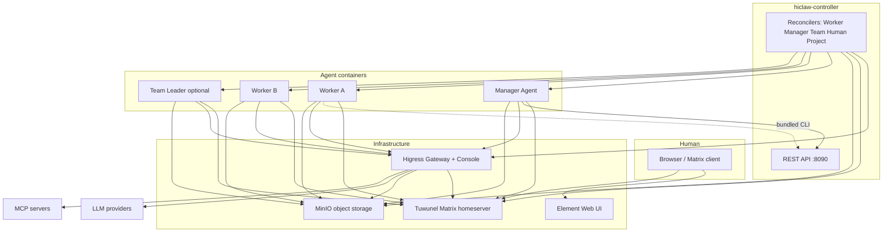

# Architecture Overview

AgentTeams uses a **Manager-Workers architecture** where a central Manager agent orchestrates multiple Worker agents. Communication happens over Matrix IM rooms, with human participants having full visibility. The system is designed so that Workers are stateless and disposable — all state lives in object storage and the Matrix homeserver.

## System Layers

| Layer | Role | Container Images |
|-------|------|-----------------|
| **hiclaw-controller** | Go operator: reconciles CRDs, REST API, worker/manager lifecycle | `agentteams-controller` (K8s) or `agentteams-embedded` (local) |
| **Manager** | Coordinator agent: tasks, workers, teams, humans, gateway config | `agentteams-manager` (OpenClaw) or `agentteams-manager-copaw` |
| **Worker** | Task executor: one container per worker, stateless, created on demand | `agentteams-worker`, `agentteams-copaw-worker`, `agentteams-hermes-worker`, `agentteams-openhuman-worker`, `agentteams-qwenpaw-worker` |

## Component Relationships



## Deployment Shapes

### Local Single Host (Docker/Podman)

One **embedded** controller container bundles Higress, Tuwunel, MinIO, Element Web, and the controller binary. It creates separate Manager and Worker containers via the Docker/Podman API:

```
+--------------------------- agentteams-controller (embedded) --------------------------+
|  Higress (:8080/...)   Tuwunel (:6167)   MinIO (:9000)   Element+nginx   controller |
|                              controller :8090 (REST)                                 |
+-------------------------------+--------------+----------------------------------------+
                                | API / Docker |
              +-----------------+----------------+------------------+
              |                                  |
       agentteams-manager                 agentteams-worker-*
       (lightweight)                      (lightweight)
```

Install via: `bash <(curl -sSL https://higress.ai/hiclaw/install.sh)`

### Kubernetes (Helm)

Each component runs as its own Pod. The controller reconciles Custom Resources to create Manager and Worker pods dynamically:

- **Higress** — Helm subchart (API gateway)
- **Tuwunel** — StatefulSet (Matrix homeserver)
- **MinIO** — StatefulSet (object storage)
- **Element Web** — Deployment (optional web UI)
- **Controller** — Deployment (Go operator)
- **Manager** — Pod created from Manager CR
- **Workers** — Pods created from Worker CRs

Install via: `helm install hiclaw higress.io/hiclaw -n hiclaw-system`

## Custom Resource Definitions (CRDs)

The controller reconciles five CRD types under the `agentteams.io` API group:

| CRD | Purpose | Key Spec Fields |
|-----|---------|----------------|
| **Worker** | AI agent worker | `runtime`, `model`, `image`, `soul`, `skills`, `mcpServers`, `expose`, `channelPolicy` |
| **Manager** | Coordinator agent | `runtime`, `model`, `image`, `soul`, `skills`, `mcpServers`, `state` |
| **Team** | Group of workers with a leader | `teamName`, `workerMembers`, `humanMembers`, `channelPolicy`, `heartbeatEvery` |
| **Human** | Human participant | `username`, `permissionLevel`, `accessibleTeams`, `accessibleWorkers` |
| **Project** | Team-scoped project with repos | `team`, `projectName`, `repos`, `workers`, `dependsOn` |

All CRDs share common status fields: `phase`, `matrixUserId`, `roomId`, `containerState`.

See [Controller: CRDs & Reconcilers](../controller/crds-and-reconcilers.md) for full type definitions and reconciler logic.

## Communication Pattern

All agent communication happens in Matrix rooms. The pattern is:

1. **Human** creates a Worker CR (or asks the Manager to create one)
2. **Controller** reconciles the CR: provisions Matrix user, creates room, sets up gateway auth, deploys agent config
3. **Worker** joins the Matrix room and starts responding to messages
4. **Manager** can delegate tasks to Workers by mentioning them in rooms
5. **Human** can observe everything and intervene at any time

Key design principles:
- **Human-in-the-loop by default** — every room includes the human, manager, and relevant workers
- **Workers are stateless** — destroy and recreate freely; config and artifacts live in MinIO
- **Centralized credentials** — Workers use consumer tokens only; real API keys stay in the gateway
- **Skills as documentation** — each `SKILL.md` tells the agent how to use an API or tool

## Credential Flow

```
Worker ──(consumer token)──► Higress Gateway ──(real API key)──► LLM Provider
                                      │
                                      └──(real PAT/token)──► MCP Servers
```

Workers never see real credentials. The controller provisions a Higress consumer with key-auth, and the gateway injects the real API key on the proxy path.

## Data Flow

```
MinIO (object storage)
├── workspaces/<worker>/         # Agent config, skills, state
├── shared/projects/<project>/   # Project manifests and plans
├── shared/tasks/<task>/         # Task specs and results
└── packages/<worker>/           # Deployed agent packages
```

Workers sync their workspace from MinIO on startup. The `agentteams_sync` Python package handles bidirectional file sync between local workspaces and MinIO.

## Source References

- Architecture docs: [`docs/architecture.md`](../../docs/architecture.md)
- K8s-native design: [`docs/k8s-native-agent-orch.md`](../../docs/k8s-native-agent-orch.md)
- CRD definitions: [`hiclaw-controller/api/v1beta1/`](../../hiclaw-controller/api/v1beta1/)
- Reconcilers: [`hiclaw-controller/internal/controller/`](../../hiclaw-controller/internal/controller/)
- Helm chart: [`helm/hiclaw/`](../../helm/hiclaw/)
- Install scripts: [`install/`](../../install/)
