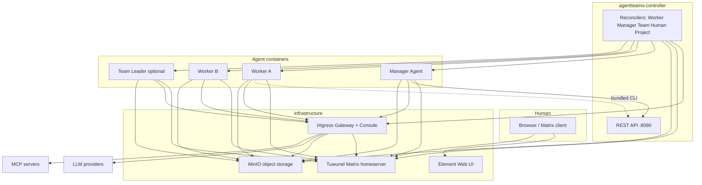
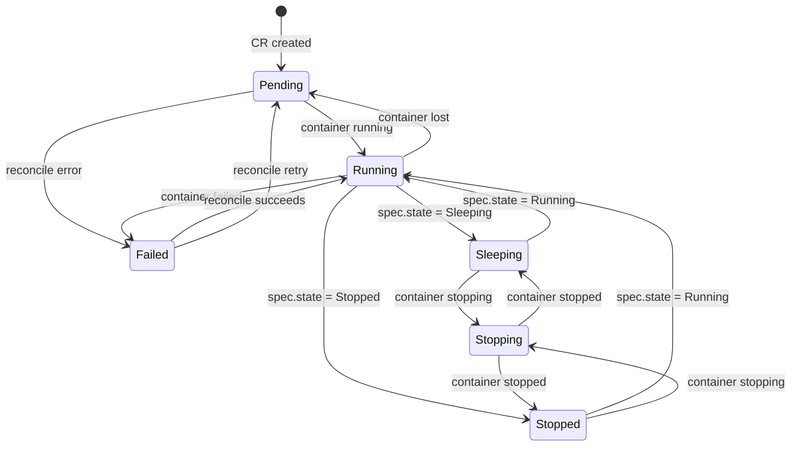

# Architecture Overview

AgentTeams uses a **Manager-Workers architecture** where a central Manager agent orchestrates multiple Worker agents. Communication happens over Matrix IM rooms, with human participants having full visibility. The system is designed so that Workers are stateless and disposable — all state lives in object storage and the Matrix homeserver.

## System Layers

| Layer | Role | Container Images |
|-------|------|-----------------|
| **agentteams-controller** | Go operator: reconciles CRDs, REST API, worker/manager lifecycle | `agentteams-controller` (K8s) or `agentteams-embedded` (local) |
| **Manager** | Coordinator agent: tasks, workers, teams, humans, gateway config | `agentteams-manager` (OpenClaw) or `agentteams-manager-copaw` |
| **Worker** | Task executor: one container per worker, stateless, created on demand | `agentteams-worker`, `agentteams-copaw-worker`, `agentteams-hermes-worker`, `agentteams-openhuman-worker`, `agentteams-qwenpaw-worker` |

The **openclaw-base** image supplies Ubuntu 24.04, Node.js 22, OpenClaw, and mcporter for OpenClaw-based Manager/Worker images. It does not ship infrastructure services — those run in the controller (embedded) or as separate Helm subcharts (Kubernetes).

## Component Relationships


```mermaid
flowchart TB
  subgraph Human["Human"]
    B[Browser / Matrix client]
  end

  subgraph Infra["Infrastructure"]
    HG[Higress Gateway + Console]
    TW[Tuwunel Matrix homeserver]
    MO[MinIO object storage]
    EW[Element Web UI]
  end

  subgraph Control["agentteams-controller"]
    API[REST API :8090]
    REC[Reconcilers: Worker Manager Team Human Project]
  end

  subgraph Agents["Agent containers"]
    M[Manager Agent]
    W1[Worker A]
    W2[Worker B]
    TL[Team Leader optional]
  end

  LLM[LLM providers]
  MCP[MCP servers]

  B --> EW
  B --> TW
  M --> TW
  W1 --> TW
  W2 --> TW
  TL --> TW

  M --> API
  W1 -.->|bundled CLI| API
  HG --> TW
  HG --> MO
  HG --> LLM
  HG --> MCP

  M --> HG
  W1 --> HG
  W2 --> HG
  TL --> HG

  M --> MO
  W1 --> MO
  W2 --> MO
  TL --> MO

  REC --> HG
  REC --> TW
  REC --> MO
  REC --> M
  REC --> W1
  REC --> W2
  REC --> TL
```

Component relationship diagram: Human accesses Element Web and the Matrix homeserver; agents communicate via Matrix rooms; the controller reconciles CRDs and manages infrastructure connections.

## Worker Lifecycle

The controller derives each Worker's lifecycle phase from the desired `spec.state`, the observed container status, and any reconcile error. The `computeMemberPhase` function in `member_reconcile.go` is the single source of truth for both standalone Workers and Team members.


```mermaid
stateDiagram-v2
    [*] --> Pending : CR created
    Pending --> Running : container running
    Pending --> Failed : reconcile error
    Running --> Sleeping : spec.state = Sleeping
    Running --> Stopped : spec.state = Stopped
    Running --> Failed : container failed
    Running --> Pending : container lost
    Sleeping --> Running : spec.state = Running
    Sleeping --> Stopping : container stopping
    Stopping --> Sleeping : container stopped
    Stopping --> Stopped : container stopped
    Stopped --> Running : spec.state = Running
    Stopped --> Stopping : container stopping
    Failed --> Running : reconcile succeeds
    Failed --> Pending : reconcile retry
```

Worker lifecycle states: Pending (provisioning), Running (active), Sleeping (paused, config preserved), Stopped (terminated, config preserved), Stopping (transition), Failed (error, controller retries).

## Deployment Shapes

### Local Single Host (Docker/Podman)

One **embedded** controller container bundles Higress, Tuwunel, MinIO, Element Web, and the controller binary. It creates separate Manager and Worker containers via the Docker/Podman API:

```
+--------------------------- agentteams-controller (embedded) --------------------------+
|  Higress (:8080/...)   Tuwunel (:6167)   MinIO (:9000)   Element+nginx   controller |
|                              controller :8090 (REST)                                 |
+-------------------------------+--------------+----------------------------------------+
                                | API / Docker |
              +-----------------+----------------+------------------+
              |                                  |
       agentteams-manager                 agentteams-worker-*
       (lightweight)                      (lightweight)
```

Install via: `bash <(curl -sSL https://higress.ai/agentteams/install.sh)`

### Kubernetes (Helm)

Each component runs as its own Pod. The controller reconciles Custom Resources to create Manager and Worker pods dynamically:

- **Higress** — Helm subchart (API gateway)
- **Tuwunel** — StatefulSet (Matrix homeserver)
- **MinIO** — StatefulSet (object storage)
- **Element Web** — Deployment (optional web UI)
- **Controller** — Deployment (Go operator)
- **Manager** — Pod created from Manager CR
- **Workers** — Pods created from Worker CRs

Install via: `helm install agt higress.io/agentteams -n agentteams-system`

## Custom Resource Definitions (CRDs)

The controller reconciles five CRD types under the `agentteams.io` API group (`v1beta1`):

| CRD | Purpose | Key Spec Fields |
|-----|---------|----------------|
| **Worker** | AI agent worker | `model`, `runtime`, `image`, `soul`, `skills`, `mcpServers`, `expose`, `channelPolicy`, `state`, `idleTimeout`, `deployMode`, `containerManaged` |
| **Manager** | Coordinator agent | `model`, `runtime`, `image`, `soul`, `agents`, `skills`, `mcpServers`, `state`, `config` (heartbeatInterval, workerIdleTimeout, notifyChannel) |
| **Team** | Group of workers with a leader | `teamName`, `workerMembers`, `humanMembers`, `admin`, `channelPolicy`, `heartbeatEvery`, `peerMentions` |
| **Human** | Human participant | `displayName`, `username`, `permissionLevel` (1=Admin, 2=Team, 3=Worker), `accessibleTeams`, `accessibleWorkers`, `identitySource` |
| **Project** | Team-scoped project with repos | `team`, `projectName`, `repos`, `workers`, `dependsOn` |

All CRDs share common status fields: `phase`, `matrixUserId`, `roomId`, `containerState`. Worker and Manager CRs also carry `state` in spec (Running, Sleeping, Stopped) for lifecycle control.

See [Controller: CRDs & Reconcilers](../controller/crds-and-reconcilers.md) for full type definitions and reconciler logic.

## Communication Pattern

All agent communication happens in Matrix rooms. The pattern is:

1. **Human** creates a Worker CR (or asks the Manager to create one)
2. **Controller** reconciles the CR: provisions Matrix user, creates room, sets up gateway auth, deploys agent config
3. **Worker** joins the Matrix room and starts responding to messages
4. **Manager** can delegate tasks to Workers by mentioning them in rooms
5. **Human** can observe everything and intervene at any time

## Credential Flow

```
Worker ──(consumer token)──► Higress Gateway ──(real API key)──► LLM Provider
                                      │
                                      └──(real PAT/token)──► MCP Servers
```

Workers never see real credentials. The controller provisions a Higress consumer with key-auth, and the gateway injects the real API key on the proxy path. The same consumer token authorizes MCP server calls — the controller translates `spec.mcpServers` into mcporter-servers.json with a Bearer header using the same gateway consumer key.

## Data Flow

```
MinIO (object storage)
├── workspaces/<worker>/         # Agent config, skills, state
├── shared/projects/<project>/   # Project manifests and plans
├── shared/tasks/<task>/         # Task specs and results
└── packages/<worker>/           # Deployed agent packages
```

Workers sync their workspace from MinIO on startup. The `agentteams_sync` Python package handles bidirectional file sync between local workspaces and MinIO. Workers are designed to be replaceable because all durable state lives in the bucket.

## Key Design Principles

- **Human-in-the-loop by default** — every room includes the human, manager, and relevant workers. Full visibility, intervention at any time.
- **Workers are stateless** — destroy and recreate freely; config and artifacts live in MinIO. The controller reconciles actual state toward desired state.
- **Centralized credentials** — Workers use consumer tokens only; real API keys stay in the gateway. Enterprise-grade security without credential exposure.
- **Skills as documentation** — each `SKILL.md` tells the agent how to use an API or tool. Agents load skills from workspace or image paths.
- **Declarative resources** — all Worker, Manager, Team, Human, and Project definitions are Kubernetes CRDs. The `agt` CLI provides operator-facing commands built from the controller REST API.
- **Multi-runtime support** — OpenClaw, CoPaw/QwenPaw, Hermes, and OpenHuman workers coexist in the same Matrix room. Each runtime does what it's best at.

## Source References

- Architecture docs: [`docs/architecture.md`](../../docs/architecture.md)
- K8s-native design: [`docs/k8s-native-agent-orch.md`](../../docs/k8s-native-agent-orch.md)
- CRD definitions: [`agentteams-controller/api/v1beta1/`](../../agentteams-controller/api/v1beta1/)
- Reconcilers: [`agentteams-controller/internal/controller/`](../../agentteams-controller/internal/controller/)
- Backend interface: [`agentteams-controller/internal/backend/interface.go`](../../agentteams-controller/internal/backend/interface.go)
- Helm chart: [`helm/agentteams/`](../../helm/agentteams/)
- Install scripts: [`install/`](../../install/)
- Integration contracts: [Higress, Matrix, MinIO](../integrations/higress-matrix-minio.md)
