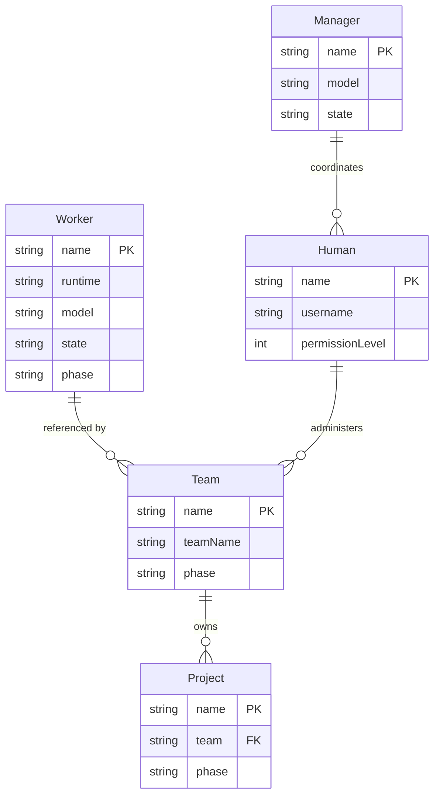
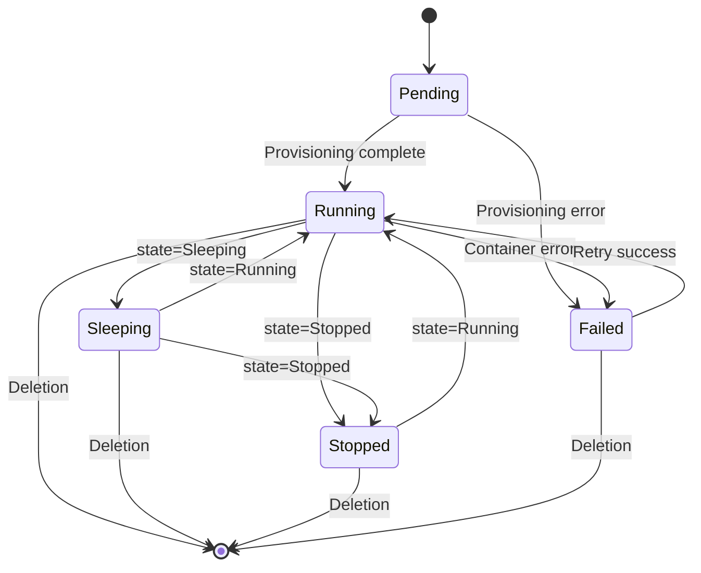

# Controller: CRDs & Reconcilers

The `agentteams-controller` is a Go-based Kubernetes operator that reconciles five Custom Resource Definitions. It runs as a standalone binary and can operate in two modes: as a Kubernetes Deployment (using CRDs) or as an embedded process in a local Docker container (using a simulated CRD store).

## CRD Types

All types are defined under `agentteams.io/v1beta1` in [`agentteams-controller/api/v1beta1/`](../../agentteams-controller/api/v1beta1/).

*CRD entity relationships: Worker referenced by Team, Team owns Project, Human administers Team.*

### Worker (`workers.agentteams.io`)

Represents an AI agent worker. The most feature-rich CRD.

**Key spec fields:**
- `runtime` — Agent framework: `openclaw` (default), `copaw`, `hermes`, `openhuman`, `qwenpaw`
- `model` / `modelProvider` — LLM configuration
- `image` — Container image override
- `workerName` — Display name in Matrix
- `identity` / `soul` — Agent personality and behavior
- `skills` — List of skill packages to deploy
- `remoteSkills` — Skills fetched from Nacos registry
- `mcpServers` — Declarative MCP server configuration
- `package` — Agent package URI (file/http/nacos)
- `expose` — Port exposure configuration
- `channelPolicy` — Matrix channel access rules
- `channels` — Specific Matrix channels to join (including DingTalk integration)
- `resources` — Container resource requests/limits
- `idleTimeout` — Auto-sleep after inactivity
- `state` — Lifecycle state: `Running`, `Sleeping`, `Stopped`
- `deployMode` — `Local`, `Remote`, or `Edge`
- `env` — Custom environment variables
- `volumes` / `mounts` — Storage configuration (OSS volumes)
- `containerManaged` — Whether controller manages container lifecycle (default true)
- `backendRuntime` — Container runtime backend: `pod` (default) or `sandbox`
- `serviceEnabled` — Whether to create a ClusterIP Service alongside the pod
- `accessEntries` — Cloud permission grants via agentteams-credential-provider
- `agentIdentity` — Non-secret workload identity metadata
- `credentialBindings` — Credential references available to worker runtime
- `labels` — User-defined Pod labels (merged under four-layer priority)

**Status fields:** `phase`, `matrixUserId`, `roomId`, `containerState`, `heartbeatInfo`, `healthState`, `specHash`, `deployMode`, `backendRuntime`, `recentEvents`

**Source:** [`types.go`](../../agentteams-controller/api/v1beta1/types.go)

### Manager (`managers.agentteams.io`)

Represents the coordinator agent that receives natural-language instructions from Admin and orchestrates Workers/Teams.

**Key spec fields:**
- `runtime` — `openclaw` (default) or `copaw`
- `model` / `modelProvider` — LLM configuration
- `image` — Container image
- `soul` / `agents` — Agent personality
- `skills` — Manager skills to deploy
- `mcpServers` — MCP server configuration
- `state` — `Running`, `Sleeping`, `Stopped`
- `accessEntries` — Cloud permission grants
- `config` — Manager configuration (heartbeat interval, worker idle timeout, notify channel)
- `env` — Custom environment variables
- `labels` — User-defined Pod labels

**Status fields:** `phase`, `matrixUserId`, `roomId` (Admin DM), `containerState`, `welcomeSent`, `specHash`

**Source:** [`types.go`](../../agentteams-controller/api/v1beta1/types.go)

### Team (`teams.agentteams.io`)

Groups workers under a team with coordination rules.

**Key spec fields:**
- `teamName` — Team identifier
- `workerMembers` — References to existing Worker CRs with roles (team_leader/worker)
- `humanMembers` — Human participants
- `admin` — Team administrator (references Human CR)
- `channelPolicy` — Team-wide channel rules
- `heartbeatEvery` — Heartbeat interval for team leader
- `peerMentions` — Cross-worker mention rules (default true)
- `leader` — Deprecated: team leader runtime configuration
- `workers` — Deprecated: inline worker definitions

**Status fields:** `phase`, `teamRoomId`, `leaderDmRoomId`, `leaderReady`, `readyWorkers`, `totalWorkers`, `members` (per-member state)

**Source:** [`types.go`](../../agentteams-controller/api/v1beta1/types.go)

### Human (`humans.agentteams.io`)

Represents a human participant.

**Key spec fields:**
- `username` — Matrix username
- `displayName` — Display name
- `email` — Email address
- `permissionLevel` — 1=Admin, 2=Team, 3=Worker
- `accessibleTeams` — Teams this human can access
- `accessibleWorkers` — Workers this human can access
- `identitySource` — Authentication source (legacy/external SSO)

**Status fields:** `phase`, `matrixUserId`, `initialPassword`, `rooms`, `emailSent`

**Source:** [`types.go`](../../agentteams-controller/api/v1beta1/types.go)

### Project (`projects.agentteams.io`)

Represents a team-scoped project with repositories and worker assignments.

**Key spec fields:**
- `team` — Owning team (required)
- `projectName` — Project identifier (immutable DNS-safe storage identity)
- `description` — Project description
- `repos` — Repository references with access level (rw/ro)
- `workers` — Assigned workers (runtime-names; empty = all team members)
- `dependsOn` — Project dependencies (for DAG ordering)

**Status fields:** `phase`, `storageKey`, `repoCount`, `recordedWorkers`, `dependencies`, conditions: `StorageIdentityReady`, `ReposResolved`, `WorkersRecorded`, `MinIOProjected`, `ArchiveProjected`, `LeaderNotified`, `DeprovisionPending`

**Source:** [`project_types.go`](../../agentteams-controller/api/v1beta1/project_types.go)

## Shared Types

Common types defined in [`types.go`](../../agentteams-controller/api/v1beta1/types.go):
- `AgentResourceRequirements` — CPU/memory requests and limits
- `MCPServer` — MCP server connection configuration (name, URL, transport)
- `AccessEntry` — Cloud permission grants (service, permissions, scope)
- `ChannelPolicySpec` — Matrix channel access rules (allow/deny lists)
- `ExposePort` — Port exposure configuration (port, protocol)
- `RemoteSkillSource` — Remote skill sources with auth configuration
- `CredentialBinding` — Credential references with tool whitelists
- `AgentIdentitySpec` — Workload identity metadata

## Reconcilers

All reconcilers live in [`agentteams-controller/internal/controller/`](../../agentteams-controller/internal/controller/).

### WorkerReconciler (`worker_controller.go`)

Reconciles standalone Worker resources (team members are handled by TeamReconciler).

*Worker lifecycle phases: Pending, Running, Sleeping, Stopped, Failed.*

**Key operations:**
1. Manages finalizers for cleanup on deletion
2. Provisions infrastructure: Matrix user, rooms, gateway consumers
3. Deploys packages and configs to MinIO
4. Handles lifecycle state transitions (Running/Sleeping/Stopped)
5. Manages edge worker heartbeat timeouts
6. Monitors health states via HealthMonitorController
7. Validates immutable deployment target (Local/Remote/Edge)

**Reconcile flow:**
1. Fetch Worker CR and compute patch base
2. Handle deletion (finalizer cleanup) or add finalizer
3. Build `MemberContext` from Worker spec
4. Resolve model provider info if configured
5. For Edge workers: handle UUID rotation and lightweight provisioning
6. For Local workers: execute full reconcile phases:
   - `ReconcileMemberInfra` — Matrix/gateway credentials
   - `EnsureModelProviderAuth` — Gateway consumer setup
   - `EnsureMemberServiceAccount` — SA lifecycle
   - `ReconcileMemberConfig` — Runtime configuration
   - `ReconcileMemberContainer` — Backend pod/container
   - `ReconcileMemberService` — ClusterIP Service
   - `ReconcileMemberExpose` — Port exposure via Higress
7. Apply status updates and requeue

### TeamReconciler (`team_controller.go`)

Reconciles Team resources that reference existing Worker CRs.

**Key operations:**
1. Creates team rooms (main room, leader DM, admin DM)
2. Provisions team members (leader + workers) into rooms
3. Injects coordination context and runtime configs
4. Handles team-wide channel policies
5. Manages team lifecycle and member states
6. Handles worker member decoupling (legacy vs decoupled mode)
7. Resolves team admin actor from Human CR

**Supporting files:**
- `team_members_decoupled.go` — New member management via Worker CR references
- `team_members_legacy.go` — Legacy inline worker definitions
- `team_channel_policy.go` — Channel policy enforcement
- `team_rooms.go` — Room creation and management
- `team_runtime_config.go` — Runtime configuration injection
- `team_status.go` — Status updates

### ManagerReconciler (`manager_controller.go`)

Reconciles Manager resources.

**Key operations:**
1. Provisions manager containers
2. Manages admin DM rooms
3. Handles welcome messages and onboarding (idempotent via `welcomeSent` flag)
4. Manages gateway auth and credentials
5. Validates gateway auth readiness before sending welcome

### HumanReconciler (`human_controller.go`)

Reconciles Human resources.

**Key operations:**
1. Creates/updates Matrix accounts for humans
2. Manages room memberships based on accessibleTeams/Workers
3. Syncs display names
4. Handles identity sources (legacy/SSO)
5. Manages initial password generation and display

### ProjectReconciler (`project_controller.go`)

Reconciles Project resources.

**Key operations:**
1. Ensures storage identity (MinIO paths)
2. Manages project `manifest.json`
3. Handles project dependencies (DAG ordering)
4. Manages archive/completion states
5. Sets conditions: `StorageIdentityReady`, `ReposResolved`, `WorkersRecorded`, `MinIOProjected`

### AutoSleepController (`auto_sleep_controller.go`)

Monitors worker heartbeats and auto-sleeps idle workers.

### HealthMonitorController (`health_monitor_controller.go`)

Monitors worker health states: healthy, stalled, zombie, idle. Reports findings for the dashboard status view.

## Service Layers

Services in [`agentteams-controller/internal/service/`](../../agentteams-controller/internal/service/) provide the core logic used by reconcilers.

### Provisioner (`provisioner.go`)

Orchestrates infrastructure provisioning:
- `ProvisionWorker` / `DeprovisionWorker` — Full worker lifecycle
- `ProvisionManager` / `DeprovisionManager` — Manager lifecycle
- `EnsureWorkerGatewayAuth` / `EnsureManagerGatewayAuth` — Gateway consumer setup
- Credential management: Matrix tokens, gateway keys, MinIO passwords, STS tokens
- `ProvisionTeamRooms` / `ArchiveTeamRooms` — Team room lifecycle
- `ReconcileExpose` — Port exposure management
- `EnsureServiceAccount` / `DeleteServiceAccount` — SA lifecycle
- `LeaveAllWorkerRooms` / `LeaveAllManagerRooms` — Cleanup operations

**Specialized files:**
- `credentials.go` — Credential generation and rotation
- `provisioner_human.go` — Human-specific provisioning
- `provisioner_sa.go` — ServiceAccount token management
- `provisioner_expose.go` — Port exposure logic
- `room_meta.go` — Room metadata management

### Deployer (`deployer.go`)

Handles config deployment and package management:
- `DeployPackage` — Deploy agent packages (file/http/nacos URIs)
- `WriteInlineConfigs` — Write inline configuration files
- `DeployMemberRuntimeConfig` — Per-member runtime configuration
- `InjectCoordinationContext` — Team coordination context injection
- `PushOnDemandSkills` — Push skills to workers on demand
- `PrepareWorkerDeps` — Prepare worker dependencies
- `DeployWorkerConfig` — Worker configuration deployment
- `DeployManagerConfig` — Manager configuration deployment
- `InjectHeartbeatConfig` / `InjectChannelPolicy` — Team configuration
- `SyncTeamLeaderAssets` / `EnsureTeamStorage` — Team storage management

**Specialized files:**
- `deployer_coordination.go` — Team coordination injection
- `deployer_manager.go` — Manager-specific deployment
- `deployer_merge.go` — Config merging logic
- `deployer_remote_skills.go` — Remote skill fetching from Nacos
- `deployer_worker_config.go` — Worker configuration deployment
- `runtime_config.go` — Runtime configuration generation

### Interfaces (`interfaces.go`)

Defines service interfaces for testability:
- `WorkerProvisioner` / `WorkerDeployer` — Worker lifecycle operations
- `ManagerProvisioner` / `ManagerDeployer` — Manager lifecycle operations
- `HumanProvisioner` — Human Matrix account operations
- `WorkerEnvBuilderI` / `ManagerEnvBuilderI` — Environment map construction

## Backend Abstraction

The backend layer abstracts container runtime operations across different environments.

### Registry (`registry.go`)

Manages available backends with auto-detection:
- `DetectWorkerBackend` — Returns first available backend (Docker → K8s → nil)
- `GetWorkerBackend` — Get specific backend by name
- `GetBackendForType` — Get backend for `backendRuntime` type (`pod` → `k8s`, `sandbox` → `sandbox`)
- `FindServiceBackend` — Find backend implementing `ServiceBackend`

### WorkerBackend Interface (`interface.go`)

Defines the contract for container operations:
- `Name()` — Backend identifier ("docker", "k8s", "sandbox")
- `DeploymentMode()` — User-facing mode ("local" or "cloud")
- `Available()` — Whether backend is usable
- `Create()` — Create and start worker container
- `Delete()` — Remove worker container
- `Start()` / `Stop()` — Lifecycle control
- `Status()` — Current worker status

### Implementations

- **DockerBackend** (`docker.go`) — Local Docker container management
- **KubernetesBackend** (`kubernetes.go`) — Kubernetes Pod management (incluster mode)
- **SandboxBackend** (`sandbox.go`) — OpenKruise Sandbox-based runtime

## Gateway Integration

Gateway clients in [`agentteams-controller/internal/gateway/`](../../agentteams-controller/internal/gateway/) abstract different gateway backends.

### HigressClient (`higress.go`)

Manages self-hosted Higress gateway via Console API:
- Session management (login, password changes)
- Consumer management (create/delete)
- AI route authorization
- Port exposure for workers
- Service source and route management

### AIGatewayClient (`aigateway.go`)

Manages Alibaba Cloud APIG:
- Consumer management via APIG SDK
- Authorization rules
- Model API binding

### Client Interface (`client.go`)

Unified interface:
- `ConsumerClient` — `EnsureConsumer`, `DeleteConsumer`, `AuthorizeAIRoutes`, `DeauthorizeAIRoutes`
- `PortExposeClient` — `ExposePort`, `UnexposePort`
- `InfrastructureClient` — `EnsureServiceSource`, `EnsureRoute`, `EnsureAIProvider`, `EnsureAIRoute`
- `ModelProviderClient` — `ResolveModelProvider`, `ListAIProviders`, `GetAIProvider`
- `HealthClient` — `Healthy` (gateway console reachability)

## Matrix Integration

Matrix clients in [`agentteams-controller/internal/matrix/`](../../agentteams-controller/internal/matrix/):

### Client Interface (`client.go`)

Comprehensive Matrix homeserver operations:
- **User management:** `EnsureUser`, `Login`, `SetDisplayName`, `SetPasswordAsAdmin`
- **Room operations:** `CreateRoom`, `ResolveRoomAlias`, `DeleteRoomAlias`, `SetRoomName`, `SetRoomState`
- **Membership:** `JoinRoom`, `LeaveRoom`, `InviteToRoom`, `KickFromRoom`, `ForceLeaveRoom`
- **Messaging:** `SendMessage`, `SendMessageAsAdmin`, `SyncMessages`
- **AppService:** `EnsureAppServiceUser`, `LoginAppServiceUser`, `RegisterAppService`, `UnregisterAppService`
- **Admin operations:** `AdminCommand`, `ListJoinedRooms`, `ListRoomMembers`

### Supporting Files

- `types.go` — Matrix API types and request/response structures
- `appservice.go` — Application Service registration and management

## Package Organization

<!-- openwiki: broken internal link [../../agentteams-controller/internal/AGENTS.md] file "../../agentteams-controller/internal/AGENTS.md" does not exist. Fix the href or restore the target, then delete this comment. -->
The internal package map is documented in [`agentteams-controller/internal/AGENTS.md`](../../agentteams-controller/internal/AGENTS.md). Key packages:

| Package | Purpose |
|---------|---------|
| `controller/` | Reconciler implementations |
| `service/` | Provisioner and deployer logic |
| `gateway/` | Higress/AIGateway client abstraction |
| `matrix/` | Matrix homeserver client |
| `server/` | REST API handlers |
| `backend/` | Container backend (Docker/Podman/K8s) |
| `config/` | Configuration loading and derivation |
| `agentconfig/` | Agent config file generation |
| `metrics/` | Prometheus metrics |
| `managerstate/` | Manager task board state |
| `workerdeps/` | Worker dependency manifests |
| `auth/` | Authentication and authorization |

## Source References

- CRD types: [`agentteams-controller/api/v1beta1/`](../../agentteams-controller/api/v1beta1/)
- Reconcilers: [`agentteams-controller/internal/controller/`](../../agentteams-controller/internal/controller/)
- Services: [`agentteams-controller/internal/service/`](../../agentteams-controller/internal/service/)
- Gateway: [`agentteams-controller/internal/gateway/`](../../agentteams-controller/internal/gateway/)
- Matrix: [`agentteams-controller/internal/matrix/`](../../agentteams-controller/internal/matrix/)
- Backend: [`agentteams-controller/internal/backend/`](../../agentteams-controller/internal/backend/)
<!-- openwiki: broken internal link [../../agentteams-controller/internal/AGENTS.md] file "../../agentteams-controller/internal/AGENTS.md" does not exist. Fix the href or restore the target, then delete this comment. -->
- Package map: [`agentteams-controller/internal/AGENTS.md`](../../agentteams-controller/internal/AGENTS.md)
