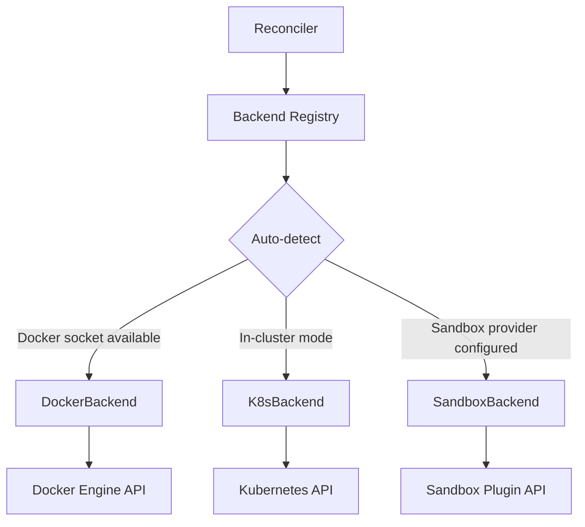

# Controller: CRDs & Reconcilers

The `agentteams-controller` is a Go-based Kubernetes operator that reconciles five Custom Resource Definitions. It runs as a standalone binary and can operate in two modes: as a Kubernetes Deployment (using CRDs) or as an embedded process in a local Docker container (using a simulated CRD store).

## CRD Types

All types are defined under `agentteams.io/v1beta1` in [`agentteams-controller/api/v1beta1/`](../../agentteams-controller/api/v1beta1/).

### Worker (`workers.agentteams.io`)

Represents an AI agent worker. The most feature-rich CRD.

**Key spec fields:**
- `model` / `modelProvider` — LLM configuration
- `runtime` — Agent framework: `openclaw` (default), `copaw`, `hermes`, `openhuman`, `qwenpaw`
- `image` — Container image override
- `workerName` — Display name in Matrix
- `identity` / `soul` / `agents` — Agent personality and behavior
- `skills` — List of skill packages to deploy
- `remoteSkills` — Skills fetched from Nacos registry
- `mcpServers` — Declarative MCP server configuration
- `package` — Agent package URI (file/http/nacos)
- `expose` — Port exposure configuration
- `channelPolicy` — Matrix channel access rules
- `channels` — Specific Matrix channels to join
- `resources` — Container resource requests/limits
- `idleTimeout` — Auto-sleep after inactivity
- `state` — Lifecycle state: `Running` (default), `Sleeping`, `Stopped`
- `deployMode` — `Local` (default), `Edge`
- `backendRuntime` — Container runtime backend: `pod` (default), `sandbox`
- `containerManaged` — Whether controller manages container lifecycle (default: true)
- `serviceEnabled` — Whether to create a ClusterIP Service
- `env` — Custom environment variables
- `labels` — User-defined Pod labels
- `accessEntries` — Cloud permissions via credential-provider
- `agentIdentity` — Workload identity metadata
- `credentialBindings` — Credential references for runtime
- `volumes` / `mounts` — Storage configuration (reserved for OSS volumes)

**Status fields:** `phase`, `matrixUserID`, `roomID`, `containerState`, `lastHeartbeat`, `lastActiveAt`, `healthState`, `backendRuntime`, `deployMode`, `specHash`, `exposedPorts`, `recentEvents`

**Source:** [`worker_types.go`](../../agentteams-controller/api/v1beta1/types.go#L168-L258)

### Manager (`managers.agentteams.io`)

Represents the coordinator agent.

**Key spec fields:**
- `model` / `modelProvider` — LLM configuration
- `runtime` — `openclaw` (default), `copaw`, `hermes`
- `image` — Container image
- `soul` / `agents` — Agent personality
- `skills` — Manager skills to deploy
- `mcpServers` — MCP server configuration
- `package` — Agent package URI
- `state` — `Running` (default), `Sleeping`, `Stopped`
- `accessEntries` — Cloud permissions
- `config` — Manager-specific configuration (heartbeat interval, worker idle timeout, notify channel)
- `resources` — Container resource requests/limits
- `env` — Custom environment variables
- `labels` — User-defined Pod labels

**Status fields:** `phase`, `matrixUserID`, `roomID`, `containerState`, `version`, `welcomeSent`, `specHash`

**Source:** [`manager_types.go`](../../agentteams-controller/api/v1beta1/types.go#L772-L855)

### Team (`teams.agentteams.io`)

Groups workers under a team with coordination rules.

**Key spec fields:**
- `teamName` — Team identifier
- `workerMembers` — References to existing Worker CRs with roles (team_leader/worker)
- `humanMembers` — Human participants
- `admin` — Team administrator
- `channelPolicy` — Team-wide channel rules
- `heartbeatEvery` — Heartbeat interval
- `peerMentions` — Cross-worker mention rules (default: true)
- `description` — Team description

**Legacy fields (deprecated):** `leader`, `workers` — Retained for backward compatibility, ignored when `workerMembers` is non-empty.

**Status fields:** `phase`, `teamRoomID`, `leaderDMRoomID`, `leaderReady`, `readyWorkers`, `totalWorkers`, `members` (per-member state array)

**Source:** [`team_types.go`](../../agentteams-controller/api/v1beta1/types.go#L437-L708)

### Human (`humans.agentteams.io`)

Represents a human participant.

**Key spec fields:**
- `displayName` — Display name
- `username` — Matrix username
- `email` — Email address
- `permissionLevel` — 1=Admin, 2=Team, 3=Worker
- `accessibleTeams` — Teams this human can access
- `accessibleWorkers` — Workers this human can access
- `identitySource` — Authentication source (issuer/subject)
- `note` — Optional note

**Status fields:** `phase`, `matrixUserID`, `initialPassword`, `displayNameSyncedGeneration`, `rooms`, `emailSent`

**Source:** [`human_types.go`](../../agentteams-controller/api/v1beta1/types.go#L715-L763)

### Project (`projects.agentteams.io`)

Represents a team-scoped project with repositories and worker assignments.

**Key spec fields:**
- `team` — Owning team (required)
- `projectName` — Project identifier (immutable DNS-safe storage identity)
- `description` — Project description
- `repos` — Repository references with access level (rw/ro)
- `workers` — Assigned workers (runtime-names; empty = all team members)
- `dependsOn` — Project dependencies (for DAG ordering)

**Status fields:** `phase`, `storageKey`, `repoCount`, `recordedWorkers`, `dependencies`, `conditions` (`StorageIdentityReady`, `ReposResolved`, `WorkersRecorded`, `MinIOProjected`, `ArchiveProjected`, `LeaderNotified`, `DeprovisionPending`)

**Source:** [`project_types.go`](../../agentteams-controller/api/v1beta1/project_types.go)

## Shared Types

Common types defined in [`types.go`](../../agentteams-controller/api/v1beta1/types.go):
- `AccessEntry` — Cloud permission grants (service, permissions, scope)
- `AgentIdentitySpec` — Workload identity metadata
- `CredentialRef` / `CredentialBinding` — Runtime credential references
- `MCPServer` — MCP server connection configuration
- `RemoteSkillSource` — Remote skill fetching configuration
- `AgentResourceRequirements` — CPU/memory requests and limits
- `ChannelPolicySpec` — Matrix channel access rules
- `ExposePort` — Port exposure configuration
- `BackendRuntime` constants — `pod` (default), `sandbox`
- `DeployMode` constants — `Local`, `Remote`, `Edge`

## Reconcilers

All reconcilers live in [`agentteams-controller/internal/controller/`](../../agentteams-controller/internal/controller/).

### WorkerReconciler (`worker_controller.go`)

Reconciles standalone Worker resources. Team members are owned by Team CRs and reconciled by TeamReconciler through shared member_reconcile helpers.

**Key operations:**
1. Manages finalizers for cleanup on deletion
2. Provisions infrastructure: Matrix user, rooms, gateway consumers
3. Deploys packages and configs to MinIO
4. Handles lifecycle state transitions (Running/Sleeping/Stopped)
5. Manages edge worker heartbeat timeouts
6. Monitors health states via HealthMonitorController

**Supporting files:**
- `member_reconcile.go` — Shared member reconciliation logic (used by both WorkerReconciler and TeamReconciler)
- `member_reconcile_service.go` — Service management for members

### TeamReconciler (`team_controller.go`)

Reconciles Team resources that reference existing Worker CRs through `spec.workerMembers`.

**Key operations:**
1. Creates team rooms (main room, leader DM, admin DM)
2. Provisions team members (leader + workers) into rooms
3. Injects coordination context and runtime configs
4. Handles team-wide channel policies
5. Manages team lifecycle and member states
6. Handles worker member decoupling (legacy vs decoupled mode)

**Supporting files:**
- `member_reconcile.go` — Shared member reconciliation logic
- `member_reconcile_service.go` — Service management for team members
- `team_controller_test.go` — Comprehensive test suite

### ManagerReconciler (`manager_controller.go`)

Reconciles Manager resources.

**Key operations:**
1. Provisions manager containers
2. Manages admin DM rooms
3. Handles welcome messages and onboarding
4. Manages gateway auth and credentials

**Supporting files:**
- `manager_reconcile_container.go` — Container lifecycle management
- `manager_reconcile_welcome.go` — Onboarding and welcome logic
- `manager_reconcile_infra.go` — Infrastructure provisioning
- `manager_reconcile_config.go` — Configuration deployment

### HumanReconciler (`human_controller.go`)

Reconciles Human resources.

**Key operations:**
1. Creates/updates Matrix accounts for humans
2. Manages room memberships based on accessibleTeams/Workers
3. Syncs display names
4. Handles identity sources

**Supporting files:**
- `human_reconcile_infra.go` — Infrastructure provisioning
- `human_reconcile_rooms.go` — Room membership management
- `human_reconcile_legacy.go` — Legacy compatibility
- `humanidentity/` — Identity provider abstraction

### ProjectReconciler (`project_controller.go`)

Reconciles Project resources.

**Key operations:**
1. Ensures storage identity (MinIO paths)
2. Manages project `manifest.json`
3. Handles project dependencies
4. Manages archive/completion states

### AutoSleepController (`auto_sleep_controller.go`)

Monitors worker heartbeats and auto-sleeps idle workers. Runs as a standalone goroutine that periodically checks all workers in the namespace and sets `state=Sleeping` for those that exceed their `idleTimeout`.

### HealthMonitorController (`health_monitor_controller.go`)

Monitors worker health states: healthy, stalled, zombie, idle. Reports findings for the dashboard status view.

## Backend Abstraction

The backend layer abstracts container lifecycle operations across different infrastructure providers. All backends implement the `WorkerBackend` interface defined in [`agentteams-controller/internal/backend/interface.go`](../../agentteams-controller/internal/backend/interface.go).



### WorkerBackend Interface

The `WorkerBackend` interface defines the contract for worker lifecycle operations:

```go
type WorkerBackend interface {
    Name() string
    DeploymentMode() string
    Available(ctx context.Context) bool
    NeedsCredentialInjection() bool
    Create(ctx context.Context, req CreateRequest) (*WorkerResult, error)
    Delete(ctx context.Context, name string) error
    Start(ctx context.Context, name string) error
    Stop(ctx context.Context, name string) error
    Status(ctx context.Context, name string) (*WorkerResult, error)
}
```

### DockerBackend (`docker.go`)

Manages worker containers via the Docker Engine API over a Unix socket. Used in embedded mode.

**Key features:**
- Direct Docker socket communication
- Container lifecycle management (create, start, stop, delete)
- Port mapping and network configuration
- Volume mounts and resource limits
- Health monitoring via Docker API

**Configuration:** `DockerConfig` with socket path, worker images, default resources, network settings.

### KubernetesBackend (`kubernetes.go`)

Manages worker pods in Kubernetes clusters. Used in incluster mode.

**Key features:**
- Pod creation with OwnerReferences for garbage collection
- ServiceAccount token projection for authentication
- Pod template overlay via ConfigMap
- Service creation when `serviceEnabled=true`
- Resource quota enforcement

**Configuration:** `K8sConfig` with namespace, worker images, default resources, controller name.

### SandboxBackend (`sandbox.go`)

Manages worker lifecycle via sandbox providers (e.g., OpenKruise Agent Sandbox). Used for sandboxed workloads.

**Key features:**
- SandboxClaim creation for isolated execution
- SandboxSet management for pre-warmed pools
- Dynamic volume mounts for worker dependencies
- Hibernate/resume capabilities
- Provider plugin architecture

**Configuration:** `SandboxConfig` with namespace, provider type, agent runtime image, prewarm size.

### Backend Registry (`registry.go`)

The `Registry` manages backend selection and detection:

```go
type Registry struct {
    workerBackends []WorkerBackend
}
```

**Detection priority:**
1. Docker backend (socket available)
2. K8s backend (incluster mode)
3. Sandbox backend (provider configured)

**Key methods:**
- `DetectWorkerBackend(ctx)` — Returns first available backend
- `GetWorkerBackend(ctx, name)` — Get specific backend by name
- `GetBackendForType(ctx, backendRuntime)` — Get backend by runtime type

### Sandbox Plugin System

The sandbox backend uses a plugin architecture for provider implementations:

```go
type SandboxPlugin interface {
    Type() string
    Capabilities(config ProviderConfig) ProviderCapabilities
    CreateSandboxClaim(ctx context.Context, spec SandboxClaimSpec, config ProviderConfig) (SandboxHandle, error)
    DeleteSandboxClaim(ctx context.Context, claimID string, config ProviderConfig) error
    // ... other lifecycle methods
}
```

**Current implementation:** OpenKruise plugin (`sandbox/openkruise.go`)

## Service Layers

Services in [`agentteams-controller/internal/service/`](../../agentteams-controller/internal/service/) provide the core logic used by reconcilers.

### Provisioner (`provisioner.go`)

Orchestrates infrastructure provisioning:
- `ProvisionWorker` / `DeprovisionWorker` — Full worker lifecycle
- `ProvisionManager` / `DeprovisionManager` — Manager lifecycle
- `EnsureWorkerGatewayAuth` / `EnsureManagerGatewayAuth` — Gateway consumer setup
- Credential management: Matrix tokens, gateway keys, MinIO passwords, STS tokens

**Specialized files:**
- `provisioner_expose.go` — Port exposure management
- `provisioner_human.go` — Human user provisioning
- `provisioner_sa.go` — ServiceAccount management
- `credentials.go` — Credential generation and rotation

### Deployer (`deployer.go`)

Handles config deployment and package management:
- `DeployPackage` — Deploy agent packages (file/http/nacos URIs)
- `WriteInlineConfigs` — Write inline configuration files
- `DeployMemberRuntimeConfig` — Per-member runtime configuration
- `InjectCoordinationContext` — Team coordination context injection
- `PushOnDemandSkills` — Push skills to workers on demand
- `PrepareWorkerDeps` — Prepare worker dependencies
- `CleanupOSSData` — Clean up object storage data

### Interfaces (`interfaces.go`)

Defines service interfaces for testability:
- `WorkerProvisioner` / `WorkerDeployer` — Worker operations
- `ManagerProvisioner` / `ManagerDeployer` — Manager operations
- `HumanProvisioner` — Human operations
- `WorkerEnvBuilderI` / `ManagerEnvBuilderI` — Environment construction

## Gateway Integration

Gateway clients in [`agentteams-controller/internal/gateway/`](../../agentteams-controller/internal/gateway/) abstract different gateway backends.

### HigressClient (`higress.go`)

Manages self-hosted Higress gateway via Console API:
- Session management (login, password changes)
- Consumer management (create/delete)
- AI route authorization
- Port exposure for workers
- Service source and route management

### AIGatewayClient (`aigateway.go`)

Manages Alibaba Cloud APIG:
- Consumer management via APIG SDK
- Authorization rules
- Model API binding

### Client Interface (`client.go`)

Unified interface:
- `ConsumerClient` — `EnsureConsumer`, `DeleteConsumer`, `AuthorizeAIRoutes`
- `PortExposeClient` — `ExposePort`, `UnexposePort`
- `InfrastructureClient` — `EnsureServiceSource`, `EnsureRoute`, `EnsureAIProvider`

## Matrix Integration

Matrix clients in [`agentteams-controller/internal/matrix/`](../../agentteams-controller/internal/matrix/):
- `client.go` — Base client setup
- `client_http.go` — HTTP-level Matrix API calls
- `client_messages.go` — Message sending
- `client_rooms.go` — Room creation and management
- `client_users.go` — User provisioning

## Package Organization

<!-- openwiki: broken internal link [../../agentteams-controller/internal/AGENTS.md] file "../../agentteams-controller/internal/AGENTS.md" does not exist. Fix the href or restore the target, then delete this comment. -->
The internal package map is documented in [`agentteams-controller/internal/AGENTS.md`](../../agentteams-controller/internal/AGENTS.md). Key packages:

| Package | Purpose |
|---------|---------|
| `controller/` | Reconciler implementations |
| `service/` | Provisioner and deployer logic |
| `gateway/` | Higress/AIGateway client abstraction |
| `matrix/` | Matrix homeserver client |
| `server/` | REST API handlers |
| `backend/` | Container backend abstraction (Docker/K8s/Sandbox) |
| `config/` | Configuration loading and derivation |
| `agentconfig/` | Agent config file generation |
| `metrics/` | Prometheus metrics |
| `managerstate/` | Manager task board state |
| `workerdeps/` | Worker dependency manifests |
| `oss/` | Object storage client |

## Source References

- CRD types: [`agentteams-controller/api/v1beta1/`](../../agentteams-controller/api/v1beta1/)
- Reconcilers: [`agentteams-controller/internal/controller/`](../../agentteams-controller/internal/controller/)
- Services: [`agentteams-controller/internal/service/`](../../agentteams-controller/internal/service/)
- Backend: [`agentteams-controller/internal/backend/`](../../agentteams-controller/internal/backend/)
- Gateway: [`agentteams-controller/internal/gateway/`](../../agentteams-controller/internal/gateway/)
- Matrix: [`agentteams-controller/internal/matrix/`](../../agentteams-controller/internal/matrix/)
<!-- openwiki: broken internal link [../../agentteams-controller/internal/AGENTS.md] file "../../agentteams-controller/internal/AGENTS.md" does not exist. Fix the href or restore the target, then delete this comment. -->
- Package map: [`agentteams-controller/internal/AGENTS.md`](../../agentteams-controller/internal/AGENTS.md)
