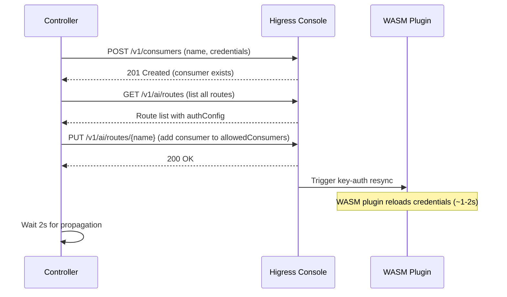
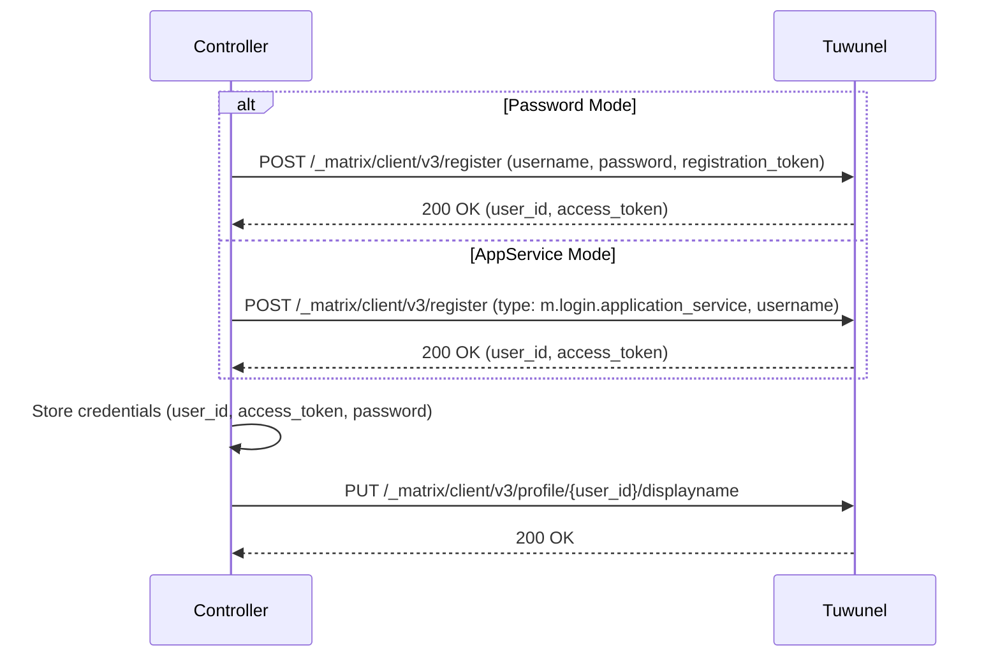

# Integration Contracts: Higress, Matrix, MinIO

This page documents the detailed integration contracts between the agentteams-controller and the three core infrastructure components: Higress AI Gateway, Matrix/Tuwunel homeserver, and MinIO/OSS object storage. Each section covers the lifecycle, authentication model, API contracts, and operational semantics.

## 1. Higress AI Gateway

Higress serves as the AI gateway providing LLM proxy, consumer authentication, route management, and MCP server hosting. The controller interacts with Higress via two distinct providers: **self-hosted Higress Console API** and **Alibaba Cloud APIG**.

### Consumer Lifecycle

The consumer lifecycle manages API key authentication for workers and managers. Consumers represent authenticated clients that can access AI routes.



**Self-Hosted Higress (`HigressClient`)**:
- **Endpoint**: `http://higress-console:8001` (session-based auth)
- **Session Management**: Login via `POST /session/login`, caches session cookies
- **Password Bootstrap**: On first boot, initializes admin via `POST /system/init`, then converges from default `admin/admin` to configured password
- **Consumer CRUD**: `POST /v1/consumers` (idempotent, 409 if exists), `DELETE /v1/consumers/{name}` (idempotent)

**Alibaba Cloud APIG (`AIGatewayClient`)**:
- **Endpoint**: `apig.{region}.aliyuncs.com` (Alibaba Cloud SDK auth)
- **Consumer Naming**: Prefixed with gateway ID (`{gatewayID}-{name}`) to avoid collisions
- **API Key**: System-generated via `CreateConsumer`, retrieved via `GetConsumer`
- **Unsupported Operations**: Route management, service sources, AI providers (managed out-of-band)

### Consumer Authentication Model

The gateway implements a **consumer-token model** where:
- Workers receive **consumer API keys** (gateway-generated or controller-provided)
- **Real provider API keys** stay in the gateway (never exposed to workers)
- The key-auth WASM plugin validates bearer tokens against allowed consumers
- Authorization is per-route: consumers must be in `authConfig.allowedConsumers`

### Route Authorization

Routes control which consumers can access which AI providers. Authorization is managed via `allowedConsumers` lists on AI routes.

**Key Behaviors**:
- `AuthorizeAIRoutes(consumerName, modelAPIID)`: Adds consumer to route's allowed list; when `modelAPIID` is specified, authorizes only on matching routes
- `DeauthorizeAIRoutes(consumerName, modelAPIID)`: Removes consumer from routes
- **Idempotency**: `PUT` always triggers WASM resync even if consumer already in list (handles race where consumer created after route write)
- **Retry Logic**: Handles 409 conflicts with exponential backoff (3 retries with random 1-3s delays)

**Provider-Specific Routes**:
- Provider-specific routes (`agentteams-{provider}-route`) use `modelPredicate` to match model prefixes (e.g., `ollama/`)
- `modelMapping` strips provider prefix before forwarding upstream (e.g., `ollama/gpt-oss:120b` → `gpt-oss:120b`)
- Regex keys (prefixed with `~`) with capture groups for flexible rewriting

### AI Provider Management

AI providers represent upstream LLM endpoints. The controller manages provider lifecycle via the Higress Console API.

**Provider Configuration**:
- **Type**: `qwen`, `openai`, or custom OpenAI-compatible
- **Tokens**: API keys stored in gateway (never exposed to consumers)
- **Protocol**: `openai/v1` for all providers
- **Raw Configs**: Provider-specific settings (e.g., `qwenEnableSearch`, `openaiCustomUrl`)

**Provider CRUD**:
- `POST /v1/ai/providers`: Create provider (idempotent, 409 if exists)
- `PUT /v1/ai/providers/{name}`: Update provider config
- `DELETE /v1/ai/providers/{name}`: Remove provider (reserved names protected)
- `GET /v1/ai/providers/{name}`: Fetch full config including tokens

**Extra Providers** (optional, via `AGENTTEAMS_EXTRA_LLM_PROVIDERS`):
- Format: `"name1=url1;name2=url2;..."`
- Each gets own service source, AI provider, and AI route
- Per-provider API key from `AGENTTEAMS_<NAME>_API_KEY` (name uppercased)

### MCP Server Management

MCP (Model Context Protocol) servers provide tool capabilities to AI agents. The controller registers MCP servers and authorizes consumers.

**MCP Server Registration**:
- `POST /v1/mcpServer`: Register MCP server with OpenAPI spec
- `PUT /v1/mcpServer`: Update MCP server config (idempotent)
- `GET /v1/mcpServer`: List registered MCP servers

**Consumer Authorization**:
- `PUT /v1/mcpServer/consumers`: Authorize consumers for MCP server
- `GET /v1/mcpServer/consumers?mcpServerName={name}&consumerName={consumer}`: Check authorization

**GitHub MCP Server** (default):
- Registered when `AGENTTEAMS_GITHUB_TOKEN` is set
- Uses `mcp-github.yaml` template with token injection
- Authorized for manager consumer only

### Port Exposure

The gateway can expose worker ports externally via dynamic route and service source creation.

**Port Expose Flow**:
1. **Domain Creation**: `POST /v1/domains` (e.g., `worker-{name}-{port}-local.agentteams.io`)
2. **Service Source**: `POST /v1/service-sources` (DNS type, points to worker's internal DNS)
3. **Route Creation**: `POST /v1/routes` (domain → service source, path prefix `/`)

**Port Unexpose Flow**:
1. **Route Deletion**: `DELETE /v1/routes/{name}`
2. **Service Source Deletion**: `DELETE /v1/service-sources/{name}`
3. **Domain Deletion**: `DELETE /v1/domains/{name}`

**Naming Convention**:
- Service source: `worker-{name}-{port}`
- Route: `worker-{name}-{port}`
- Domain: `worker-{name}-{port}-local.agentteams.io` (or custom domain)

### Stream Idle Timeout

LLM streaming responses require extended idle timeouts. The controller patches the Higress config to increase `downstream.idleTimeout`.

**Default**: 900 seconds (15 minutes)
**Config Location**: `/system/higress-config` (YAML format)
**Patch Logic**: Finds `downstream:` section, inserts/updates `idleTimeout: {seconds}`

## 2. Matrix/Tuwunel

Tuwunel (conduwuit) serves as the Matrix homeserver for agent communication. The controller manages users, rooms, messages, and AppService registration.

### User Provisioning

User provisioning creates Matrix accounts for workers, managers, and humans. Supports two modes: **password-based registration** and **AppService mode**.



**Password Mode** (legacy):
- Registration via `m.login.registration_token` (shared secret)
- Login via `m.login.password` (username + password)
- Orphan recovery: If login fails, uses admin bot `!admin users reset-password` command
- Retry logic: 5 attempts with exponential backoff (500ms base)

**AppService Mode** (preferred):
- Registration via `m.login.application_service` (as_token authentication)
- Login via `m.login.application_service` (no password needed)
- **Security Model**: Claims exclusive `@.*:{domain}` namespace (only safe for AgentTeams-managed homeservers)
- **Namespace Regex**: Configurable via `AGENTTEAMS_MATRIX_APPSERVICE_USER_NAMESPACE_REGEX` for shared homeservers
- **Password Setting**: Admin bot `!admin users reset-password` for Human users needing Element access

**User Credential Storage**:
- `MatrixToken`: Cached access token (never re-login to avoid invalidating running workers)
- `MatrixPassword`: Generated or provided password (for AppService mode Human users)
- `Created`: Boolean indicating new vs. existing user

### Room Creation and Management

Rooms provide communication channels between agents and humans. Each worker gets a dedicated room; teams have shared rooms.

**Room Creation**:
- **Idempotency**: Uses `room_alias_name` for duplicate detection; returns existing room if alias exists
- **Alias Format**: `agentteams-{kind}-{name}` (e.g., `agentteams-worker-alice`, `agentteams-team-dev`)
- **Power Levels**: Manager (100), Admin (100), Authority (100), Worker (0)
- **E2EE**: Optional `m.room.encryption` state event on creation

**Room Aliases**:
- `ResolveRoomAlias(alias)`: Returns room ID if alias exists, empty if not found
- `DeleteRoomAlias(alias)`: Removes alias (idempotent)
- **Stale Alias Recovery**: If fresh credentials resolve to existing room, deletes alias and recreates room

**Room State**:
- `SetRoomName(roomID, name, token)`: Updates room name
- `SetRoomState(roomID, eventType, stateKey, content, token)`: Writes arbitrary state events
- **Worker Room Meta**: Stores worker metadata (name, role, team, leader) as custom state event

**Room Membership**:
- `JoinRoom(roomID, token)`: User joins room (idempotent)
- `LeaveRoom(roomID, token)`: User leaves room (idempotent)
- `InviteToRoom(roomID, userID)`: Admin invites user (idempotent, handles "already in room")
- `KickFromRoom(roomID, userID, reason)`: Admin removes user (idempotent)
- `ListRoomMembers(roomID)`: Returns joined/invited members (filters leave/ban/knock)
- `ListJoinedRooms(token)`: Returns all rooms user is joined to

### AppService Registration

AppService mode allows the controller to act as a Matrix Application Service, managing users without passwords.

**Registration Flow**:
1. **Smoke Test**: Attempt AS login as `sender_localpart` user
2. **Unregister**: Remove existing registration (best-effort)
3. **Register**: Send registration YAML via `!admin appservices register` command
4. **Verify**: Wait 2s for async processing

**Registration YAML Structure**:
```yaml
id: agentteams-controller
url: http://controller:8090/_matrix/appservice  # optional for push
as_token: <as_token>
hs_token: <hs_token>
sender_localpart: agentteams-controller
rate_limited: false
namespaces:
  users:
    - exclusive: true
      regex: "@.*:matrix-local.agentteams.io"  # or restrictive regex
  aliases:
    - exclusive: false
      regex: "#agentteams-.*:matrix-local.agentteams.io"
  rooms: []
```

**Security Considerations**:
- Exclusive user namespace allows AS to impersonate ALL local users
- Only safe for AgentTeams-managed homeservers (embedded Tuwunel)
- For shared homeservers, set restrictive regex (e.g., `@agentteams-.*:{domain}`)

### Message Routing

The controller sends messages as admin user for system-level prompts and can relay messages between rooms.

**Message Sending**:
- `SendMessage(roomID, token, body)`: Send plain-text message (uses `m.room.message` event)
- `SendMessageAsAdmin(roomID, body)`: Send as admin user (for system prompts)
- **Transaction IDs**: Unique per message (`hc-{counter}`) for deduplication

**Message Syncing**:
- `SyncMessages(since, timeout)`: Long-poll for new messages
- **Filters**: Only `m.room.message` events with `m.mentions` user IDs
- **Use Case**: Controller monitors rooms for @mentions to agents

### Admin Commands

Tuwunel admin bot processes commands sent to `#admins:{domain}` room.

**Command Format**: `!admin {command} [args...]`
**Examples**:
- `!admin users reset-password {user_id} {password}`: Reset user password
- `!admin rooms delete-room {room_id}`: Delete room
- `!admin appservices register {yaml}`: Register AppService
- `!admin appservices unregister {id}`: Unregister AppService

**Command Execution**: Fire-and-forget (delivery confirmed, execution async)

### Token Management

Access tokens are cached and reused to avoid invalidating running workers.

**Token Lifecycle**:
- **Initial**: Obtained via registration or login
- **Caching**: Stored in `adminToken` atomic value
- **Invalidation**: Cleared on 401/403 responses
- **Refresh**: Re-login on next call if cache empty
- **Worker Tokens**: Never re-login (would invalidate token in use by running worker)

**Orphan Recovery**:
When a worker's Matrix user exists but login fails (e.g., password rotated), the controller:
1. Issues `!admin users reset-password` command
2. Retries login 5 times with exponential backoff
3. Returns error if recovery fails

## 3. MinIO/OSS Storage

MinIO provides object storage for agent workspaces, shared data, and configuration. Supports two modes: **embedded MinIO** (local) and **external OSS** (cloud).

### Bucket Creation

Buckets are created once during initialization.

**Embedded MinIO**:
- `mc mb {alias}/{bucket} --ignore-existing`: Create bucket if not exists
- **Default Bucket**: `agentteams-storage`

**External OSS**:
- Bucket pre-created out-of-band (Terraform, console, etc.)
- Controller only manages objects within bucket

### Workspace Layout

Storage organizes agent data into logical prefixes:

```
{bucket}/
├── agents/
│   ├── {worker-name}/
│   │   ├── openclaw.json          # Agent config
│   │   ├── SOUL.md                # Agent personality
│   │   ├── AGENTS.md              # Agent instructions
│   │   ├── HEARTBEAT.md           # Health status
│   │   ├── config/                # Runtime config
│   │   └── ...                    # Agent files
│   └── ...
├── shared/
│   ├── {team-name}/               # Team shared data
│   │   └── ...
│   └── ...                        # Global shared data
├── manager/
│   └── ...                        # Manager workspace
└── teams/
    └── {team-name}/               # Team workspace
        └── ...
```

**Path Scoping**:
- Workers scoped to `agents/{worker-name}/` and `shared/`
- Managers additionally scoped to `manager/`
- Team workers additionally scoped to `teams/{team-name}/`

### File Sync Protocol

The `agentteams_sync` package provides file synchronization between local workspaces and MinIO.

**Sync Contracts** (per runtime):
- **Startup Mirror**: Full mirror of agent prefix and shared data on container start
- **Background Pull**: Periodic sync from MinIO to local (interval varies by runtime)
- **Background Push**: Periodic sync from local to MinIO (interval varies by runtime)
- **On-Demand Pull**: Explicit pull for shared data when needed

**Runtime-Specific Contracts**:
- **CoPaw**: 60s pull interval, 5s push check, inner→outer bridge before push
- **Hermes**: 300s pull interval, 5s push check, pull_all includes shared
- **OpenClaw**: 300s pull interval, 5s push check, PULL_MARKER mtime guard
- **OpenHuman**: 300s pull interval, 30s push check, bash mc loops
- **QwenPaw**: Push loop only (5s check), no background pull
- **TeamHarness MCP**: On-demand only via MCP filesync tool

**Sync Operations**:
- `mirror_all()`: Full mirror from MinIO to local (with `--exclude credentials/**`)
- `pull(path)`: Pull specific file/directory from MinIO
- `push(path)`: Push specific file/directory to MinIO
- `stat(path)`: Check if object exists in MinIO
- `list(prefix)`: List objects under prefix

**Cloud Mode STS Refresh**:
- Workers in cloud mode refresh STS tokens via controller `/api/v1/credentials/sts`
- Tokens cached in `/tmp/mc-oss-credentials.env` with 1-hour expiry
- Refresh margin: 10 minutes before expiry
- Fallback: Use cached credentials if refresh fails (transient outage tolerance)

### Credential Management

Credentials are managed differently based on deployment mode.

**Embedded MinIO (Local)**:
- **Static Credentials**: AccessKey/SecretKey from Config
- **Alias Setup**: `mc alias set {alias} {endpoint} {accessKey} {secretKey}`
- **Per-Worker Users**: Created via `mc admin user add`
- **Scoped Policies**: JSON policies restricting workers to their prefixes

**External OSS (Cloud)**:
- **STS Tokens**: Short-lived credentials from Alibaba Cloud STS
- **Controller-Mediated**: Workers call controller `/api/v1/credentials/sts`
- **Credential Source**: `CredentialSource` interface with `Resolve(ctx) (Credentials, error)`
- **Dynamic MC_HOST**: Environment variable `MC_HOST_{alias}` updated per invocation

**Policy Structure** (embedded mode):
```json
{
  "Version": "2012-10-17",
  "Statement": [
    {
      "Effect": "Allow",
      "Action": ["s3:GetBucketLocation"],
      "Resource": ["arn:aws:s3:::{bucket}"]
    },
    {
      "Effect": "Allow",
      "Action": ["s3:ListBucket"],
      "Resource": ["arn:aws:s3:::{bucket}"],
      "Condition": {
        "StringLike": {
          "s3:prefix": ["agents/{worker-name}/*", "shared/*", ...]
        }
      }
    },
    {
      "Effect": "Allow",
      "Action": ["s3:GetObject", "s3:PutObject", "s3:DeleteObject"],
      "Resource": [
        "arn:aws:s3:::{bucket}/agents/{worker-name}/*",
        "arn:aws:s3:::{bucket}/shared/*",
        ...
      ]
    }
  ]
}
```

### MinIO Admin Operations

Embedded MinIO uses `mc admin` CLI for user and policy management.

**User Management**:
- `EnsureUser(username, password)`: Create or update user (idempotent)
- `DeleteUser(username)`: Remove user and detach policy

**Policy Management**:
- `EnsurePolicy(PolicyRequest)`: Create scoped policy and attach to user
  1. Detach existing policy (best-effort)
  2. Remove existing policy (best-effort)
  3. Create new policy from JSON
  4. Attach policy to user
- **Policy Naming**: `worker-{worker-name}`
- **Team Scoping**: Additional `teams/{team-name}/` prefix for team workers
- **Manager Scoping**: Additional `manager/` prefix for managers

## Cross-References

- [Architecture Overview](../architecture/overview.md): System layers and component relationships
- [CRDs and Reconcilers](../controller/crds-and-reconcilers.md): Custom resource definitions
- [Helm Reference](../operations/helm-reference.md): Deployment configuration
- [Shared Libraries](../shared-libraries.md): `agentteams_sync` and `agentteams_protocol` packages
- [Provisioning Lifecycle](../workflows/provisioning-lifecycle.md): Worker/Manager provisioning flow
