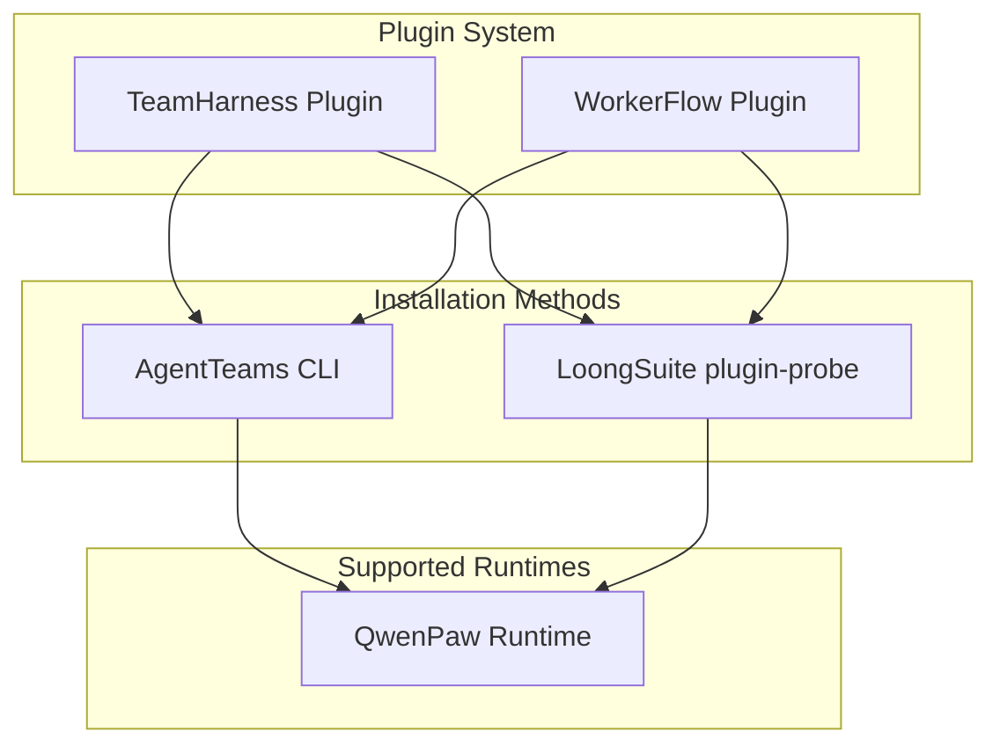

# Plugin System

AgentTeams uses a plugin system to extend runtime capabilities for TeamHarness and WorkerFlow environments. The plugin architecture defines a standardized contract for packaging, installing, and managing plugins that provide prompts, skills, MCP tools, and runtime-specific adapters.

## Plugin Architecture Overview

The plugin system supports two primary plugin types:

- **TeamHarness** — Full-featured plugin providing team coordination, project management, task delegation, and MCP tools for agent orchestration
- **WorkerFlow** — Simplified workflow plugin for Worker-local task execution without team-wide coordination

Both plugins follow the same `plugin.yaml` contract and can be installed via the AgentTeams CLI or LoongSuite's `plugin-probe` convention.



## plugin.yaml Contract

Every AgentTeams plugin must include a `plugin.yaml` manifest that defines the plugin's metadata, capabilities, and packaging requirements. The manifest follows the `AgentTeamPlugin` schema version `agentteams.agentteam/v1alpha1`.

### Required Fields

| Field | Type | Description |
|-------|------|-------------|
| `apiVersion` | String | Must be `agentteams.agentteam/v1alpha1` |
| `kind` | String | Must be `AgentTeamPlugin` |
| `metadata` | Object | Plugin name and version (semver format) |
| `prompts` | Object | Agent, team, and manager prompt definitions |
| `skills` | Object | Skill definitions for different roles |
| `mcp` | Object | MCP server and tool configurations |
| `adapters` | Array | Runtime-specific adapter definitions |
| `package` | Object | Packaging inclusion rules |

### Example plugin.yaml Structure

```yaml
apiVersion: agentteams.agentteam/v1alpha1
kind: AgentTeamPlugin
metadata:
  name: teamharness
  version: 0.1.0
prompts:
  team: prompts/team/TEAMS.md
  agent:
    leader: prompts/agent/leader.md
    worker: prompts/agent/worker.md
    remoteMember: prompts/agent/remote-member.md
  manager:
    agents: prompts/manager/AGENTS.md
    tools: prompts/manager/TOOLS.md
    heartbeat: prompts/manager/HEARTBEAT.md
skills:
  agent:
    - id: mcporter
      path: skills/agent/mcporter
      roles: [leader, worker, manager, remote-member]
  team:
    - id: communication
      path: skills/team/communication
      roles: [leader, worker, manager, remote-member]
mcp:
  servers:
    - id: teamharness
      transport: stdio
      command: python
      args:
        - mcp/server.py
      tools:
        - health
        - message
        - roomflow
        - filesync
        - artifact
        - projectflow
        - taskflow
adapters:
  - id: qwenpaw
    path: adapters/qwenpaw
package:
  include:
    - plugin.yaml
    - prompts/
    - skills/
    - mcp/
    - adapters/
    - scripts/
```

### Validation

The plugin manifest is validated by `plugins/scripts/validate-plugin.rb`, which checks:
- Correct API version and kind
- Required metadata fields with valid semver version
- All referenced prompt, skill, and MCP files exist
- Skill directories contain `SKILL.md` files
- No duplicate skill IDs
- MCP server arguments reference valid files
- Adapter directories contain `README.md`
- Required lifecycle scripts exist (`scripts/install.sh`, `scripts/uninstall.sh`)

## Adapter Pattern

The adapter pattern allows plugins to support multiple runtime environments through runtime-specific installation logic. Each plugin defines adapters in its `plugin.yaml` manifest, and the main lifecycle scripts dispatch to the appropriate adapter based on detected runtimes.

### Adapter Structure

```
adapters/
└── qwenpaw/
    ├── install-plugin.sh      # Shared installation logic
    ├── install.sh             # Runtime-specific installer
    ├── uninstall.sh           # Runtime-specific uninstaller
    ├── plugin.py              # Python adapter implementation
    ├── README.md              # Adapter documentation
    └── scripts/               # Build and helper scripts
```

### QwenPaw Adapter Example

The QwenPaw adapter packages plugins for the QwenPaw runtime framework. Installation involves:

1. **Build Phase**: Converts plugin content to QwenPaw-compatible package format
2. **Extract Phase**: Unpacks the generated package for installation
3. **Install Phase**: Registers the plugin with the QwenPaw runtime

```bash
# QwenPaw adapter installation flow
install-plugin.sh <PLUGIN_ROOT>
# 1. Validates prerequisites (qwenpaw command, ruby, build script)
# 2. Builds QwenPaw plugin package using build script
# 3. Extracts package using Python module
# 4. Installs via `qwenpaw plugin install` command
```

### Adapter Lifecycle

Each adapter implements two lifecycle scripts:
- **install.sh**: Detects supported runtimes and performs installation
- **uninstall.sh**: Removes runtime-specific installation artifacts

The main plugin scripts (`scripts/install.sh`, `scripts/uninstall.sh`) detect available runtimes and dispatch to the matching adapter.

## TeamHarness Plugin

TeamHarness is the primary plugin for team coordination and project management. It provides comprehensive tools for agent orchestration, task management, and team collaboration.

### Package Structure

```
teamharness/
├── plugin.yaml              # Plugin manifest
├── prompts/                 # Agent, team, and manager prompts
│   ├── team/
│   ├── agent/
│   └── manager/
├── skills/                  # Agent and team skills
│   ├── agent/
│   └── team/
├── mcp/                     # MCP server and tools
│   └── server.py
├── adapters/                # Runtime-specific adapters
│   └── qwenpaw/
├── scripts/                 # Lifecycle scripts
│   ├── install.sh
│   └── uninstall.sh
└── loongsuite/              # LoongSuite compatibility
    └── agents.d/
        └── teamharness.json
```

### Key Capabilities

TeamHarness provides the following MCP tools:
- **health**: System health monitoring
- **message**: Matrix room messaging
- **roomflow**: Room management and flow control
- **filesync**: File synchronization with MinIO
- **artifact**: Artifact management
- **projectflow**: Project lifecycle management
- **taskflow**: Task creation, assignment, and tracking

### Skills

TeamHarness includes skills for different roles:
- **Agent skills**: MCP tool calling, skill discovery
- **Team skills**: Communication, file sharing, room flow, team coordination, project management, task delegation, task execution

## WorkerFlow Plugin

WorkerFlow is a simplified workflow plugin for Worker-local task execution. It provides basic workflow capabilities without the full team coordination features of TeamHarness.

### Package Structure

```
workerflow/
├── plugin.yaml              # Plugin manifest
├── prompts/                 # Worker and manager prompts
│   ├── team/
│   ├── agent/
│   └── manager/
├── skills/                  # Worker-specific skills
│   └── agent/
├── mcp/                     # MCP server and tools
│   └── server.py
├── adapters/                # Runtime-specific adapters
│   └── qwenpaw/
└── scripts/                 # Lifecycle scripts
    ├── install.sh
    └── uninstall.sh
```

### Key Differences from TeamHarness

WorkerFlow is designed for simpler use cases:
- **Worker-local only**: No team-wide coordination or project management
- **Limited MCP tools**: Only `worker_agentflow` tool
- **Simplified skills**: Focus on worker-internal workflow
- **No remote management**: Doesn't support remote-managed Claude Code workers

### WorkerFlow QwenPaw Adapter

The WorkerFlow QwenPaw adapter packages the plugin for QwenPaw runtime:
- Registers the WorkerFlow skill
- Configures a `workerflow` MCP client
- Doesn't install TeamHarness project, task, room, or requester routing behavior

## CLI Installation

The AgentTeams CLI provides commands for managing plugin installations. The CLI stores local state under `.agentteams/` and manages plugin packages without hard-coding runtime-specific details.

### Installation Commands

```bash
# Install a plugin package
agentteams plugin install teamharness --package dist/teamharness.tar.gz

# List installed plugins
agentteams plugin list

# Update an installed plugin
agentteams plugin update teamharness --package dist/teamharness.tar.gz

# Uninstall a plugin
agentteams plugin uninstall teamharness
```

### Installation Process

1. **Package Preparation**: Extracts tarball or validates source directory
2. **Manifest Validation**: Loads and validates `plugin.yaml` metadata
3. **Dependency Check**: Verifies plugin dependencies (if any)
4. **Content Installation**: Copies plugin content to installation directory
5. **Lifecycle Execution**: Runs `scripts/install.sh` for runtime setup
6. **Manifest Recording**: Saves installation manifest with version and hash

### CLI Features

- **Safe extraction**: Validates tarball contents to prevent path traversal
- **Content hashing**: SHA256 hash of installed content for integrity verification
- **Lifecycle management**: Automatic uninstall before reinstall/update
- **Environment setup**: Configures `AGENTTEAMS_PLUGIN_DIR`, `PILOT_DATA_DIR`, and other environment variables

## LoongSuite Compatibility

TeamHarness supports LoongSuite/Pilot for local deployment through the `plugin-probe` convention. This integration path allows LoongSuite to discover and install TeamHarness without parsing plugin internals.

### LoongSuite Integration

LoongSuite uses a `teamharness.json` configuration file:

```json
{
  "id": "teamharness",
  "displayName": "TeamHarness",
  "deployMode": "plugin-probe",
  "detection": {
    "paths": ["~/.qwenpaw"],
    "commands": ["qwenpaw"]
  },
  "pluginProbe": {
    "source": {
      "type": "tar",
      "tarball": "$PILOT_DIR/plugins/teamharness.tar.gz",
      "destDir": "$PILOT_DATA/plugins/teamharness"
    },
    "mountType": "wrapper"
  }
}
```

### LoongSuite Workflow

1. **Discovery**: Detects QwenPaw runtime via paths and commands
2. **Extraction**: Unpacks TeamHarness tarball to designated directory
3. **Installation**: Runs standard lifecycle script (`scripts/install.sh`)
4. **No Internal Parsing**: LoongSuite doesn't parse `plugin.yaml`, prompts, skills, MCP tools, or adapter internals

### Compatibility Boundaries

- **Runtime-specific content**: Remote-managed Claude Code runtime templates live in `teamharness/remote/`
- **Agent packages**: `desired.agentPackage` in runtime config is separate from TeamHarness plugin packages
- **Cluster workers**: Cluster QwenPaw workers don't use LoongSuite but may reuse TeamHarness tarball

## Remote-Managed Workers

For remote-managed Claude Code workers, TeamHarness provides separate packages:

```
teamharness/remote/
└── claude-code/
    ├── runtime templates
    ├── agent configuration
    └── packaging scripts
```

These produce a separate `agentteams-claude-code-local-runtime-0.0.1.tar.gz` bundle that doesn't mix with the runtime-neutral TeamHarness base package.

## Configuration and Operations

### Environment Variables

The plugin system uses several environment variables for configuration:

| Variable | Description |
|----------|-------------|
| `AGENTTEAMS_PLUGIN_DIR` | Plugin installation directory |
| `AGENTTEAMS_PLUGIN_INSTALL_LOG` | Installation log file path |
| `PILOT_DATA_DIR` | Pilot data directory |
| `PILOT_LOG_DIR` | Log directory for plugin operations |
| `TEAMHARNESS_RUNTIME_CONFIG` | Path to runtime configuration file |
| `AGENTTEAMS_MEMBER_RUNTIME_CONFIG` | Fallback runtime config path |

### Runtime Configuration

Plugins can load runtime configuration from JSON or YAML files:

```python
from plugins.common.runtime_config import load_runtime_config

config = load_runtime_config(
    primary_env="TEAMHARNESS_RUNTIME_CONFIG",
    fallback_env="AGENTTEAMS_MEMBER_RUNTIME_CONFIG"
)
```

The configuration loader supports:
- JSON format
- YAML format (with fallback to simple YAML parser)
- Environment variable expansion
- Section-based access patterns

## Extension Points

### Adding New Adapters

To add support for a new runtime:

1. Create adapter directory under `adapters/<runtime>/`
2. Implement `install.sh` and `uninstall.sh` scripts
3. Add adapter to `plugin.yaml` manifest
4. Update main lifecycle scripts to detect the new runtime
5. Document adapter in `README.md`

### Custom Skills

Skills are added by:
1. Creating skill directory under `skills/agent/` or `skills/team/`
2. Adding `SKILL.md` with agent instructions
3. Including skill in `plugin.yaml` manifest with role assignments
4. Ensuring skill directory structure follows conventions

### MCP Tools

MCP tools are added by:
1. Implementing tool in `mcp/server.py` or separate modules
2. Adding tool to MCP server configuration in `plugin.yaml`
3. Defining tool schema and parameters
4. Implementing tool logic in Python

## Validation and Testing

### Validation Commands

```bash
# Run integration tests
plugins/tests/run-integration-tests.sh

# Validate CLI code
python3 -m compileall -q plugins/cli/src

# Validate plugin manifest
ruby plugins/scripts/validate-plugin.rb plugins/teamharness/plugin.yaml

# Syntax check lifecycle scripts
bash -n plugins/teamharness/scripts/install.sh
bash -n plugins/teamharness/scripts/uninstall.sh

# Check for whitespace issues
git diff --check
```

### Test Coverage

The test suite includes:
- **Protocol characterization tests**: Verify plugin protocol behavior
- **CLI tests**: Test plugin management commands
- **Contract validation**: Verify plugin manifest compliance
- **Adapter tests**: Test runtime-specific adapter functionality
- **MCP tool tests**: Verify MCP server and tool behavior
- **Package tests**: Test plugin packaging and distribution

## Troubleshooting

### Common Issues

1. **Plugin not found**: Ensure `plugin.yaml` exists and is valid
2. **Installation fails**: Check runtime prerequisites (qwenpaw, ruby, python)
3. **Adapter errors**: Verify adapter directory structure and scripts
4. **Skill loading fails**: Ensure `SKILL.md` exists in skill directories
5. **MCP tool errors**: Check MCP server configuration and Python syntax

### Debugging

- Check installation logs in `$PILOT_LOG_DIR`
- Verify plugin content hash matches manifest
- Test adapter scripts individually
- Validate plugin manifest with validation script
- Check environment variable configuration

## Source References

- Plugin system: [`plugins/`](../../plugins/)
- Plugin manifest: [`plugins/teamharness/plugin.yaml`](../../plugins/teamharness/plugin.yaml)
- WorkerFlow manifest: [`plugins/workerflow/plugin.yaml`](../../plugins/workerflow/plugin.yaml)
- Plugin schema: [`plugins/schemas/plugin.schema.json`](../../plugins/schemas/plugin.schema.json)
- CLI source: [`plugins/cli/src/agentteams_cli/`](../../plugins/cli/src/agentteams_cli/)
- QwenPaw adapter: [`plugins/adapters/qwenpaw/`](../../plugins/adapters/qwenpaw/)
- Validation script: [`plugins/scripts/validate-plugin.rb`](../../plugins/scripts/validate-plugin.rb)
- Integration tests: [`plugins/tests/`](../../plugins/tests/)
- Runtime configuration: [`plugins/common/runtime_config.py`](../../plugins/common/runtime_config.py)
- Architecture overview: [`openwiki/architecture/overview.md`](../architecture/overview.md)
- Worker runtimes: [`openwiki/workers/runtime-guide.md`](../workers/runtime-guide.md)
