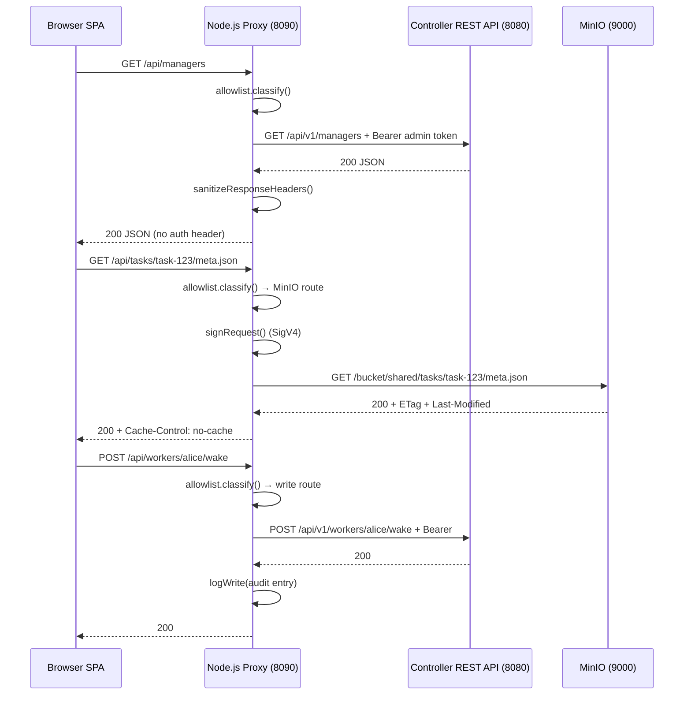

# Operations: Dashboard

The AgentTeams dashboard is a web UI for monitoring and interacting with the system. It is composed of two layers: a **Vite single-page application** (vanilla JS, no framework) and a **Node.js same-origin proxy** that mediates all communication between the browser and the backend (the `agentteams-controller` REST API and MinIO object storage). The browser never holds admin credentials or MinIO keys — the proxy injects them server-side.

## Architecture



The diagram shows the three categories of proxied requests: controller read passthrough, MinIO object read with conditional-GET, and controller write with audit logging.

### Directory layout

- **`server/`** — A near-zero-dependency Node proxy (`node:http` + hand-rolled AWS SigV4 signer for MinIO, no framework, no AWS SDK). Entry point: [`server/src/server.js`](../../dashboard/server/src/server.js). Tests: `node --test`.
- **`web/`** — A plain Vite + vanilla-JS SPA (no framework). Talks only to same-origin `/api/*` paths. Build: Vite 6, output in `dist/`.
- **`Dockerfile`** — Multi-stage build: compiles the SPA with Node, then ships only the proxy + built static assets (no dev dependencies, no Vite at runtime).

## Why the proxy is mandatory

The controller's REST API sets **no CORS headers** and **requires a Bearer admin token on every request**. The SPA cannot call it directly from the browser without exposing that token client-side. The proxy solves three problems:

1. **Admin token injection** — The proxy reads the token from a file (`AGENTTEAMS_AUTH_TOKEN_FILE`, minted by the embedded controller at startup) and injects it as `Authorization: Bearer <token>` on every upstream controller call. The browser never holds this token. The [`ControllerClient`](../../dashboard/server/src/controller-client.js) strips `authorization`, `set-cookie`, `connection`, `transfer-encoding`, `content-length`, and `content-encoding` from every upstream response before relaying it (the [`sanitizeResponseHeaders`](../../dashboard/server/src/controller-client.js) function).

2. **Scoped allowlist** — The proxy enforces a strict allowlist of exactly the routes the dashboard needs. This is the entire attack surface, deliberately kept in one pure, exhaustively-tested module: [`server/src/allowlist.js`](../../dashboard/server/src/allowlist.js).

3. **Same-origin elimination of CORS** — The proxy serves the built SPA's static files and proxies `/api/*` routes, so the SPA and proxy are same-origin by construction. No CORS headers are needed anywhere.

## Scoped allowlist security model

The [`classify(method, pathname)`](../../dashboard/server/src/allowlist.js) function is a pure function (no I/O) that decides for every request whether it is allowed and where it should be routed. It returns one of:

- `{ ok: true, route: { target, kind, ... } }` — allowed, with routing metadata
- `{ ok: false, status: 404 }` — unknown path shape
- `{ ok: false, status: 405 }` — known path shape, disallowed HTTP method

### Route categories

| Pattern | Method | Target | Notes |
|---------|--------|--------|-------|
| `/api/managers\|teams\|workers\|manager-tasks\|projects[/...]` | GET | Controller `GET /api/v1/...` passthrough | List and detail reads |
| `/api/tasks/<...rest>` | GET | MinIO `shared/tasks/<...rest>` | Task metadata, results, progress |
| `/api/files/<shared\|agents>/<...rest>` | GET | MinIO `shared/` or `agents/` only | File browser; path-traversal guarded |
| `/api/workers/{name}/wake\|sleep\|ensure-ready` | POST | Controller `POST /api/v1/workers/{name}/...` | v1.1 lifecycle writes; audit-logged |
| `/api/managers/{name}/message` | POST | Controller `POST /api/v1/managers/{name}/message` | v1.5 message injection; audit-logged |
| `/api/teams/{name}/message` | POST | Controller `POST /api/v1/teams/{name}/message` | v1.5 message injection; audit-logged |
| `/api/gateway/providers` | GET, POST | Controller `GET/POST /api/v1/gateway/providers` | Provider list and registration |
| `/api/gateway/providers/{name}` | DELETE | Controller `DELETE /api/v1/gateway/providers/{name}` | Provider deletion |
| `/api/gateway/providers/{name}/models` | GET | Controller `GET /api/v1/gateway/providers/{name}/models` | Model listing per provider |
| `/api/workers\|teams\|managers/{name}` | PUT | Controller `PUT /api/v1/{kind}/{name}` | Model/provider assignment |

Everything else is rejected: unknown path shapes return `404`; a disallowed method on a known path shape returns `405`.

### Path-traversal guard

The [`normalizeMinioKey`](../../dashboard/server/src/allowlist.js) function rejects any MinIO key containing `..` segments, embedded backslashes, null bytes, or segments that decode into traversal attempts (e.g., `%2e%2e`). This is defense-in-depth: the allowlist already constrains the root prefix to `shared/` or `agents/`, but `normalizeMinioKey` prevents encoded-traversal bypasses.

### What is never proxied

The `/docker/` path (the controller's embedded-mode Docker socket passthrough) has **no route here at all** — it is simply not present in the allowlist and returns `404`.

## Audit logging for write operations

Every allow-listed write operation produces an audit log entry written as a JSON line to stdout via the [`createRequestLogger`](../../dashboard/server/src/request-log.js) sink. The log format varies by action:

| Action | Log fields |
|--------|-----------|
| `wake`, `sleep`, `ensure-ready` | `ts`, `action`, `worker`, `status`, `remoteAddr` |
| `message` | `ts`, `action:"message"`, `kind` (`"managers"` or `"teams"`), `target` (name), `status`, `remoteAddr`, `bodyLen`, `bodyPreview` (truncated to ≤120 chars) |
| `register-provider` | `ts`, `action`, `provider`, `status`, `remoteAddr` |
| `delete-provider` | `ts`, `action`, `provider`, `status`, `remoteAddr` |
| `update` (model/provider assignment) | `ts`, `action`, `kind`, `target`, `status`, `remoteAddr` |

The message-body preview is deliberately truncated — the full message body (which may contain sensitive operator instructions) is never written to the log. Provider writes also never log body content (which contains API keys).

## Conditional-GET caching for MinIO routes

On MinIO object routes (`/api/tasks/*`, `/api/files/*`), the proxy supports HTTP conditional-GET to reduce redundant re-downloads on the SPA's 15-second poll cycle:

1. The browser sends `If-None-Match` / `If-Modified-Since` headers (the browser's own HTTP cache supplies these automatically once an `ETag` has been seen on a previous response).
2. The proxy forwards these headers to MinIO as **unsigned** transport headers. The SigV4 `SignedHeaders` set (`host;x-amz-content-sha256;x-amz-date`) never changes whether or not conditional headers are present — MinIO/S3 evaluates conditional headers independently of which headers were signed.
3. A MinIO `304` is relayed as a bodyless `304` to the browser. A `200` is relayed with `ETag`, `Last-Modified`, and `Cache-Control: no-cache` (forces revalidation on every poll instead of letting the browser cache heuristically).

**Listing responses** (the directory-listing fallback when a MinIO object 404s) are **never cached** — they aggregate many objects and can change whenever any one of them does. Controller-proxied GETs are also unaffected (small JSON, not worth caching).

No SPA code changes were required — the browser's native HTTP cache handles `If-None-Match` automatically once it has seen an `ETag` header.

## Authentication

The dashboard proxy itself supports HTTP Basic authentication, implemented in [`server/src/auth.js`](../../dashboard/server/src/auth.js) with constant-time credential comparison via `crypto.timingSafeEqual`.

| Mode | Configuration | Behavior |
|------|--------------|----------|
| **Enabled (default)** | `AGENTTEAMS_DASHBOARD_USERNAME` + `AGENTTEAMS_DASHBOARD_PASSWORD_FILE` required | Every request must carry a valid `Authorization: Basic` header |
| **Disabled** | `AGENTTEAMS_DASHBOARD_AUTH_DISABLED=true` | All requests allowed; only accepted when binding to a loopback address (`127.0.0.1`, `::1`, `localhost`) |

Authentication is fail-closed: it is enabled unless explicitly disabled, and disabling it is rejected at startup when binding to a non-loopback address.

## Milestone features

The dashboard was built across three implementation milestones, each adding a tier of the #17 ladder:

### v1 — Read-only (Milestone 2, Step 3)

- **Managers / Teams / Workers cards** — polled every 15 seconds (Workers every 30 seconds, since `GET /api/v1/workers` triggers a live backend `Status()` call per team member).
- **Manager task table** — sourced from `/api/manager-tasks` (the Manager's `state.json`) and joined by task id with MinIO `shared/tasks/{id}/meta.json` where available.
- **Project browser** — one card per Project CRD (`GET /api/projects`), joined by id with the chat-flow layer (`shared/projects/{id}/meta.json` + `plan.md`). Progress shown as `[ ]`/`[~]`/`[x]`/`[!]` counts parsed from `plan.md`.
- **File browser** — list and read under `shared/` and `agents/` (no upload/delete).

### v1.1 — Worker lifecycle writes (Milestone 2, Step 3)

- **Wake / Sleep / Ensure Ready buttons** on worker cards, each behind a confirm dialog, calling the three allow-listed POST routes.
- Server-side audit log entry per write.

### v1.5 — Message injection (Milestone 3, Step 1)

- **Message buttons** on Manager and Team cards, opening a textarea dialog and posting to `POST /api/managers/{name}/message` or `POST /api/teams/{name}/message`.
- Success toasts the destination room id. A `409` (room not provisioned yet) is surfaced as a distinct, friendlier error.
- Request bodies capped at **64 KB** (413 over the cap, no upstream call made).
- Audit log entries include a `bodyPreview` truncated to ≤120 characters.

### v2 — Task detail, kanban, DAG (Milestone 3, Step 3)

All v2 views render from data contracts the proxy already served — no new endpoints, no proxy changes, no controller changes.

- **Task detail panel** — click a row in the Manager Tasks table to open a drawer with `meta.json` (status, project, assignee, `depends_on`), `result.md`'s Outcome badge (`SUCCESS`/`SUCCESS_WITH_NOTES`/`REVISION_NEEDED`/`BLOCKED`), and the latest `progress/YYYY-MM-DD.md` note. Refreshes every 15 seconds while open; every sub-fetch tolerates 404 independently.
- **Board tab (status kanban)** — four columns: **Active** (state.json entries without blocked status; unknown status strings land here with their raw badge), **Blocked** (`blocked_reason`/`blocked_since`), **Completed** (MinIO `shared/tasks/` ids whose `meta.json.status === "completed"`, minus currently-active ids, capped at ~50 most recent by timestamp prefix), **Cancelled** (state.json `cancelled_tasks`). No drag-drop — writes beyond v1.5 stay chat/CLI actions.
- **Project DAG / plan expander** — each Project card gains a collapsible "Plan" section parsing `plan.md` into `### Phase` groups with per-task marker/assignee/depends-on annotations. A `plan.md` that doesn't parse into any recognizable task line falls back silently to the marker-count view.

The pure parsing logic ([`web/src/plan-parse.js`](../../dashboard/web/src/plan-parse.js)) is covered by `node --test` with no DOM or network dependencies.

## Configuration

### Environment variables

| Variable | Default | Purpose |
|----------|---------|---------|
| `AGENTTEAMS_DASHBOARD_PORT` (or `PORT`) | `8090` | Port the proxy listens on |
| `AGENTTEAMS_DASHBOARD_BIND_HOST` | `127.0.0.1` | Bind address |
| `AGENTTEAMS_CONTROLLER_URL` | `http://127.0.0.1:8080` | Base URL of the controller REST API |
| `AGENTTEAMS_AUTH_TOKEN_FILE` | `/var/run/agentteams/cli-token` | Path to the admin Bearer token (read fresh on every request; never cached to survive rotation) |
| `AGENTTEAMS_MINIO_ENDPOINT` (or `MINIO_ENDPOINT`) | `http://127.0.0.1:9000` | MinIO S3 API endpoint |
| `AGENTTEAMS_MINIO_ACCESS_KEY` (or `MINIO_ACCESS_KEY`, `MINIO_ACCESS`) | *(none)* | MinIO access key |
| `AGENTTEAMS_MINIO_SECRET_KEY` (or `MINIO_SECRET_KEY`, `MINIO_SECRET`) | *(none)* | MinIO secret key |
| `AGENTTEAMS_FS_BUCKET` | `agentteams-storage` | Bucket holding `shared/` and `agents/` |
| `AGENTTEAMS_DASHBOARD_USERNAME` | *(required when auth enabled)* | HTTP Basic auth username |
| `AGENTTEAMS_DASHBOARD_PASSWORD_FILE` | *(required when auth enabled)* | Path to file containing HTTP Basic auth password |
| `AGENTTEAMS_DASHBOARD_AUTH_DISABLED` | `false` | Disable Basic auth (loopback bind only) |
| `AGENTTEAMS_DASHBOARD_UPSTREAM_TIMEOUT_MS` | `15000` | Upstream request timeout |
| `AGENTTEAMS_DASHBOARD_MAX_JSON_BYTES` | `2097152` (2 MB) | Max JSON response size from controller |
| `AGENTTEAMS_DASHBOARD_MAX_OBJECT_BYTES` | `16777216` (16 MB) | Max MinIO object size |
| `AGENTTEAMS_DASHBOARD_LIST_MAX_LIMIT` | `1000` | Max items per MinIO listing |
| `AGENTTEAMS_DASHBOARD_LIST_DEFAULT_LIMIT` | `500` | Default items per MinIO listing |
| `AGENTTEAMS_DASHBOARD_PUBLIC_ORIGIN` | *(none)* | Public origin for external URL generation |

The token file is read fresh on every request (with an mtime-based cache) so that token rotation is seamless. The `onUnauthorized` callback invalidates the cache when the controller returns `401`.

### MinIO credential handling

The MinIO client ([`server/src/minio-client.js`](../../dashboard/server/src/minio-client.js)) signs every request with a hand-rolled AWS SigV4 signer ([`server/src/sigv4.js`](../../dashboard/server/src/sigv4.js)). The `SignedHeaders` set is fixed at `host;x-amz-content-sha256;x-amz-date` — conditional headers (`If-None-Match`, `If-Modified-Since`) are merged onto the transport request **after** signing and are deliberately not part of the signature.

## Build and deployment

### Local development

```bash
# Proxy tests (zero dependencies, no network required)
cd dashboard/server && npm install && npm test

# SPA tests + build
cd dashboard/web && npm install && npm test && npm run build

# Docker image (PowerShell on Windows)
docker build -t agentteams-dashboard dashboard/
```

### Multi-stage Docker build

The [`Dockerfile`](../../dashboard/Dockerfile) performs a two-stage build:

1. **`web-build` stage** — `node:24-alpine` runs `npm install` + `npm run build` to compile the Vite SPA.
2. **Runtime stage** — `node:24-alpine` copies the proxy source and the built `web/dist/` directory. No dev dependencies, no Vite at runtime. The proxy is dependency-free (`node:http` + `node:crypto` only), so there is no `node_modules/` to copy.

### Static file serving

The proxy reads the entire `web/dist/` directory into memory at startup via [`createStaticFileServer`](../../dashboard/server/src/static.js). Files are served from this in-memory cache (with a path-traversal guard). Paths without a file extension fall back to `index.html` for client-side routing support.

### Deployment behind Traefik

The dashboard is designed to sit behind Traefik as a same-origin service:

```yaml
labels:
  - "traefik.enable=true"
  - "traefik.http.routers.agentteams-dashboard.rule=Host(`dashboard.example.com`)"
  - "traefik.http.routers.agentteams-dashboard.entrypoints=websecure"
  - "traefik.http.routers.agentteams-dashboard.tls.certresolver=letsencrypt"
  - "traefik.http.services.agentteams-dashboard.loadbalancer.server.port=8090"
```

The token file must be readable from inside the container (bind-mount the same path the controller writes to, read-only). In embedded-mode deployments, this is the same directory the controller's own Dockerfile writes `AGENTTEAMS_AUTH_TOKEN_FILE` to.

### Polling cadence and background-tab optimization

The SPA's polling helper ([`web/src/poll.js`](../../dashboard/web/src/poll.js)) pauses timers when the browser tab is hidden (the `document.hidden` API) and immediately ticks once when the tab becomes visible again, ensuring the view is fresh without wasting background requests. Overlapping ticks are guarded: while a previous tick is still awaiting its `fn()`, a visibilitychange-triggered tick does not start a second concurrent call.

| Resource | Poll interval |
|----------|--------------|
| Managers, Teams | 15 seconds |
| Workers | 30 seconds (live `Status()` call per member) |
| Board (kanban) | 15 seconds |
| Task detail (while open) | 15 seconds |

## Testing

The proxy has comprehensive `node:test` tests covering:

- Allowlist enforcement: unknown path shapes → `404`, disallowed methods → `405`, the exact set of allowed write routes
- Token injection upstream and stripping from responses
- Path-traversal guard on MinIO routes
- Request-log entries for every write operation
- Conditional-GET header forwarding and 304 relay
- Body-size cap enforcement (64 KB for writes)
- Body-preview truncation (≤120 chars)

The SPA has `node:test` tests (pure parsers, no DOM, no network) covering:

- `plan-parse.js`: plan-line/phase/depends-on parsing including drift cases, kanban bucketing, latest-progress-file selection, and recent-id cap/sort
- Board column rendering from state.json and MinIO data
- Task-detail panel behavior
- Polling helper lifecycle

## See also

- [Architecture Overview](../architecture/overview.md) — system layers and deployment shapes
- [Controller: CLI & API](../controller/cli-and-api.md) — REST API endpoints the proxy forwards to
- [Operations: Install & Deploy](installation.md) — installation scripts and Helm chart
