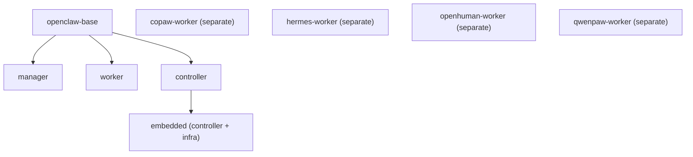

# Operations: Install & Deploy

AgentTeams supports two deployment modes: local Docker/Podman install and Kubernetes via Helm. Both modes use the same container images but differ in how infrastructure components are orchestrated.

## Local Install (Docker/Podman)

### Quick Start

**macOS / Linux:**
```bash
bash <(curl -sSL https://higress.ai/agentteams/install.sh)
```

**Windows (PowerShell 7+):**
```powershell
Set-ExecutionPolicy Bypass -Scope Process -Force
$wc = New-Object Net.WebClient
$wc.Encoding = [Text.Encoding]::UTF8
iex $wc.DownloadString('https://higress.ai/agentteams/install.ps1')
```

The installer walks through:
1. Choose LLM provider (OpenAI-compatible APIs supported)
2. Enter API key
3. Select network mode (local-only or external access)
4. Wait for setup to complete

The installer automatically detects the optimal image registry based on timezone (China, North America, or Southeast Asia) for faster image pulls.

### What Gets Installed

The embedded controller container (the only supported architecture since v1.1.0) bundles everything:
- **Higress** — AI gateway (ports 8080, 8443)
- **Tuwunel** — Matrix homeserver (port 6167)
- **MinIO** — Object storage (port 9000)
- **Element Web** — Browser-based Matrix client (port 18088)
- **Controller** — Go operator (port 8090)

Plus separate containers for:
- **Manager** — Coordinator agent
- **Workers** — Created on demand

### Access

Open `http://127.0.0.1:18088` in your browser to access Element Web. The Manager will greet you and explain how to create your first Worker.

Default ports (configurable via environment variables):
- **Gateway:** 18080 (Higress)
- **Console:** 18001 (Higress admin)
- **Element Web:** 18088
- **Manager Console:** 18888

### Install Scripts

| Script | Purpose |
|--------|---------|
| [`install/agentteams-install.sh`](../../install/agentteams-install.sh) | Main installer (macOS/Linux) |
| [`install/agentteams-install.ps1`](../../install/agentteams-install.ps1) | Main installer (Windows) |
| [`install/agentteams-verify.sh`](../../install/agentteams-verify.sh) | Installation verification |
| [`install/defaults.env`](../../install/defaults.env) | Default configuration values (shared by bash and PowerShell installers) |
| [`install/load-defaults.ps1`](../../install/load-defaults.ps1) | PowerShell defaults loader |

### Upgrade

```bash
# Upgrade to latest (preserves all data)
bash <(curl -sSL https://higress.ai/agentteams/install.sh)

# Upgrade to specific version
AGENTTEAMS_VERSION=v1.1.2 bash <(curl -sSL https://higress.ai/agentteams/install.sh)
```

### Uninstall

```bash
# macOS / Linux
bash <(curl -fsSL https://raw.githubusercontent.com/agentscope-ai/AgentTeams/main/install/agentteams-install.sh) uninstall

# Windows
Set-ExecutionPolicy Bypass -Scope Process -Force
$wc = New-Object Net.WebClient
$wc.Encoding = [Text.Encoding]::UTF8
$s = $wc.DownloadString('https://raw.githubusercontent.com/agentscope-ai/AgentTeams/main/install/agentteams-install.ps1')
& ([scriptblock]::Create($s)) uninstall
```

### Non-Interactive Mode (Automation)

Set environment variables to skip prompts:

```bash
# macOS / Linux
export AGENTTEAMS_NON_INTERACTIVE=1
export AGENTTEAMS_LLM_API_KEY="your-api-key"
bash <(curl -fsSL https://higress.ai/agentteams/install.sh)
```

```powershell
# Windows
$env:AGENTTEAMS_NON_INTERACTIVE = "1"
$env:AGENTTEAMS_LLM_API_KEY = "your-api-key"
Set-ExecutionPolicy Bypass -Scope Process -Force
$wc = New-Object Net.WebClient
$wc.Encoding = [Text.Encoding]::UTF8
iex $wc.DownloadString('https://higress.ai/agentteams/install.ps1')
```

See [`install/README.md`](../../install/README.md) for the full list of environment variables and platform notes.

## Kubernetes Install (Helm)

### Prerequisites

- Kubernetes 1.24+ (kind / minikube / k3s / managed K8s)
- Helm 3.7+
- Default StorageClass (for Tuwunel + MinIO PVCs)

### Quick Install

```bash
helm repo add higress.io https://higress.io/helm-charts
helm repo update

helm install agt higress.io/agentteams \
  -n agentteams-system --create-namespace \
  --render-subchart-notes \
  --set credentials.llmApiKey=<your-api-key> \
  --set credentials.adminPassword=<your-admin-password> \
  --set gateway.publicURL=http://localhost:18080
```

### Key Helm Values

| Value | Required | Description |
|-------|----------|-------------|
| `credentials.llmApiKey` | yes | LLM provider API key |
| `gateway.publicURL` | yes | Public URL for Element Web access |
| `credentials.adminPassword` | recommended | Matrix admin password (auto-generated if empty) |
| `credentials.llmProvider` | no | LLM provider name (default: `openai-compat`) |
| `credentials.defaultModel` | no | Default model (default: `gpt-5.4`) |
| `credentials.llmBaseUrl` | no | OpenAI-compatible base URL |
| `manager.runtime` | no | Manager runtime: `openclaw` (default) or `copaw` |
| `worker.defaultRuntime` | no | Default worker runtime: `openclaw`, `copaw`, `hermes`, `openhuman`, `qwenpaw` |
| `preflight.llm.enabled` | no | LLM connectivity preflight check (default: `true`) |
| `preflight.llm.strict` | no | Fail install on preflight failure (default: `true`) |

### Helm Chart Structure

The chart is at [`helm/agentteams/`](../../helm/agentteams/):

```
helm/agentteams/
├── Chart.yaml              # Chart metadata (v1.1.1)
├── values.yaml             # Default values
├── crds/                   # CRD manifests (5 types)
│   ├── workers.agentteams.io.yaml
│   ├── teams.agentteams.io.yaml
│   ├── projects.agentteams.io.yaml
│   ├── managers.agentteams.io.yaml
│   └── humans.agentteams.io.yaml
├── templates/
│   ├── _helpers.tpl        # Template helpers
│   ├── controller/         # Controller deployment
│   ├── manager/            # Manager CR (optional)
│   ├── matrix/             # Tuwunel StatefulSet
│   ├── minio/              # MinIO StatefulSet
│   ├── gateway/            # Higress configuration
│   └── element/            # Element Web deployment
└── charts/                 # Subcharts (Higress)
```

For the complete Helm values reference with all configuration options, see [Helm Reference](../operations/helm-reference.md).

## Building from Source

### Image Dependency Chain



*Image dependency chain: openclaw-base provides the foundation for manager and worker images. The controller image is built separately and used by the embedded image. Standalone runtime images (copaw, hermes, openhuman, qwenpaw) are independent.*

### Build Commands

```bash
# Build all images
make build

# Build specific images
make build-manager
make build-worker
make build-copaw-worker
make build-hermes-worker
make build-openhuman-worker
make build-qwenpaw-worker
make build-controller
make build-embedded
make build-openclaw-base

# Build using local base image (important!)
make build-manager build-worker \
    OPENCLAW_BASE_IMAGE=agt/openclaw-base \
    OPENCLAW_BASE_VERSION=latest
```

**Common pitfall:** Running `make build-manager` without `OPENCLAW_BASE_IMAGE=agt/openclaw-base` will pull the remote registry's image instead of using your locally-built base. Always set both variables together.

### Registry Configuration

Default registry: `higress-registry.cn-hangzhou.cr.aliyuncs.com/higress/`

Regional mirrors:
- **China:** `higress-registry.cn-hangzhou.cr.aliyuncs.com`
- **North America:** `higress-registry.us-west-1.cr.aliyuncs.com`
- **Southeast Asia:** `higress-registry.ap-southeast-7.cr.aliyuncs.com`

### Multi-Architecture Builds

```bash
# Build and push multi-arch (amd64 + arm64)
make push

# Push native-arch only (dev use)
make push-native
```

### Proxy Support

```bash
PROXY_ARGS="--build-arg HTTP_PROXY=http://host.containers.internal:1087 \
    --build-arg HTTPS_PROXY=http://host.containers.internal:1087"

make build-embedded build-manager build-worker DOCKER_BUILD_ARGS="${PROXY_ARGS}"
```

### China Build Acceleration

```bash
# APT mirror
make build-embedded DOCKER_BUILD_ARGS="--build-arg APT_MIRROR=mirrors.aliyun.com"

# PIP mirror (Python images)
make build-copaw-worker DOCKER_BUILD_ARGS="--build-arg PIP_INDEX_URL=https://mirrors.aliyun.com/pypi/simple/"

# NPM mirror (Node.js images)
make build-openclaw-base DOCKER_BUILD_ARGS="--build-arg NPM_REGISTRY=https://registry.npmmirror.com/"
```

## Declarative Resource Management

Workers, Teams, and Humans can be created from YAML files:

```yaml
# worker.yaml
apiVersion: agentteams.io/v1beta1
kind: Worker
metadata:
  name: my-worker
spec:
  runtime: openclaw
  model: gpt-4
  workerName: "My Worker"
  soul: "You are a helpful assistant."
  skills:
    - name: github-operations
```

```bash
agt apply -f worker.yaml
```

See [`docs/declarative-resource-management.md`](../../docs/declarative-resource-management.md) for full reference.

## Source References

- Install scripts: [`install/`](../../install/)
- Helm chart: [`helm/agentteams/`](../../helm/agentteams/)
- Makefile: [`Makefile`](../../Makefile)
- Development guide: [`docs/development.md`](../../docs/development.md)
- Declarative management: [`docs/declarative-resource-management.md`](../../docs/declarative-resource-management.md)
