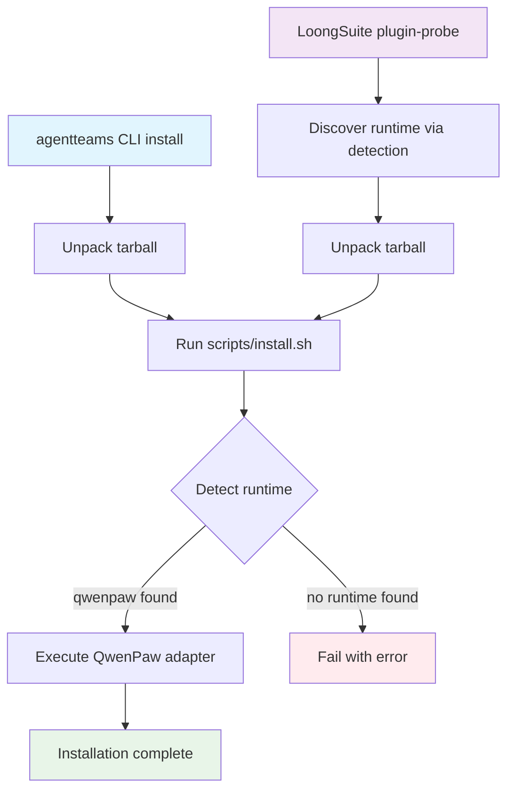
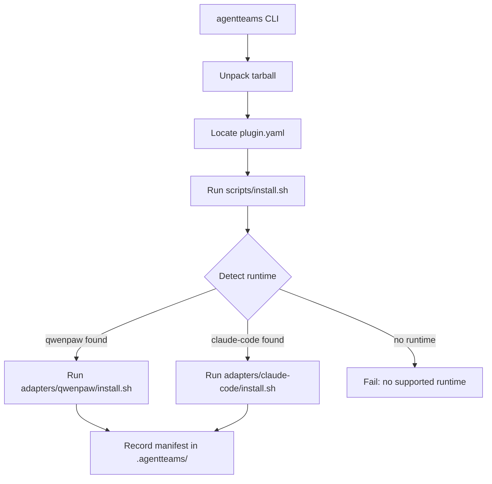

# Plugin Platform

The AgentTeams plugin platform enables extensible runtime behavior through a standardized package contract. Two primary plugins—TeamHarness and WorkerFlow—provide team-based task orchestration and per-worker internal workflow routing respectively. The platform supports installation via the AgentTeams CLI and compatibility with LoongSuite/Pilot's plugin-probe convention.

## Plugin Package Contract

Every AgentTeam plugin follows a shared contract defined by the `agentteams.agentteam/v1alpha1` API version. Plugins are distributed as tarballs whose root contains the plugin content directly.

### Installation Flow

The plugin installation follows two main paths: the AgentTeams CLI direct installation and LoongSuite/Pilot's plugin-probe convention. Both paths converge at the same lifecycle scripts.



*Plugin installation flow showing both CLI and LoongSuite paths converging at the lifecycle script.*

### Tarball Structure

```text
plugin-name.tar.gz
├── plugin.yaml          # Plugin manifest (required)
├── prompts/             # Agent prompts and overlays
├── skills/              # Agent and team skills
├── mcp/                 # MCP server and tool implementations
├── hooks/               # Lifecycle hooks
├── adapters/            # Runtime-specific adapters
└── scripts/             # Lifecycle entrypoints (install.sh, uninstall.sh)
```

The `plugin.yaml` manifest is the single source of truth for what a plugin exposes. It declares the API version, kind, metadata, prompts, skills, MCP servers, and adapters.

### Manifest Schema

```yaml
apiVersion: agentteams.agentteam/v1alpha1
kind: AgentTeamPlugin
metadata:
  name: <plugin-name>
  version: <semver>
prompts:
  team: <path-to-team-prompt>
  agent:
    leader: <path-to-leader-prompt>
    worker: <path-to-worker-prompt>
    remoteMember: <path-to-remote-member-prompt>
  manager:
    agents: <path-to-agents-overlay>
    tools: <path-to-tools-overlay>
    heartbeat: <path-to-heartbeat-overlay>
skills:
  agent:
    - id: <skill-id>
      path: <skill-path>
      roles: [<role>, ...]
  team:
    - id: <skill-id>
      path: <skill-path>
      roles: [<role>, ...]
mcp:
  servers:
    - id: <server-id>
      transport: stdio
      command: python
      args: [<script>]
      tools: [<tool-name>, ...]
adapters:
  - id: <adapter-id>
    path: <adapter-path>
package:
  include: [<paths-to-include-in-tarball>]
```

### Lifecycle Scripts

The shared contract defines two lifecycle entrypoints:

- **`scripts/install.sh`**: Detects supported local runtimes and dispatches to the matching adapter's install script.
- **`scripts/uninstall.sh`**: Removes the runtime-specific installation through the matching adapter when available.

Both the AgentTeams CLI and LoongSuite's `plugin-probe` path call these same lifecycle scripts. Runtime-specific details stay inside the plugin's adapters.

### Plugin Install Flow



*Figure: Plugin install flow showing the agentteams CLI unpacking a tarball, running the lifecycle script, detecting the runtime, and recording the installed manifest.*

## TeamHarness Plugin

TeamHarness is the team-based task orchestration plugin. It provides an MCP server for project/task/file/artifact management, agent prompts and skills for team coordination, and runtime adapters that bridge the plugin into specific worker runtimes (currently QwenPaw).

### MCP Server

The TeamHarness MCP server runs as a Python stdio process (`mcp/server.py`) and exposes seven tools:

| Tool | Purpose |
|------|---------|
| `health` | Check server availability and tool wiring |
| `message` | Send cross-room Matrix messages and external channel sends |
| `roomflow` | Create and describe Matrix rooms |
| `filesync` | Pull/push/stat/list files via agentteams_sync |
| `artifact` | Verify deliverable artifacts |
| `projectflow` | Project CRUD and DAG delegation |
| `taskflow` | Task lifecycle (create/assign/submit/review) |

The server depends on several internal modules:

- **`mcp_common.py`**: Shared helpers for storage, config, and auth context.
- **`protocol_bridge.py`**: DAG validation bridge to `agentteams_protocol`.
- **`message_tool.py`**: Matrix message send/read tools.
- **`roomflow_tool.py`**: Room creation and membership tools.
- **`tools/`**: Focused tool dispatch modules (`projectflow.py`, `taskflow.py`, `filesync.py`, `artifact.py`, `matrix_format.py`).

### Prompts

TeamHarness provides prompts for team coordination and per-role agent behavior:

- **`prompts/team/TEAMS.md`**: Team coordination prompt defining team dynamics and communication protocols.
- **`prompts/agent/`**: Per-role prompts for leader, worker, and remote-member agents.
- **`prompts/manager/`**: Manager prompt overlays for AGENTS, TOOLS, and HEARTBEAT contexts.

### Skills

Skills are organized into agent-level and team-level categories:

**Agent Skills** (available to all roles):
- `mcporter`: MCP tool usage and portability.
- `find-skills`: Skill discovery and selection.

**Team Skills** (role-specific):
- `communication`: Team communication protocols.
- `file-sharing`: File sharing conventions.
- `roomflow`: Room management (leader only).
- `team-coordination`: Team coordination (leader only).
- `project-management`: Project management (leader only).
- `task-delegation`: Task delegation (leader only).
- `task-execution`: Task execution (worker, remote-member).

### Runtime Adapters

TeamHarness includes adapters for specific worker runtimes:

#### QwenPaw Adapter

The QwenPaw adapter (`adapters/qwenpaw/`) provides:

- **`plugin.py`**: Core adapter logic for QwenPaw-specific install/reconcile behavior.
- **`matrix_channel.py`**: Matrix channel integration for QwenPaw.
- **`task_trace.py`**: Task tracing and observability.
- **`install.sh`** and **`uninstall.sh`**: Adapter-specific lifecycle scripts.

The adapter detects QwenPaw availability via the `qwenpaw` command, installs TeamHarness assets into the QwenPaw workspace, and manages the MCP server lifecycle.

#### Claude Code Adapter

The Claude Code adapter (`adapters/claude-code/`) handles remote-managed Claude Code runtime integration. It produces a separate `agentteams-claude-code-local-runtime-0.0.1.tar.gz` bundle.

### Security Considerations

The TeamHarness MCP server implements several security measures:

- **Sensitive artifact detection**: Blocks artifacts containing secrets, tokens, or private keys.
- **Sanitizer patterns**: Redacts cloud credentials (LTAI, AKIA, AKID patterns) and sensitive key-value pairs.
- **Message tool restrictions**: Blocks direct messaging from worker and remote-member roles.
- **Session write locks**: Thread-safe session file operations.

## WorkerFlow Plugin

WorkerFlow is a separate plugin for per-worker internal workflow routing. It enables a single Worker to organize its own internal execution without creating TeamHarness Workers, project DAGs, task rooms, or Leader acceptance state.

### MCP Server

The WorkerFlow MCP server (`mcp/server.py`) exposes a single tool:

- **`worker_agentflow`**: Manages Worker-local QwenPaw agent lifecycle for internal workflows.

The tool supports these actions:

| Action | Purpose |
|--------|---------|
| `list_agents` | List available QwenPaw agents |
| `list_subagents` | List subagents under default workspace |
| `create_temp_agent` | Create temporary QwenPaw agent from templates |
| `delete_temp_agent` | Remove temporary agent and optional workspace |
| `cleanup_shared` | Remove shared directory for a workflow run |
| `workflow_run` | Execute workflow with fan-out plan or DAG nodes |
| `workflow_start` | Start workflow card in Matrix room |
| `workflow_update` | Update workflow progress |
| `workflow_finish` | Mark workflow complete |
| `workflow_fail` | Mark workflow failed |

### Workflow Routing

WorkerFlow supports two workflow execution patterns:

1. **Fan-out plan**: Create multiple temporary agents for parallel execution with shared input/output directories.
2. **DAG nodes**: Define dependency relationships between workflow steps with explicit `dependsOn` constraints.

The server manages shared directories under `~/.qwenpaw/workspaces/default/shared/workerflow/<run-id>/` with proper input/output isolation per agent.

### Configuration

WorkerFlow loads runtime configuration from environment variables:

- `TEAMHARNESS_RUNTIME_CONFIG`: Primary runtime config path.
- `AGENTTEAMS_MEMBER_RUNTIME_CONFIG`: Fallback config path.
- `QWENPAW_API_BASE_URL` / `QWENPAW_BASE_URL`: QwenPaw API endpoint (defaults to `http://127.0.0.1:8088/api`).
- `QWENPAW_WORKING_DIR`: QwenPaw working directory (defaults to `~/.qwenpaw`).

The server enforces loopback-only API access when an explicit `apiBaseUrl` is provided.

## Plugin CLI

The AgentTeams CLI (`plugins/cli/`) provides a local fallback installer for plugin packages.

### Commands

```bash
# Install a plugin from tarball
agentteams plugin install <name> --package <tarball-path>

# Install from source directory
agentteams plugin install <name> --source <source-path>

# List installed plugins
agentteams plugin list

# Update an existing plugin
agentteams plugin update <name> --package <tarball-path>

# Uninstall a plugin
agentteams plugin uninstall <name>
```

### Implementation

The CLI stores local state under `.agentteams/` and provides:

- **`plugin_manager.py`**: Core install/update/uninstall logic with tarball extraction, manifest parsing, and lifecycle script execution.
- **`config_store.py`**: Configuration storage and plugin manifest management.

The CLI does not manage cluster worker lifecycle or hard-code runtime-specific install details. It unpacks the tarball, calls the package lifecycle script, and records the installed manifest with content hashing for integrity verification.

### Installation Process

1. **Package preparation**: Extract tarball to temporary directory or use source path directly.
2. **Manifest parsing**: Load `plugin.yaml` to extract metadata (name, version, dependencies).
3. **Old plugin removal**: If updating, run `uninstall.sh` on the existing installation.
4. **Content copy**: Copy plugin content to `.agentteams/plugins/<name>/content/`.
5. **Lifecycle execution**: Run `install.sh` with environment variables (`AGENTTEAMS_PROJECT_DIR`, `AGENTTEAMS_PLUGIN_DIR`, etc.).
6. **Manifest recording**: Save installation manifest with timestamp, content hash, and package/source paths.

## LoongSuite Compatibility

TeamHarness maintains compatibility with LoongSuite/Pilot's `plugin-probe` convention for local QwenPaw runtime deployment.

### Plugin Probe Convention

LoongSuite discovers TeamHarness through a descriptor file:

```text
loongsuite-pilot/
├── agents.d/teamharness.json
└── plugins/teamharness.tar.gz
```

The `agents.d/teamharness.json` file uses the plugin-probe shape:

```json
{
  "id": "teamharness",
  "displayName": "TeamHarness",
  "deployMode": "plugin-probe",
  "detection": {
    "paths": ["~/.qwenpaw"],
    "commands": ["qwenpaw"]
  },
  "pluginProbe": {
    "source": {
      "type": "tar",
      "tarball": "$PILOT_DIR/plugins/teamharness.tar.gz",
      "destDir": "$PILOT_DATA/plugins/teamharness"
    },
    "mountType": "wrapper"
  }
}
```

### Compatibility Scope

LoongSuite only:
1. Discovers the local runtime via detection paths/commands.
2. Unpacks the tarball to the destination directory.
3. Runs the standard lifecycle script (`scripts/install.sh`).

LoongSuite does **not** parse `plugin.yaml`, prompts, skills, MCP tools, hooks, or runtime adapter internals. This ensures the base TeamHarness package remains generic and runtime-neutral.

### Remote-Managed Workers

Remote-managed local workers use runtime-specific packages under `teamharness/remote/`. Claude Code local management assets, worker code, and LoongSuite runtime templates live there to avoid mixing with the runtime-neutral TeamHarness base package.

## Testing

The plugin platform includes comprehensive test coverage:

### Integration Tests

Run the full integration test suite:

```bash
plugins/tests/run-integration-tests.sh
```

This executes:
- Protocol characterization tests
- CLI plugin management tests
- Plugin manifest validation
- Plugin packaging tests
- Contract verification tests
- QwenPaw adapter tests (unit and integration)
- MCP server tests for all tools

### Individual Test Suites

```bash
# TeamHarness MCP server tests
ruby plugins/tests/teamharness/mcp/test-server.rb

# TeamHarness tool-specific tests
ruby plugins/tests/teamharness/mcp/tools/test-message.rb
ruby plugins/tests/teamharness/mcp/tools/test-filesync.rb
ruby plugins/tests/teamharness/mcp/tools/test-projectflow.rb
ruby plugins/tests/teamharness/mcp/tools/test-taskflow.rb

# QwenPaw adapter tests
python3 -m pytest plugins/tests/teamharness/adapters/qwenpaw/test_adapter.py -q
python3 -m pytest plugins/tests/teamharness/adapters/qwenpaw/test_package.py -q

# CLI tests
python3 plugins/tests/cli/test_agentteams_plugin_cli.py

# WorkerFlow tests (separate plugin)
python3 -m pytest plugins/tests/workerflow/ -q
```

### Validation Commands

```bash
# Validate plugin manifest
ruby plugins/scripts/validate-plugin.rb plugins/teamharness/plugin.yaml

# Validate shell scripts
bash -n plugins/teamharness/scripts/install.sh
bash -n plugins/teamharness/scripts/uninstall.sh

# Check for trailing whitespace
git diff --check
```

## Boundaries and Constraints

- **AgentPackage vs Plugin Package**: `desired.agentPackage` in the runtime config contract is an AgentTeams AgentSpec package, not a TeamHarness plugin package.
- **Cluster Workers**: Cluster QwenPaw workers do not use LoongSuite. They may later reuse the same TeamHarness tarball or bundled assets from the worker image.
- **Remote-Managed Workers**: Claude Code workers use `teamharness/remote/claude-code/` and produce a separate runtime bundle.
- **Stage 2 Scope**: The current implementation defines package, lifecycle, CLI fallback, and LoongSuite compatibility contracts. TeamHarness business semantics and real QwenPaw/remote-managed Claude Code runtime integration are covered in later phases.

## Related Pages

- [Skills and Prompts](../agent-content/skills-and-prompts.md): Detailed skill and prompt documentation
- [Build and Test](../development/build-and-test.md): Development workflow and testing
- [Higress Matrix MinIO](../integrations/higress-matrix-minio.md): Integration architecture
- [Manager Overview](../manager/overview.md): Manager agent documentation
- [Runtime Guide](../workers/runtime-guide.md): Worker runtime configuration
