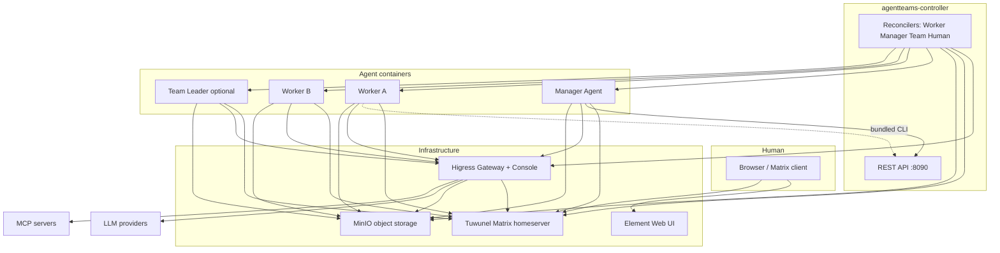

# AgentTeams OpenWiki

AgentTeams is an open-source collaborative multi-agent runtime platform. A **Manager** agent coordinates multiple **Worker** agents in Matrix IM rooms, with full human visibility and intervention. The system does not implement agent logic itself — it orchestrates and manages agent containers across multiple runtimes.

## What This Wiki Covers

This wiki is the generated knowledge base for the AgentTeams repository. It explains the architecture, components, and workflows so that both humans and AI agents can navigate the codebase effectively.

| Section | What It Covers |
|---------|---------------|
| [Architecture Overview](architecture/overview.md) | System layers, deployment shapes, component relationships, CRD model |
| [Controller: CRDs & Reconcilers](controller/crds-and-reconcilers.md) | Go operator, 5 CRD types, reconciler logic, service/provisioner layers |
| [Controller: CLI & API](controller/cli-and-api.md) | `agt` CLI commands, REST API endpoints, lifecycle operations |
| [Worker Runtimes](workers/runtime-guide.md) | OpenClaw, CoPaw, Hermes, OpenHuman, QwenPaw — configuration and differences |
| [Manager](manager/overview.md) | Coordinator agent, 19 skills, bootstrap chain, agent config templates |
| [Operations: Install & Deploy](operations/installation.md) | Docker install, Helm chart, build commands, registry mirrors |
| [Development: Build & Test](development/build-and-test.md) | Makefile targets, CI/CD, testing, changelog policy |
| [Workflows: Provisioning Lifecycle](workflows/provisioning-lifecycle.md) | End-to-end flow from Worker CR creation through infrastructure provisioning |
| [Workflows: Task Delegation](workflows/task-delegation.md) | Task assignment through Manager, team creation, coordination loops |
| [Integrations: Higress, Matrix, MinIO](integrations/higress-matrix-minio.md) | Detailed integration reference for infrastructure components |
| [Shared Libraries](shared-libraries.md) | Cross-cutting infrastructure packages consumed by all runtimes |
| [Plugin Platform](plugins/teamharness-and-workerflow.md) | Extension architecture: TeamHarness, WorkerFlow, plugin contracts |
| [Agent Content Model](agent-content/skills-and-prompts.md) | Agent-facing content: AGENTS.md/SOUL.md/HEARTBEAT.md/TOOLS.md convention |

## Quick Orientation

**If you want to understand the system:**
1. Start with [Architecture Overview](architecture/overview.md) for the big picture
2. Read [Controller: CRDs & Reconcilers](controller/crds-and-reconcilers.md) for the core data model
3. Browse [Worker Runtimes](workers/runtime-guide.md) to understand the multi-runtime design
4. Review [Workflows: Provisioning Lifecycle](workflows/provisioning-lifecycle.md) for end-to-end flows

**If you want to run the system:**
1. Follow [Operations: Install & Deploy](operations/installation.md) for installation
2. Use [Controller: CLI & API](controller/cli-and-api.md) for day-to-day operations
3. Check [Integrations: Higress, Matrix, MinIO](integrations/higress-matrix-minio.md) for infrastructure details

**If you want to develop or modify code:**
1. Read [Development: Build & Test](development/build-and-test.md) for build pipeline and CI
2. See [Manager](manager/overview.md) for agent-facing content and skills
3. Check [Controller: CRDs & Reconcilers](controller/crds-and-reconcilers.md) for operator development
4. Review [Shared Libraries](shared-libraries.md) for cross-cutting infrastructure packages

**If you want to extend with new runtimes or plugins:**
1. Browse [Worker Runtimes](workers/runtime-guide.md) for runtime comparison and extension points
2. Explore [Plugin Platform](plugins/teamharness-and-workerflow.md) for plugin architecture
3. Check [Agent Content Model](agent-content/skills-and-prompts.md) for agent-facing content conventions

## High-Level System Architecture



*Figure 1: AgentTeams component relationship diagram showing Human, Infrastructure, Controller, and Agent layers.*

## Repository Map

```
AgentTeams/
├── agentteams-controller/   # Go operator: CRDs, reconcilers, CLI, REST API
├── helm/agentteams/         # Helm chart for Kubernetes deployment
├── manager/             # Manager images, agent configs, 19 skills, bootstrap scripts
├── worker/              # OpenClaw Worker base image
├── copaw/               # CoPaw Python worker runtime
├── hermes/              # Hermes Python worker runtime
├── openhuman/           # OpenHuman Rust worker runtime
├── qwenpaw/             # QwenPaw worker runtime (TeamHarness plugin)
├── openclaw-base/       # Base image: Ubuntu + Node.js + OpenClaw + mcporter
├── plugins/             # TeamHarness, WorkerFlow, runtime adapters
├── shared/              # Shell libs + 5 Python packages (protocol, sync, merge, format, policies)
├── dashboard/           # Web dashboard (Vite SPA + Node.js proxy)
├── install/             # Local install scripts (Bash, PowerShell)
├── docs/                # Existing upstream documentation
├── tests/               # Integration tests
└── .github/workflows/   # CI/CD: build, test, release
```

## Key Technology Stack

| Component | Technology | Purpose |
|-----------|-----------|---------|
| Kubernetes operator | Go (agentteams-controller) | Reconciles Worker/Manager/Team/Human/Project CRDs |
| AI Gateway | Higress | LLM proxy, MCP server hosting, consumer auth |
| Matrix Server | Tuwunel (conduwuit fork) | IM between agents and humans |
| File System | MinIO or Alibaba Cloud OSS | Centralized object storage for workspaces |
| Agent Frameworks | OpenClaw, CoPaw, Hermes, OpenHuman, QwenPaw | Multiple runtimes for different agent capabilities |
| MCP CLI | mcporter | Worker calls MCP server tools via CLI |

## Deployment Modes

### Local (Docker/Podman)
One embedded controller container bundles Higress + Tuwunel + MinIO + Element Web + controller process. Manager and Worker run as separate containers via Docker API.

**Quick Install:**
```bash
bash <(curl -sSL https://raw.githubusercontent.com/agentscope-ai/AgentTeams/main/install/agentteams-install.sh)
```

### Kubernetes (Helm)
Each component runs as its own Pod. The controller reconciles CRDs to create Manager and Worker pods dynamically.

**Quick Install:**
```bash
helm repo add higress.io https://higress.io/helm-charts
helm repo update
helm install agentteams higress.io/agentteams \
  -n agentteams-system --create-namespace \
  --set credentials.llmApiKey=<your-api-key> \
  --set credentials.adminPassword=<your-admin-password> \
  --set gateway.publicURL=http://localhost:18080
```

See [Architecture Overview](architecture/overview.md) for detailed deployment diagrams and [Operations: Install & Deploy](operations/installation.md) for complete installation instructions.

## Upstream Documentation

The `docs/` directory contains the original project documentation:

- [`docs/architecture.md`](../docs/architecture.md) — System architecture and component diagrams
- [`docs/quickstart.md`](../docs/quickstart.md) — End-to-end setup guide
- [`docs/development.md`](../docs/development.md) — Developer workflow
- [`docs/declarative-resource-management.md`](../docs/declarative-resource-management.md) — YAML-driven resource management
- [`docs/worker-guide.md`](../docs/worker-guide.md) — Worker development guide
- [`docs/manager-guide.md`](../docs/manager-guide.md) — Manager administration guide
- [`docs/faq.md`](../docs/faq.md) — Frequently asked questions

## Git Context

- **Repository:** `agentscope-ai/AgentTeams` (GitHub)
- **Latest documented commit:** `f37b50c` — feat(agt): rewrite status as one-screen cluster overview
- **Key recent work:** Gastown-inspired features (escalation, health monitoring, dispatch gating, session recovery), QwenPaw runtime wiring, remediation gates CI
