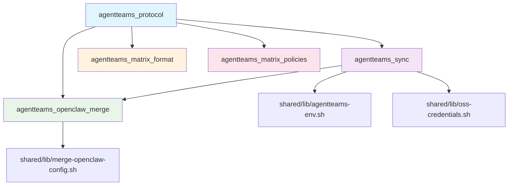

# Shared Libraries

This page documents the shared infrastructure packages consumed by all AgentTeams worker runtimes (CoPaw, Hermes, QwenPaw, OpenHuman, OpenClaw). These libraries provide domain logic, environment bootstrap, credential management, and configuration deployment across the system.

## Python Packages

Five independently-installable Python packages provide domain logic shared across all runtimes. Each package is consumed as a build-context dependency in Dockerfiles and installed via `pip install -e`.

### agentteams_protocol

**Purpose**: Domain models and task/project DAG validation for the AgentTeams taskflow system.

**Key Modules**:
- `task.py` (1300+ lines): Core domain models and DAG validation logic
- `errors.py`: Protocol-level error definitions

**Public API** (from `__init__.py`):
- **Domain Models**: `ProjectMeta`, `DagTask`, `LoopPlan`, `TaskMeta`, `TaskResult`, `VerifiableClaim`, `VerificationReport`
- **Task Operations**: `create_project`, `add_tasks`, `plan_dag`, `submit_task`, `ack_task`, `complete_project`, `delegate_task`
- **Validation**: `validate_dag`, `validate_task_result`, `verify_task_artifacts`
- **Parsing/Rendering**: `parse_dag_tasks`, `parse_loop_plan`, `render_dag_task`, `render_task_result`
- **Status Management**: `RESULT_STATUSES`, `EFFECTIVE_RESULT_STATUSES`, `MARKER_TO_STATUS`, `STATUS_TO_MARKER`

**Key Responsibilities**:
- Project lifecycle management (create, pause, resume, complete)
- DAG task validation with cycle detection and dependency checking
- Task result parsing and validation from markdown format
- File-based task storage via `FileSystemTaskStore`
- Loop plan iteration tracking and history management

**Test Location**: `shared/python/agentteams_protocol/tests/test_verify_artifacts.py`

### agentteams_sync

**Purpose**: MinIO file synchronization daemon and per-runtime push policies.

**Key Modules**:
- `filesync.py`: Core `FileSync` class for MinIO file operations
- `daemon.py`: Background synchronization daemon
- `contract.py`: Per-runtime sync contracts (COPAW, HERMES, OPENCLAW, etc.)
- `policy.py`: Push policy definitions for different runtimes
- `openclaw.py`: OpenClaw-specific sync integration
- `openclaw_matrix.py`: Matrix integration for OpenClaw sync

**Public API** (from `__init__.py`):
- **Core**: `FileSync`, `SyncContract`, `PushPolicy`
- **Runtime Contracts**: `COPAW`, `HERMES`, `OPENCLAW`, `OPENHUMAN`, `QWENPAW`, `TEAMHARNESS_MCP`, `RUNTIME_CONTRACTS`
- **Sync Operations**: `push_local`, `push_loop`, `sync_loop`
- **Helpers**: `team_storage_name_from_worker_team`, `BridgeRuntimeError`

**Key Responsibilities**:
- MinIO file synchronization with configurable pull/push intervals
- Per-runtime sync contracts defining synchronization behavior
- Background daemon for continuous file synchronization
- OpenClaw-specific merge integration with `agentteams_openclaw_merge`
- Matrix event handling for OpenClaw sync operations

**Test Location**: `shared/python/agentteams_sync/tests/` (3 test files)

### agentteams_openclaw_merge

**Purpose**: Canonical openclaw.json merge logic for configuration deployment.

**Key Modules**:
- `merge.py`: Core merge implementation with documented merge rules
- `__main__.py`: CLI wrapper for command-line usage

**Public API** (from `__init__.py`):
- `merge_openclaw_config(remote_text, local_text) -> str`: Merge remote and local openclaw.json
- `deep_merge(base, override) -> dict`: Deep merge with override winning leaf conflicts

**Merge Rules** (documented in `merge.py`):
- **Base document**: Start from local (authoritative base)
- **models**: Remote wins wholesale (replace if remote defines)
- **gateway**: Remote wins wholesale
- **channels**: Deep merge with remote winning leaf conflicts
- **channels.matrix.accessToken**: Local wins (preserve worker re-login)
- **plugins.entries**: Deep merge with local winning leaf conflicts
- **plugins.load.paths**: Set union, sorted unique

**Test Location**: `shared/tests/test_merge_openclaw_config_parity.py` (shared fixtures)

### agentteams_matrix_format

**Purpose**: Markdown-it rendering for Matrix messages.

**Key Modules**:
- `__init__.py`: Complete implementation with fallback handling

**Public API** (from `__init__.py`):
- `md_to_html(text) -> str`: Convert markdown to HTML for Matrix `formatted_body`
- `render_with_markdown_it(text) -> str | None`: Render with markdown-it-py (graceful fallback)
- `md_to_html_simple(text) -> str`: Escape plain text with line breaks
- `edit_fallback_html(text) -> str`: Wrap escaped text for Matrix edit fallbacks

**Key Features**:
- Markdown-it-py integration with linkify-it-py for URL detection
- Graceful fallback to plain text escaping when dependencies unavailable
- Matrix-specific HTML formatting for `formatted_body`

**Test Location**: `shared/python/agentteams_matrix_format/tests/` (if exists)

### agentteams_matrix_policies

**Purpose**: Matrix channel allow-list policy builder and outbound message filtering.

**Key Modules**:
- `policies.py`: Policy implementation with mention handling and history buffering

**Public API** (from `__init__.py`):
- **Policy Classes**: `DualAllowList`, `HistoryBuffer`
- **Mention Handling**: `extract_mentions_from_text`, `apply_outbound_mentions`, `normalize_user_id`
- **Message Filtering**: `should_suppress_outbound`
- **Constants**: `CURRENT_MESSAGE_MARKER`, `DEFAULT_HISTORY_LIMIT`, `HISTORY_CONTEXT_MARKER`

**Key Features**:
- Dual allow-list system for room and user filtering
- History buffering for context management
- Outbound mention enrichment and filtering
- Matrix user ID normalization and validation

**Test Location**: `shared/python/agentteams_matrix_policies/tests/` (if exists)

## Shell Libraries

Shell scripts in `shared/lib/` provide environment bootstrap, credential management, and utility functions.

### agentteams-env.sh

**Purpose**: Unified environment bootstrap for both Manager and Worker containers.

**Key Functions**:
- `is_cloud_runtime()`: Check if runtime is cloud-based (aliyun/k8s)
- `is_local_runtime()`: Check if runtime is local (docker/none)
- `agentteams_mc_host_var()`: Get MC_HOST variable name for storage alias
- `agentteams_mc_host_configured()`: Check if MC_HOST is configured

**Exported Variables**:
- **Runtime**: `AGENTTEAMS_RUNTIME`, `AGENTTEAMS_CONTAINER_SOCKET`
- **Matrix**: `AGENTTEAMS_MATRIX_URL`, `AGENTTEAMS_MATRIX_DOMAIN`
- **Storage**: `AGENTTEAMS_FS_*`, `AGENTTEAMS_STORAGE_*`
- **Worker**: `AGENTTEAMS_WORKER_NAME`, `AGENTTEAMS_AUTH_TOKEN*`
- **AI Gateway**: `AGENTTEAMS_AI_GATEWAY_URL`, `AGENTTEAMS_AI_GATEWAY_DOMAIN`
- **CMS**: `AGENTTEAMS_CMS_*` (tracing, metrics, endpoint)

**Key Features**:
- Worker environment mount handling with timeout and validation
- Environment file validation against command substitution injection
- Runtime detection (aliyun/k8s/docker/none)
- Storage credential management integration

**Consumers**: All runtime containers, scripts requiring environment variables

### oss-credentials.sh

**Purpose**: STS credential management for mc (MinIO Client).

**Key Functions**:
- `ensure_mc_credentials()`: Public API for credential refresh (no-op in local mode)
- `_oss_refresh_sts_via_controller()`: Refresh STS tokens via controller API
- `_oss_resolve_bearer()`: Resolve bearer token from env/file
- `_oss_load_cred_file()`: Parse cached credential file safely

**Key Features**:
- Controller-mediated STS token refresh for cloud deployments
- Lazy credential refresh with 10-minute margin before expiry
- Cached credential fallback for transient refresh failures
- Secure credential file parsing (no shell execution)

**Consumers**: `mc-wrapper.sh`, any script using `mc` commands

### mc-wrapper.sh

**Purpose**: Transparent STS credential refresh wrapper for mc.

**Key Behavior**:
- Installed as `/usr/local/bin/mc` (symlink), real binary at `/usr/local/bin/mc.bin`
- Refreshes STS credentials before every mc invocation
- No-op in local mode (near-zero overhead)

**Consumers**: All `mc` command invocations in container environments

### merge-openclaw-config.sh

**Purpose**: Shell wrapper for openclaw.json merge logic.

**Key Function**:
- `merge_openclaw_config <remote_path> <local_path> [<output_path>]`: Merge remote and local configs

**Implementation**: Delegates to `python3 -m agentteams_openclaw_merge`

**Consumers**: Worker entrypoint scripts, sync loops

### render-skills.sh

**Purpose**: Replace environment variable placeholders in agent documentation files.

**Key Features**:
- Whitelist-based variable replacement (only known variables)
- Support for single file or directory rendering
- Preserves non-whitelisted variables (like `$task_id`)

**Usage**: `render-skills.sh <directory> [file1 file2 ...]`

**Consumers**: Startup scripts, skill deployment

### resolve-model-params.sh

**Purpose**: Resolve model metadata from known-models.json.

**Key Function**:
- `resolve_model_params <model_id>`: Set MODEL_* variables for given model

**Output Variables**:
- `MODEL_CONTEXT_WINDOW`: Context window size
- `MODEL_MAX_TOKENS`: Maximum token limit
- `MODEL_REASONING`: Whether model supports reasoning
- `MODEL_INPUT`: Supported input modalities

**Consumers**: Model configuration, runtime initialization

### sync-shared-worker-skills.sh

**Purpose**: Copy canonical shared worker skills into runtime agent trees.

**Key Features**:
- Maintains stable deploy layout while deduplicating script content
- Copies skills from `shared-worker-skills/` to all runtime agent directories
- Ensures script permissions are set correctly

**Usage**: `sync-shared-worker-skills.sh [AGENT_SRC]`

**Consumers**: Image build process, startup initialization

## Dependency Graph



**Dependency Rule**: `agentteams_protocol` is the foundation package. Other packages may import it, but no cross-imports are allowed between non-protocol packages. This ensures:
- Clear dependency hierarchy
- Independent package installation
- No circular dependencies
- Foundation models available to all packages

## Conventions

### Namespace
All Python packages use the `agentteams_*` prefix to:
- Clearly identify shared infrastructure
- Avoid naming conflicts with runtime-specific packages
- Enable easy discovery in dependency lists

### Layout
- **Python**: Setuptools src-layout (`src/agentteams_<name>/`)
- **Shell**: Flat structure in `shared/lib/` with descriptive names
- **Tests**: Co-located with packages (`tests/` subdirectory)

### Versioning
- All packages start at `>=0.1.0`
- No published PyPI releases (installed from source)
- Version bumps indicate breaking changes or significant features

### Test Command
```bash
# All shared packages
for pkg in shared/python/agentteams_*; do
  [ -d "$pkg/tests" ] && python -m pytest -q "$pkg/tests"
done

# Or via Makefile (includes runtime tests too)
make test-python
```

### Installation
Each package is independently installable:
```bash
pip install -e ./shared/python/agentteams_<name>
```

## Consumer Note: Rebuild Triggers

**Critical**: Changes to shared packages trigger rebuilds of **all** dependent runtime images:
- `copaw`
- `hermes`
- `qwenpaw`
- `openhuman`
- `worker`
- `manager-copaw`

**CI Integration**: The `remediation-gates.yml` CI job auto-discovers and tests all `shared/python/agentteams_*` packages on every PR to catch breaking changes before they affect runtimes.

**Best Practice**: When modifying shared libraries:
1. Run full test suite across all packages
2. Consider backward compatibility
3. Update documentation if public APIs change
4. Test integration with at least one runtime before merging
