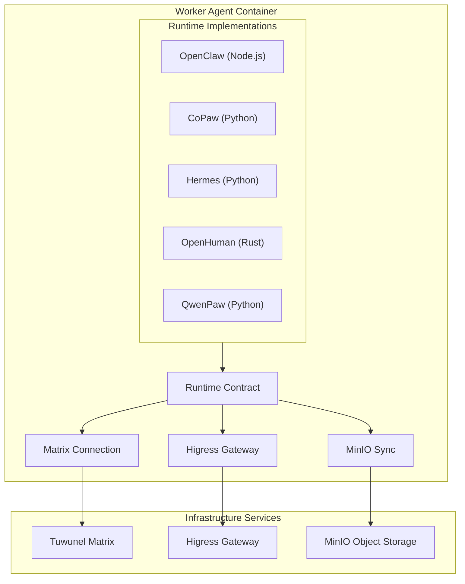

# Worker Runtimes

AgentTeams supports five worker runtimes. Each runtime implements the same core contract — join Matrix rooms, respond to messages, call LLMs through the Higress gateway — but uses a different language and agent framework. The runtime is selected per Worker CR via `spec.runtime`.

## Runtime Comparison

| Runtime | Language | Framework | Image | Manager Compatible | Notes |
|---------|----------|-----------|-------|-------------------|-------|
| `openclaw` | Node.js | OpenClaw (fork) | `agentteams-worker` | Yes | Default runtime; uses openclaw-base |
| `copaw` | Python 3.11 | CoPaw | `agentteams-copaw-worker` | Yes | Dual venv (standard/lite); bridge pattern |
| `hermes` | Python 3.11 | hermes-worker | `agentteams-hermes-worker` | No (worker-only) | Custom Matrix adapter; autonomous coding |
| `openhuman` | Rust | openhuman-core | `agentteams-openhuman-worker` | No (worker-only) | Native Matrix support; channel-matrix feature |
| `qwenpaw` | Python 3.11 | QwenPaw + TeamHarness | `agentteams-qwenpaw-worker` | No (worker-only) | Plugin system; runtime.yaml config; TeamHarness integration |

## Runtime Architecture

*Figure: Worker runtime architecture showing the common contract and five runtime implementations*

## OpenClaw Runtime (`openclaw`)

The default and most mature runtime. Based on the OpenClaw agent framework (a fork of an open-source agent gateway).

**Architecture:**
- Node.js process running OpenClaw gateway
- Matrix plugin handles room joins and message routing
- Gateway mode: LLM calls go through Higress proxy
- `mcporter` CLI for MCP server tool calls
- OpenClaw CMS plugin for observability

**Base image:** `openclaw-base` provides Ubuntu 24.04, Node.js 22, OpenClaw, and mcporter.

**Configuration:**
- Agent config: `workspace/agent.json` (generated by controller)
- Skills: `workspace/skills/<name>/SKILL.md` (auto-loaded)
- Personality: `workspace/SOUL.md`
- Bootstrap: `workspace/AGENTS.md`

**Key files:**
- [`worker/Dockerfile`](../../worker/Dockerfile) — Image build
- [`worker/scripts/worker-entrypoint.sh`](../../worker/scripts/worker-entrypoint.sh) — Startup logic
- [`openclaw-base/`](../../openclaw-base/) — Base image definition

## CoPaw Runtime (`copaw`)

Python-based alternative using the CoPaw framework.

**Architecture:**
- Python process with CoPaw bridge
- Dual virtual environments: `standard` (full) and `lite` (minimal)
- Matrix channel via `copaw channels send` CLI
- File sync via `agentteams_sync` package
- Manager bootstrap supports both CoPaw Manager and Worker modes

**Key components:**
- `copaw_worker/bridge.py` — Core bridge between CoPaw and AgentTeams
- `copaw_worker/worker.py` — Worker lifecycle management
- `copaw_worker/sync.py` — File synchronization with MinIO
- `copaw_worker/task.py` — Task handling
- `copaw_worker/hooks/tools/taskflow.py` — Task flow tool integration
- `copaw_worker/matrix_channel.py` — Matrix channel management
- `copaw_worker/workspace_layout.py` — Workspace directory structure

**Configuration:**
- Agent config: `templates/agent.worker.json` / `templates/agent.manager.json`
- Skills: Shared with OpenClaw Manager skills tree

**Key files:**
- [`copaw/Dockerfile`](../../copaw/Dockerfile) — Image build
- [`copaw/pyproject.toml`](../../copaw/pyproject.toml) — Package definition
- [`copaw/src/copaw_worker/`](../../copaw/src/copaw_worker/) — Python package source

## Hermes Runtime (`hermes`)

Python-based autonomous coding agent runtime built on hermes-agent (v0.10.0).

**Architecture:**
- Python process with `hermes-worker` package
- Custom Matrix adapter overlaying hermes-agent's native mautrix implementation
- Policy-based message filtering (allowlists, mention-required, vision support)
- Worker-only (cannot serve as Manager)

**Key components:**
- `hermes_worker/` — Worker runtime package with CLI, bridge, and run-loop
- `hermes_worker/bridge.py` — Configuration bridge from openclaw.json to hermes config
- `hermes_matrix/` — Matrix adapter with CoPaw-equivalent policies
- `hermes_matrix/overlay_adapter.py` — Matrix-nio adapter overlay for policy enforcement

**Key files:**
- [`hermes/Dockerfile`](../../hermes/Dockerfile) — Image build
- [`hermes/pyproject.toml`](../../hermes/pyproject.toml) — Package definition
- [`hermes/src/`](../../hermes/src/) — Python package source

## OpenHuman Runtime (`openhuman`)

Rust-based runtime with native Matrix support.

**Architecture:**
- Rust binary (`openhuman-core`) with `channel-matrix` feature flag
- Native Matrix protocol implementation (no bridge)
- Multi-stage Docker build: `rust:1.93-bookworm` → `debian:bookworm-slim`
- MinIO sync for workspace state
- Worker-only (cannot serve as Manager)

**Configuration:**
- Config: `config.toml` (generated at startup)
- Entrypoint handles config generation, MinIO sync, health check

**Key files:**
- [`openhuman/Dockerfile`](../../openhuman/Dockerfile) — Multi-stage Rust build
- [`openhuman/scripts/openhuman-worker-entrypoint.sh`](../../openhuman/scripts/openhuman-worker-entrypoint.sh) — Startup logic
- [`openhuman/pyproject.toml`](../../openhuman/pyproject.toml) — Python bridge package
- [`openhuman/src/openhuman_worker/`](../../openhuman/src/openhuman_worker/) — Python bridge source

## QwenPaw Runtime (`qwenpaw`)

Python-based runtime using the QwenPaw framework with TeamHarness plugin integration.

**Architecture:**
- Python process with QwenPaw framework
- TeamHarness plugin provides MCP server for agent tools
- Plugin bootstrap system for runtime extensions
- Security bootstrap for credential isolation
- Runtime configurator for dynamic config updates
- Worker-only (cannot serve as Manager)

**Key components:**
- `qwenpaw_worker/worker.py` — Worker lifecycle management
- `qwenpaw_worker/plugin_bootstrap.py` — Plugin initialization and TeamHarness integration
- `qwenpaw_worker/plugin_install.py` — Plugin installation and management
- `qwenpaw_worker/runtime_configurator.py` — Dynamic configuration updates via runtime.yaml
- `qwenpaw_worker/security_bootstrap.py` — Security setup and credential isolation
- `qwenpaw_worker/sync.py` — File synchronization with MinIO
- `qwenpaw_worker/heartbeat.py` — Health monitoring and reporting
- `qwenpaw_worker/better_harness.py` — Better-harness CLI integration for agent self-review
- `qwenpaw_worker/update/` — Update subsystem (agent packages, channels, models, runtime)

**Key files:**
- [`qwenpaw/Dockerfile`](../../qwenpaw/Dockerfile) — Image build
- [`qwenpaw/pyproject.toml`](../../qwenpaw/pyproject.toml) — Package definition
- [`qwenpaw/src/qwenpaw_worker/`](../../qwenpaw/src/qwenpaw_worker/) — Python package source

## Worker Agent Templates

Each runtime has a corresponding agent template directory under [`manager/agent/`](../../manager/agent/):

| Runtime | Template Directory |
|---------|-------------------|
| `openclaw` | `manager/agent/worker-agent/` |
| `copaw` | `manager/agent/copaw-worker-agent/` |
| `hermes` | `manager/agent/hermes-worker-agent/` |
| `openhuman` | `manager/agent/openhuman-worker-agent/` |
| `qwenpaw` | `manager/agent/qwenpaw-worker-agent/` |

These templates are copied into worker workspaces during provisioning. They contain agent configuration, skills, and bootstrap instructions specific to each runtime.

## Common Patterns

All runtimes share these patterns:

1. **Matrix connection** — Join rooms, receive messages, send responses
2. **Gateway auth** — Use consumer token for LLM access through Higress
3. **MinIO sync** — Download workspace on startup, upload state periodically
4. **Health reporting** — Report health status to controller
5. **Skill loading** — Load SKILL.md files from workspace/skills/
6. **Configuration bridge** — Translate openclaw.json to runtime-specific config
7. **Shared libraries** — Use agentteams_* Python packages for domain logic

## Source References

- Runtime comparison: [`AGENTS.md`](../../AGENTS.md) (Runtime model section)
- OpenClaw base: [`openclaw-base/`](../../openclaw-base/)
- CoPaw: [`copaw/`](../../copaw/)
- Hermes: [`hermes/`](../../hermes/)
- OpenHuman: [`openhuman/`](../../openhuman/)
- QwenPaw: [`qwenpaw/`](../../qwenpaw/)
- Worker templates: [`manager/agent/`](../../manager/agent/)
