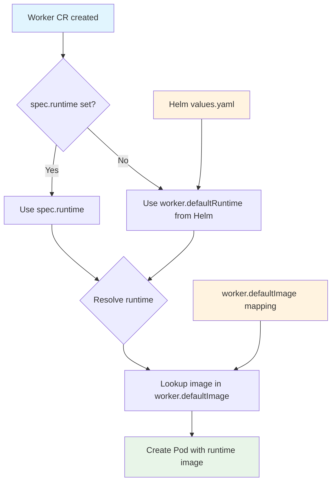

# Worker Runtimes

AgentTeams supports five worker runtimes. Each runtime implements the same core contract — join Matrix rooms, respond to messages, call LLMs through the Higress gateway — but uses a different language and agent framework. The runtime is selected per Worker CR via `spec.runtime`.

## Runtime Selection Flow

The controller selects the runtime image from the Worker CR `spec.runtime` field. If `spec.runtime` is not set, the controller uses the Helm `worker.defaultRuntime` value (defaulting to `openclaw`). The image is then selected from `worker.defaultImage.<runtime>` in the Helm values.



*Figure: Runtime selection flow from Worker CR to container image.*

## Runtime Comparison

| Runtime | Language | Framework | Image | Manager Compatible | Notes |
|---------|----------|-----------|-------|-------------------|-------|
| `openclaw` | Node.js | OpenClaw (fork) | `agentteams-worker` | Yes | Default runtime; uses openclaw-base |
| `copaw` | Python 3.11 | CoPaw/AgentScope | `agentteams-copaw-worker` | Yes | Dual venv (standard/lite); bridge pattern |
| `hermes` | Python 3.11 | hermes-worker | `agentteams-hermes-worker` | No (worker-only) | Mautrix Matrix SDK; autonomous coding |
| `openhuman` | Rust | openhuman-core | `agentteams-openhuman-worker` | No (worker-only) | Native Matrix support; channel-matrix feature |
| `qwenpaw` | Python 3.11 | QwenPaw + TeamHarness | `agentteams-qwenpaw-worker` | No (worker-only) | Plugin system; runtime.yaml config |

## Controller Runtime Selection

The controller uses the following logic to select the runtime image:

1. **Worker CR `spec.runtime`**: If set, use this value
2. **Helm `worker.defaultRuntime`**: If `spec.runtime` is empty, use this value (default: `openclaw`)
3. **Image mapping**: Use `worker.defaultImage.<runtime>` from Helm values to select the container image

### Helm Values Configuration

```yaml
# Helm values.yaml
worker:
  defaultRuntime: "openclaw"  # Default runtime when spec.runtime is not set
  defaultImage:
    openclaw:
      repository: "agentteams/agentteams-worker"
      tag: ""
    copaw:
      repository: "agentteams/agentteams-copaw-worker"
      tag: ""
    hermes:
      repository: "agentteams/agentteams-hermes-worker"
      tag: ""
    openhuman:
      repository: "agentteams/agentteams-openhuman-worker"
      tag: ""
    qwenpaw:
      repository: "agentteams/agentteams-qwenpaw-worker"
      tag: ""
```

### Runtime Resolution Logic

The controller's `ResolveRuntime()` function implements this logic:

```go
// ResolveRuntime returns the effective runtime for a backend request.
// Resolution order:
//  1. The explicit runtime on the request (req.Runtime).
//  2. The caller-provided fallback (req.RuntimeFallback) — typically
//     AGENTTEAMS_MANAGER_RUNTIME for Manager pods, AGENTTEAMS_DEFAULT_WORKER_RUNTIME
//     for Worker pods. The caller (reconciler) is responsible for picking the
//     right env var since Backend.Create is shared between both.
//  3. RuntimeOpenClaw — the historical default.
func ResolveRuntime(reqRuntime, fallback string) string {
    if reqRuntime != "" {
        return reqRuntime
    }
    if fallback != "" {
        return fallback
    }
    return RuntimeOpenClaw
}
```

## OpenClaw Runtime (`openclaw`)

The default and most mature runtime. Based on the OpenClaw agent framework (a fork of an open-source agent gateway).

**Architecture:**
- Node.js process running OpenClaw gateway
- Matrix plugin handles room joins and message routing
- Gateway mode: LLM calls go through Higress proxy
- `mcporter` CLI for MCP server tool calls

**Base image:** `openclaw-base` provides Ubuntu 24.04, Node.js 22, OpenClaw, and mcporter. This base image is shared by both Manager and Worker containers.

**Configuration:**
- Agent config: `workspace/agent.json` (generated by controller)
- Skills: `workspace/skills/<name>/SKILL.md` (auto-loaded)
- Personality: `workspace/SOUL.md`
- Bootstrap: `workspace/AGENTS.md`

**Key files:**
- [`worker/Dockerfile`](../../worker/Dockerfile) — Image build
- [`worker/scripts/worker-entrypoint.sh`](../../worker/scripts/worker-entrypoint.sh) — Startup logic
- [`openclaw-base/`](../../openclaw-base/) — Base image definition

**Manager compatibility:** Yes - OpenClaw runtime can serve as both Manager and Worker. The Manager image uses the same base but includes additional manager-specific scripts and configuration.

## CoPaw Runtime (`copaw`)

Python-based alternative using the CoPaw/AgentScope framework.

**Architecture:**
- Python process with CoPaw bridge
- Dual virtual environments: `standard` (full) and `lite` (minimal)
- Matrix channel via `copaw channels send` CLI
- File sync via `agentteams_sync` package
- Manager bootstrap supports both CoPaw Manager and Worker modes

**Key components:**
- `copaw_worker/bridge.py` — Core bridge between CoPaw and AgentTeams
- `copaw_worker/worker.py` — Worker lifecycle management
- `copaw_worker/sync.py` — File synchronization with MinIO
- `copaw_worker/task.py` — Task handling
- `copaw_worker/hooks/tools/taskflow.py` — Task flow tool integration
- `copaw_worker/matrix_channel.py` — Matrix channel management
- `copaw_worker/workspace_layout.py` — Workspace directory structure

**Configuration:**
- Agent config: `templates/agent.worker.json` / `templates/agent.manager.json`
- Skills: Shared with OpenClaw Manager skills tree

**Key files:**
- [`copaw/Dockerfile`](../../copaw/Dockerfile) — Image build
- [`copaw/pyproject.toml`](../../copaw/pyproject.toml) — Package definition
- [`copaw/src/copaw_worker/`](../../copaw/src/copaw_worker/) — Python package source

**Manager compatibility:** Yes - CoPaw runtime can serve as both Manager and Worker. The Manager image uses a separate Dockerfile (`Dockerfile.copaw`) with additional manager-specific configuration.

## Hermes Runtime (`hermes`)

Python-based autonomous coding agent runtime.

**Architecture:**
- Python process with `hermes-worker` package
- Mautrix Matrix SDK for native Matrix support
- Policy-based message filtering
- Worker-only (cannot serve as Manager)

**Key components:**
- `hermes_worker/` — Worker runtime package
- `hermes_matrix/` — Matrix integration with policies
- `hermes_matrix/policies.py` — Message filtering policies

**Key files:**
- [`hermes/Dockerfile`](../../hermes/Dockerfile) — Image build
- [`hermes/pyproject.toml`](../../hermes/pyproject.toml) — Package definition
- [`hermes/src/`](../../hermes/src/) — Python package source

**Manager compatibility:** No - Hermes is a worker-only runtime. It cannot serve as a Manager agent.

## OpenHuman Runtime (`openhuman`)

Rust-based runtime with native Matrix support.

**Architecture:**
- Rust binary (`openhuman-core`) with `channel-matrix` feature flag
- Native Matrix protocol implementation (no bridge)
- Multi-stage Docker build: `rust:1.93-bookworm` → `debian:bookworm-slim`
- MinIO sync for workspace state
- Worker-only (cannot serve as Manager)

**Configuration:**
- Config: `config.toml` (generated at startup)
- Entrypoint handles config generation, MinIO sync, health check

**Key files:**
- [`openhuman/Dockerfile`](../../openhuman/Dockerfile) — Multi-stage Rust build
- [`openhuman/scripts/openhuman-worker-entrypoint.sh`](../../openhuman/scripts/openhuman-worker-entrypoint.sh) — Startup logic
- [`openhuman/pyproject.toml`](../../openhuman/pyproject.toml) — Python bridge package
- [`openhuman/src/openhuman_worker/`](../../openhuman/src/openhuman_worker/) — Python bridge source

**Manager compatibility:** No - OpenHuman is a worker-only runtime. It cannot serve as a Manager agent.

## QwenPaw Runtime (`qwenpaw`)

Python-based runtime using the QwenPaw framework with TeamHarness plugin integration.

**Architecture:**
- Python process with QwenPaw framework
- TeamHarness plugin provides MCP server for agent tools
- Plugin bootstrap system for runtime extensions
- Security bootstrap for credential isolation
- Runtime configurator for dynamic config updates
- Worker-only (cannot serve as Manager)

**Key components:**
- `qwenpaw_worker/worker.py` — Worker lifecycle
- `qwenpaw_worker/plugin_bootstrap.py` — Plugin initialization
- `qwenpaw_worker/plugin_install.py` — Plugin installation
- `qwenpaw_worker/runtime_configurator.py` — Dynamic configuration
- `qwenpaw_worker/security_bootstrap.py` — Security setup
- `qwenpaw_worker/sync.py` — File synchronization
- `qwenpaw_worker/update/` — Update subsystem (agent packages, channels, models, runtime)

**Key files:**
- [`qwenpaw/Dockerfile`](../../qwenpaw/Dockerfile) — Image build
- [`qwenpaw/pyproject.toml`](../../qwenpaw/pyproject.toml) — Package definition
- [`qwenpaw/src/qwenpaw_worker/`](../../qwenpaw/src/qwenpaw_worker/) — Python package source

**Manager compatibility:** No - QwenPaw is a worker-only runtime. It cannot serve as a Manager agent. QwenPaw uses the TeamHarness plugin system for enhanced functionality.

### QwenPaw Plugin Integration

QwenPaw has special integration with the TeamHarness plugin system:

- **TeamHarness plugin**: Provides MCP server for project/task/file/artifact management
- **WorkerFlow plugin**: Enables per-worker internal workflow routing
- **Plugin bootstrap**: Automatic plugin installation and initialization
- **Runtime configurator**: Dynamic configuration updates without container restarts
- **Security bootstrap**: Credential isolation and sensitive artifact detection

For detailed information about QwenPaw plugin integration, see [Plugin Platform](../plugins/teamharness-and-workerflow.md).

## Worker Agent Templates

Each runtime has a corresponding agent template directory under [`manager/agent/`](../../manager/agent/):

| Runtime | Template Directory |
|---------|-------------------|
| `openclaw` | `manager/agent/worker-agent/` |
| `copaw` | `manager/agent/copaw-worker-agent/` |
| `hermes` | `manager/agent/hermes-worker-agent/` |
| `openhuman` | `manager/agent/openhuman-worker-agent/` |
| `qwenpaw` | `manager/agent/qwenpaw-worker-agent/` |

### Template Usage

These templates are copied into worker workspaces during provisioning:

1. **Controller provisioning**: When creating a worker, the controller copies the appropriate template directory into the worker's MinIO workspace
2. **Startup initialization**: The worker's entrypoint script pulls these templates from MinIO during startup
3. **Agent configuration**: Templates contain `AGENTS.md` (bootstrap instructions), `SOUL.md` (personality), and skills directories
4. **Runtime-specific behavior**: Each template includes runtime-specific instructions for the agent

### Template Structure

Each template directory contains:
- **`AGENTS.md`**: Main bootstrap instructions for the agent
- **`SOUL.md`**: Agent personality and rules (often filled by onboarding)
- **`skills/`**: Directory containing SKILL.md files for runtime-specific capabilities
- **Runtime-specific files**: Some runtimes include additional configuration files

For QwenPaw runtime, the template also includes TeamHarness plugin integration details. See [Plugin Platform](../plugins/teamharness-and-workerflow.md) for more information.

## Common Patterns

All runtimes share these patterns:

1. **Matrix connection** — Join rooms, receive messages, send responses via Matrix protocol
2. **Gateway auth** — Use consumer token for LLM access through Higress gateway
3. **MinIO sync** — Download workspace on startup, upload state periodically (change-triggered + fallback)
4. **Health reporting** — Report health status to controller via `agt worker report-ready`
5. **Skill loading** — Load SKILL.md files from workspace/skills/ directory
6. **File sync** — Local↔Remote synchronization with MinIO using `agentteams_sync` package
7. **Credential management** — STS tokens refreshed automatically via `mc-wrapper.sh`
8. **Workspace isolation** — Each worker has isolated workspace under `/root/agentteams-fs/agents/<name>/`

## Source References

- Runtime comparison: [`AGENTS.md`](../../AGENTS.md) (Runtime model section)
- OpenClaw base: [`openclaw-base/`](../../openclaw-base/)
- CoPaw: [`copaw/`](../../copaw/)
- Hermes: [`hermes/`](../../hermes/)
- OpenHuman: [`openhuman/`](../../openhuman/)
- QwenPaw: [`qwenpaw/`](../../qwenpaw/)
- Worker templates: [`manager/agent/`](../../manager/agent/)
- Controller runtime logic: [`agentteams-controller/internal/backend/interface.go`](../../agentteams-controller/internal/backend/interface.go)
- Kubernetes backend: [`agentteams-controller/internal/backend/kubernetes.go`](../../agentteams-controller/internal/backend/kubernetes.go)
- Helm values: [`helm/agentteams/values.yaml`](../../helm/agentteams/values.yaml)
- QwenPaw plugin integration: [Plugin Platform](../plugins/teamharness-and-workerflow.md)
