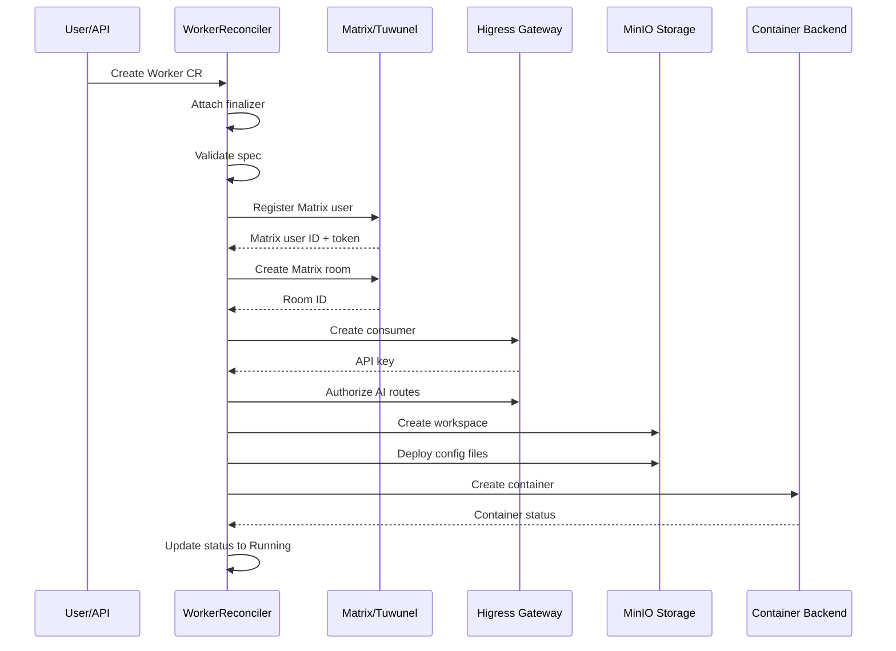

# Worker Provisioning Lifecycle

This document details the complete lifecycle of a Worker from CR creation through infrastructure provisioning to running state. The WorkerReconciler orchestrates a multi-phase process involving Matrix user/room provisioning, Higress gateway consumer setup, MinIO workspace initialization, and container deployment.

## Provisioning Flow Overview



## Provisioning Phases

### 1. CR Creation & Finalizer Attachment

When a Worker CR is created, the WorkerReconciler attaches a finalizer `agentteams.io/cleanup` to ensure proper cleanup during deletion. The controller validates the spec and resolves effective configuration.

**Key Steps:**
- Attach finalizer if not present
- Validate Worker spec and deployment target
- Build MemberContext with effective spec
- Handle edge worker UUID rotation if needed

### 2. Infrastructure Provisioning (Matrix & Gateway)

The `ReconcileMemberInfra` function handles core infrastructure provisioning:

```go
// ReconcileMemberInfra provisions Matrix account, room, and gateway consumer
func ReconcileMemberInfra(ctx context.Context, d MemberDeps, m MemberContext, state *MemberState) (reconcile.Result, error) {
    // Load or generate credentials
    // Register Matrix account
    // Create Matrix room
    // Create Higress gateway consumer
    // Authorize AI routes
}
```

**Provisioning Steps:**
1. **Credential Generation**: Generate Matrix password, MinIO password, and gateway API key
2. **Matrix Account Registration**: Register Matrix user (AppService or password mode)
3. **Room Creation**: Create Matrix room with appropriate power levels and invites
4. **Gateway Consumer**: Create Higress consumer and authorize AI routes
5. **Credential Persistence**: Save credentials to credential store

### 3. Model Provider Authorization

If a model provider is specified, the controller authorizes the gateway consumer on the provider's HTTP API:

```go
func EnsureModelProviderAuth(ctx context.Context, d MemberDeps, m MemberContext, state *MemberState) error {
    // Authorize consumer on model provider's HttpApi
}
```

### 4. Service Account Creation

For Kubernetes deployments, the controller ensures a ServiceAccount exists:

```go
func EnsureMemberServiceAccount(ctx context.Context, d MemberDeps, m MemberContext) error {
    // Create Kubernetes ServiceAccount
}
```

### 5. Configuration Deployment

The `ReconcileMemberConfig` function deploys all configuration to MinIO:

**Runtime Config (runtime.yaml):**
- Member metadata (name, role, runtime)
- Matrix credentials and room IDs
- Team context (if applicable)
- Model provider configuration
- Channel policy and access entries

**Agent Configuration:**
- Package deployment and extraction
- Inline config writes (identity, soul, agents)
- AGENTS.md merging with builtin section
- Skill deployment and MCP server config

### 6. Container Creation

The `ReconcileMemberContainer` function manages container lifecycle:

```go
func ReconcileMemberContainer(ctx context.Context, d MemberDeps, m MemberContext, state *MemberState) (reconcile.Result, error) {
    // Handle desired state: Running, Sleeping, Stopped
    // Create or resume container
    // Manage backend-specific logic
}
```

**Container Creation Process:**
1. Build environment variables from provision results
2. Prepare worker dependencies (token, env, data mounts)
3. Create backend-specific container (Docker, K8s Pod, or Sandbox)
4. Set container state to "starting"

### 7. Service & Port Exposure

For services that need external access:

```go
func ReconcileMemberService(ctx context.Context, m *MemberContext, d *MemberDeps) (string, error) {
    // Create Kubernetes Service if needed
}

func ReconcileMemberExpose(ctx context.Context, d MemberDeps, m MemberContext, state *MemberState) error {
    // Expose ports via Higress gateway
}
```

## State Transitions

### Worker Phases

The worker lifecycle is tracked through these phases:

- **Pending**: Initial state, provisioning in progress
- **Starting**: Container created, waiting for ready
- **Running**: Container running and healthy
- **Stopping**: Container being stopped
- **Sleeping**: Container stopped but preserved
- **Stopped**: Container deleted
- **Failed**: Reconcile error occurred

### Phase Computation

The `computeMemberPhase` function determines the current phase:

```go
func computeMemberPhase(currentPhase, matrixUserID, desiredState, containerState string, reconcileErr error) string {
    if reconcileErr != nil {
        // Failed if no Matrix user, otherwise keep current phase
    }
    switch desiredState {
    case "Sleeping":
        return "Sleeping"
    case "Stopped":
        return "Stopped"
    default: // Running
        // Map container state to phase
    }
}
```

### Health States

The HealthMonitorController classifies worker health:

- **Healthy**: Recent activity
- **Stalled**: No activity for 60+ minutes with tasks
- **Zombie**: No heartbeat for 15+ minutes
- **Idle**: No activity for 5+ minutes with no tasks

## Edge Worker Path

Edge workers (`deployMode=Edge`) have a lightweight controller path:

1. **UUID Rotation**: Delete SA when UUID label changes
2. **Infrastructure Provisioning**: Matrix/gateway credentials
3. **Config Deployment**: runtime.yaml for remote-managed local worker
4. **No Container Management**: Controller doesn't manage Pods/Services

**Heartbeat Timeout:**
- Edge workers report heartbeats every minute
- If no heartbeat for 2+ minutes, phase set to "Pending"
- Controller requeues every minute for edge workers

## Deletion & Cleanup

When a Worker CR is deleted:

1. **Leave Matrix Rooms**: Worker leaves all joined rooms
2. **Delete Matrix Room**: Admin command to delete room
3. **Deprovision Infrastructure**: Clean up gateway consumers, MinIO users
4. **Remove Finalizer**: Finalizer removed after cleanup

```go
func (r *WorkerReconciler) reconcileDelete(ctx context.Context, w *v1beta1.Worker) (reconcile.Result, error) {
    // Leave all rooms
    // Delete room
    // Deprovision infrastructure
    // Remove finalizer
}
```

## Backend-Specific Behavior

### Docker Backend
- Containers managed via Docker Engine API
- No Kubernetes resources created
- SA tokens injected as environment variables
- Config synced from local filesystem

### Kubernetes Backend
- Pods created with proper labels and owner references
- ServiceAccounts created for authentication
- ConfigMaps/Secrets for environment injection
- Pod lifecycle watched for state changes

### Sandbox Backend
- SandboxClaim CRs for resource allocation
- Spec hash comparison for change detection
- Token projection for sandbox authentication

## Credential Management

Credentials are generated once and persisted:

- **MatrixPassword**: For Matrix authentication
- **MinIOPassword**: For object storage access
- **GatewayKey**: For Higress API key
- **MatrixToken**: Cached access token

**Credential Rotation:**
- Edge workers rotate SA tokens on UUID change
- Matrix tokens reused from cache to avoid invalidation
- Gateway keys persisted after consumer creation

## Monitoring & Observability

**Metrics:**
- Worker health state transitions
- Provisioning duration
- Container status changes

**Events:**
- Health state changes recorded in worker events
- Zombie state triggers failure event
- Provisioning errors logged with context

**Status Fields:**
- `phase`: Current lifecycle phase
- `healthState`: Health classification
- `lastHeartbeat`: Last edge worker heartbeat
- `lastActiveAt`: Last activity timestamp
- `specHash`: Applied spec hash for change detection
