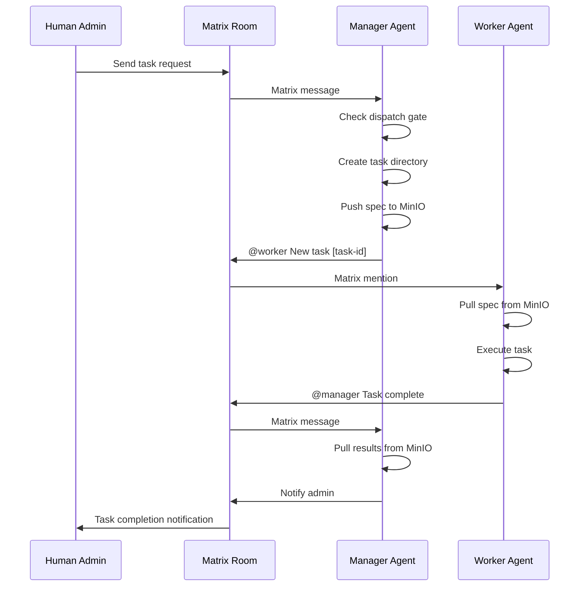
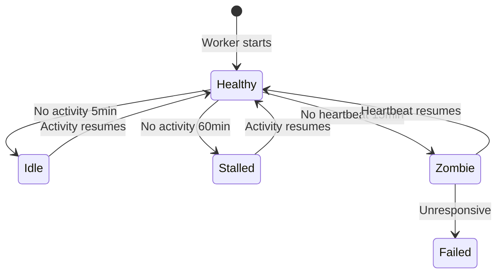

# Task Delegation and Team Coordination

This page documents the complete lifecycle of task delegation in AgentTeams: from human request through Manager to Worker execution and back, including team-based coordination, health monitoring, and failure recovery.

## Task Types

AgentTeams supports two fundamental task types:

### Finite Tasks
- **Definition**: Tasks with a clear end state. Worker delivers a result, and the task is complete.
- **Examples**: "implement login page", "fix bug #123", "write a report", "deploy service"
- **Lifecycle**: assigned → in-progress → completed (or failed)
- **State tracking**: `meta.json` contains `type: "finite"` and `status: "assigned"` initially

### Infinite Tasks
- **Definition**: Recurring tasks that repeat on a cron schedule with no natural end.
- **Examples**: "monitor server health every hour", "generate daily report", "check for new issues"
- **Lifecycle**: created → active (repeats on schedule until cancelled)
- **State tracking**: `meta.json` contains `type: "infinite"`, `status: "active"`, `schedule` (5-field cron), and `timezone`
- **Triggering**: Executed exclusively by heartbeat when `now > next_scheduled_at + 30min` and `last_executed_at < next_scheduled_at`

## Task State Machine

<!-- openwiki: mermaid parse failed and this diagram was converted to a text fence so it does not break rendering. Fix the diagram source and restore the mermaid fence. Parser error: Heuristic: an unescaped angle bracket inside a label breaks rendering; rephrase the label. -->
```text
stateDiagram-v2
    [*] --> Assigned: Manager creates task
    Assigned --> InProgress: Worker starts
    InProgress --> Completed: Worker delivers result
    InProgress --> Blocked: Worker reports blocker
    InProgress --> Failed: Task fails
    Blocked --> InProgress: Blocker resolved
    Blocked --> Failed: Escalation unresolved
    Completed --> [*]
    Failed --> [*]
    
    state "Infinite Tasks" as Infinite {
        Active --> Active: Heartbeat triggers
        Active --> Cancelled: Admin cancels
    }
```

## Dispatch Gating Rules

Before assigning any task, the Manager checks dispatch capacity to prevent overwhelming the AI gateway:

### Capacity Controls
- **Max concurrent workers**: Limits total workers with active tasks (default: 0 = unlimited)
- **Max tasks per worker**: Limits tasks assigned to a single worker (default: 2)
- **Circuit breaker**: Per-worker failure tracking with automatic cooldown

### Circuit Breaker Semantics
Each worker has an independent circuit breaker:
1. Failed task assignments increment the worker's failure count
2. When count reaches threshold (default: 3), circuit opens
3. While open, dispatch to that worker is denied
4. After cooldown period (default: 30 minutes), circuit auto-resets
5. Successful task completion resets the failure count

### YOLO Mode
When `AGENTTEAMS_YOLO=1` or `~/yolo-mode` exists, the gate is **advisory only**:
- Log a warning if dispatch is denied
- Proceed with assignment anyway
- Admin has delegated full authority and is unreachable

### Dispatch Gate Check
```bash
bash /opt/agentteams/agent/skills/task-management/scripts/dispatch-gate.sh \
  --action check --worker {worker-name}
```

If `allowed: false`, defer the task and retry on next heartbeat.

## Manager → Worker Delegation via Matrix Mentions

### Task Assignment Flow



### Key Rules
1. **Never @mention a Worker after recording infinite task execution** - this creates rapid-fire loops
2. **Always push task files to MinIO before notifying Worker** - Worker needs to file-sync
3. **Always pull task directory from MinIO before reading results** - Worker pushes results there
4. **Every task MUST be registered in state.json** - prevents auto-stopping by idle timeout

## Team Creation Flow

### Quick Create (2 steps)
```bash
# 1. Create team via agt CLI
agt create team \
  --name <TEAM_NAME> \
  --leader-name <LEADER_NAME> \
  --leader-model <MODEL> \
  --workers <w1>,<w2>

# 2. @mention the Leader in Leader Room to assign task
```

### Controller Actions
After `agt create team`, the controller's Team reconciler handles:

1. **Room creation**: Team Room (Leader + Team Admin + all workers) and Leader DM (Team Admin ↔ Leader)
2. **Leader provisioning**: Creates Team Leader Worker CR with team-leader-agent skills
3. **Worker provisioning**: Creates each team worker Worker CR with copaw-worker-agent skills
4. **Coordination injection**: Injects coordination context into Leader's AGENTS.md
5. **Storage setup**: Sets up shared team storage in MinIO
6. **Registry update**: Updates legacy teams registry

### Team Member Roles
- **Team Leader**: Special Worker with management skills, handles task decomposition and assignment
- **Team Worker**: Standard Worker, only talks to their Leader (not Manager directly)
- **Team Admin**: Human coordinator, defaults to Global Admin if not specified

## Leader-Worker Coordination

### Communication Patterns
```
Manager → Team Leader (via Matrix @mention in Leader Room)
Team Leader → Team Workers (via Matrix @mention in Team Room)
Team Workers → Team Leader (via Matrix @mention in Team Room)
Team Leader → Manager (via Matrix @mention in Leader Room)
```

### Task Decomposition Modes

#### Simple Task Mode
For straightforward tasks that a single team worker can complete:
- Leader assigns directly to a worker
- Sub-task tracked in `teams/{team}/tasks/`
- Result aggregated and written back to `shared/tasks/{parent-task-id}/result.md`

#### Project Mode (DAG)
For complex tasks requiring multiple workers with dependencies:
- Leader creates a team project with DAG-based task plan
- Tasks orchestrated with parallel/serial execution based on dependencies
- `resolve-dag.sh` automatically identifies which tasks can run in parallel
- Result aggregated and written back to `shared/tasks/{parent-task-id}/result.md`

### Project DAG Dependencies
The DAG (Directed Acyclic Graph) system allows:
- **Parallel execution**: Independent tasks run simultaneously
- **Serial dependencies**: Tasks wait for prerequisites
- **Conditional branching**: Based on intermediate results
- **Resource optimization**: Efficient worker utilization

## Heartbeat Monitoring Loop

### Health Monitor Controller
Runs every 30 seconds to classify worker health states:

```go
// Health states
const (
    HealthStateHealthy = "healthy"  // Recent activity
    HealthStateStalled = "stalled"  // No activity for 60min while having tasks
    HealthStateZombie  = "zombie"   // No heartbeat for 15min
    HealthStateIdle    = "idle"     // No activity for 5min with no tasks
)
```

### Classification Logic
1. **Zombie detection**: No heartbeat for 15 minutes
2. **Stalled detection**: Has activity but it's stale (likely has tasks but not progressing)
3. **Idle detection**: Recent heartbeat but no recent activity
4. **Healthy state**: Recent activity

### Health State Transitions


## Auto-Sleep

### Auto-Sleep Controller
Runs every minute to check if workers should be put to sleep:

```go
func shouldSleep(now time.Time, state, idleTimeout, lastActiveAt string) bool {
    if state != "Running" || idleTimeout == "" || lastActiveAt == "" {
        return false
    }
    timeout, err := time.ParseDuration(idleTimeout)
    if err != nil || timeout <= 0 {
        return false
    }
    lastActive, err := time.Parse(time.RFC3339, lastActiveAt)
    if err != nil {
        return false
    }
    return now.Sub(lastActive) > timeout
}
```

### Sleep Conditions
- Worker must be in "Running" state
- `idleTimeout` must be configured in worker spec
- `lastActiveAt` must be set
- Time since last activity must exceed idle timeout

## Escalation and Session Recovery

### Escalation Management

#### Severity Levels
| Level | When to use | Routing |
|-------|-------------|---------|
| `CRITICAL` | Work fully stopped, data loss risk, security issue | Immediate admin DM |
| `HIGH` | Blocked on external input, needs human decision | Next heartbeat report |
| `MEDIUM` | Degraded but workaround exists, non-urgent question | Daily digest inclusion |

#### Worker Self-Report Format
Workers report blockers using this format:
```
[BLOCKED:<CRITICAL|HIGH|MEDIUM>] <what was tried> — <specific question>
```

#### Escalation Lifecycle
```
raise → open → acknowledged → resolved
              ↘ (stale) → re-escalated (count++) → ... → max_reached
```

- **Max re-escalations**: 3 (after that, flag as "needs human intervention")
- **Re-escalation intervals**: CRITICAL: 1h, HIGH: 4h, MEDIUM: 24h

### Session Recovery

#### Manager Session Recovery
On every Manager session start, after reading SOUL.md and memory files:
1. Read session snapshot: `cat ~/last-session-snapshot.json`
2. If snapshot exists and is recent (< 1 hour old), use as starting context
3. If snapshot is stale (> 1 hour) or missing, fall back to normal startup flow

#### Worker Recreation Recovery
When a Worker is recreated (detected via `lifecycle-worker.sh --action ensure-ready` returning `recreated`):
1. Previous session context is lost
2. Check if Worker had active tasks in state.json
3. If yes, re-send task assignment with full context
4. Worker's MinIO data persists (spec.md, progress notes, partial results)

## Task Directory Layout

```
shared/tasks/{task-id}/
├── meta.json     # Manager-maintained metadata
├── spec.md       # Manager-written requirements
├── base/         # Manager-maintained reference files
├── plan.md       # Worker-written execution plan
├── result.md     # Worker-written final result
└── *             # Intermediate artifacts
```

## Task Coordination

### Processing Marker System
Prevents conflicts when both Manager and Workers need to access the same task workspace:

#### `.processing` Marker Format
```json
{
  "processor": "manager",
  "started_at": "2026-02-25T10:30:00Z",
  "expires_at": "2026-02-25T10:45:00Z",
  "operation": "git-delegation"
}
```

#### Coordination Protocol
1. **Sync from MinIO first**
2. **Check for `.processing` marker**
3. **If safe, create marker**
4. **Perform modifications**
5. **Remove marker**
6. **Sync to MinIO**

## Operator Task Injection

### Using `replay-task.sh`
Operators can inject tasks directly into the Manager via Matrix:

```bash
# CLI mode
./scripts/replay-task.sh "Create a Worker named alice"

# Interactive mode
./scripts/replay-task.sh

# Pipe mode
echo "Create worker bob" | ./scripts/replay-task.sh
```

### Environment Variables
- `AGENTTEAMS_ADMIN_USER`: Admin username (default: admin)
- `AGENTTEAMS_ADMIN_PASSWORD`: Admin password (required)
- `AGENTTEAMS_MATRIX_DOMAIN`: Matrix domain (default: matrix-local.agentteams.io:8080)
- `REPLAY_WAIT`: Wait for reply (default: 1, set 0 to skip)
- `REPLAY_TIMEOUT`: Reply timeout secs (default: 300)

## Key Invariants

1. **Every task MUST be registered in state.json** - prevents auto-stopping by idle timeout
2. **Never @mention Worker after recording infinite task execution** - prevents rapid-fire loops
3. **Always push to MinIO before notifying Worker** - ensures file-sync works
4. **Always pull from MinIO before reading results** - ensures Manager reads latest
5. **Team workers only talk to their Leader** - never directly to Manager
6. **Manager only talks to Team Leader** - never directly to team workers
7. **Use `manage-state.sh` for state.json** - never edit manually
8. **Use `manage-escalations.sh` for escalations** - never edit manually

## Extension Points

### Dispatch Governor (Phase 2)
Future controller-level enforcement via:
- `POST /api/v1/dispatch/acquire` for hard enforcement
- Prometheus metrics for dispatch denials
- Authoritative active worker count tracking

### Custom Team Domains
While not currently supported, future extensions could add:
- Structured team-level domain/expertise/capability fields
- Automatic team matching based on task requirements
- Skill-based team composition optimization

## Configuration

### Dispatch Config
```json
{
  "max_concurrent_workers": 0,
  "max_tasks_per_worker": 2,
  "circuit_breaker_threshold": 3,
  "circuit_breaker_cooldown_min": 30
}
```

### Health Monitor Thresholds
- `stalledThreshold`: 60 minutes
- `zombieThreshold`: 15 minutes
- `idleThreshold`: 5 minutes
- `defaultHealthMonitorInterval`: 30 seconds

### Auto-Sleep
- `defaultAutoSleepInterval`: 1 minute
- Configurable per-worker via `spec.idleTimeout`

## Related Pages

- [Skills and Prompts](../agent-content/skills-and-prompts.md) - Task management skills
- [Architecture Overview](../architecture/overview.md) - System architecture
- [CRDs and Reconcilers](../controller/crds-and-reconcilers.md) - Controller logic
- [Manager Overview](../manager/overview.md) - Manager agent details
- [Provisioning Lifecycle](provisioning-lifecycle.md) - Worker provisioning flows
